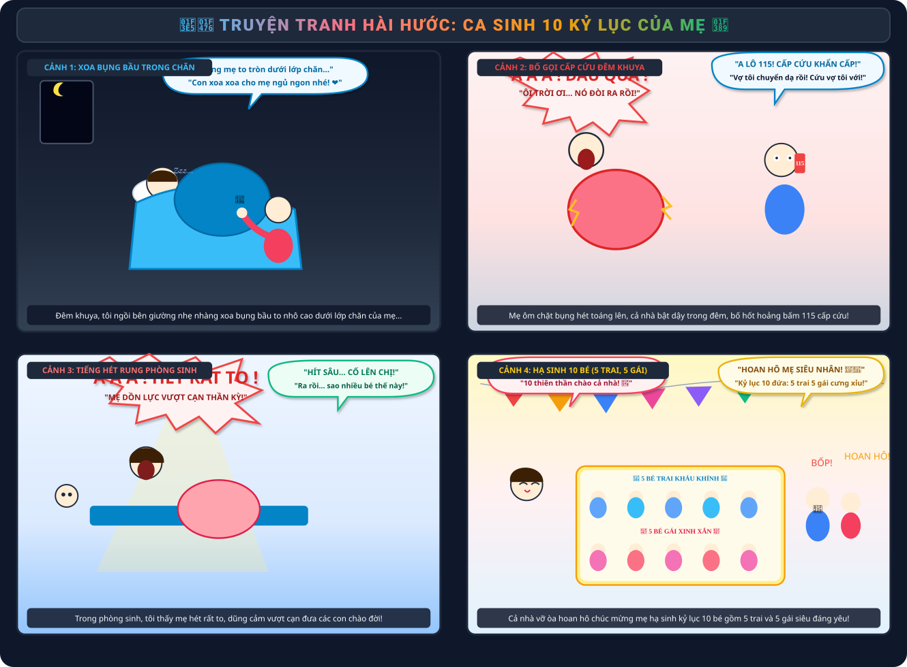
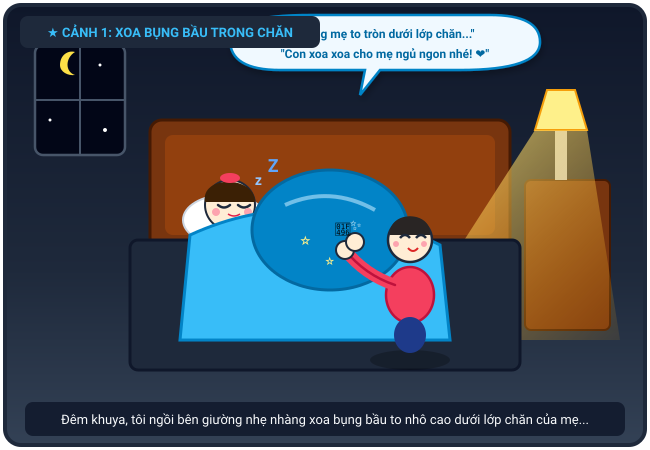
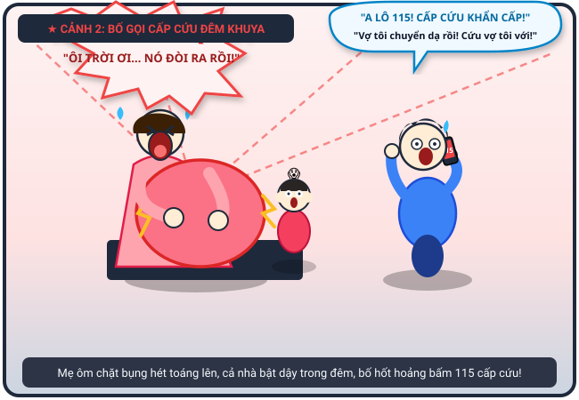
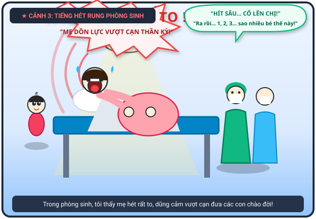
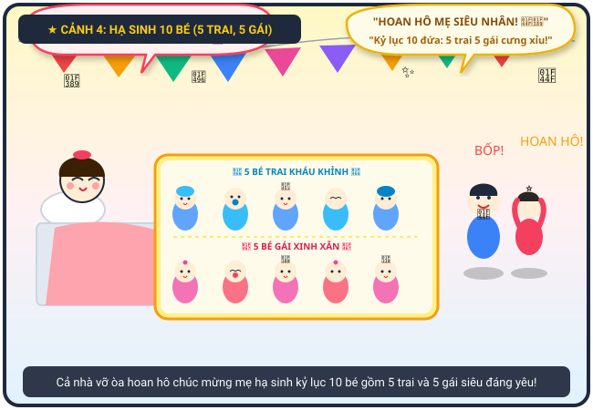

# 🍃 🏥👶 Truyện Tranh Hài Hước: Ca Sinh 10 Kỷ Lục Của Mẹ

> *Đêm khuya thanh vắng đang êm đềm xoa chiếc bụng bầu trong chăn của mẹ, bỗng một tiếng hét thất thanh vang dội làm cả nhà giật mình bật dậy, bố cuống cuồng gọi cấp cứu 115 và cái kết vỡ òa hạnh phúc khi mẹ hạ sinh trọn vẹn 10 thiên thần nhỏ gồm 5 trai và 5 gái!*

---

## 🎨 Trọn Bộ Truyện Tranh (Comic Strip)

---

## 📖 Chi Tiết Từng Phân Cảnh (Comic Panels)

### 🌟 Cảnh 1: Xoa Chiếc Bụng Bầu To Dưới Lớp Chăn

> **Dẫn truyện:** Giữa đêm khuya thanh vắng, mẹ tôi đang nằm ngủ say sưa trên giường. Dưới lớp chăn ấm áp, chiếc bụng bầu của mẹ nhô cao tròn xoe như một ngọn đồi nhỏ. Tôi ngồi bên cạnh, hai tay nhẹ nhàng vuốt ve, xoa xoa chiếc bụng bầu để vỗ về cho các em bé trong bụng mẹ ngủ ngon.
> 
> 🧒 **Tôi (ngồi bên mép giường, xoa xoa bụng mẹ mỉm cười thì thầm):** *“Bụng mẹ hôm nay to tròn núng nính dưới lớp chăn luôn... Con xoa xoa thế này cho mẹ ngủ thật ngoan, mấy đứa em trong bụng cũng ngoan ngoãn đừng đạp mẹ nhé! ❤️”*
> 
> 😴 **Mẹ (ngủ say, phát ra tiếng thở đều êm dịu):** *“Zzz... zzz...”*

---

### 🚨 Cảnh 2: Tiếng Hét Xé Màn Đêm – Cả Nhà Bật Dậy & Bố Gọi Cấp Cứu!

> **Dẫn truyện:** Đang yên đang lành, bỗng một tiếng hét chói tai vang lên từ phòng ngủ xé toạc màn đêm tĩnh mịch: “Á Á Á!”. Mẹ tôi gập người ngồi bật dậy, hai tay ôm ghì lấy chiếc bụng bầu to tướng, mặt mũi tái mét vì cơn đau chuyển dạ ập đến dữ dội. Cả nhà tôi giật mình thon thót, bố bật tung chăn nhảy bổ xuống giường, tay run lẩy bẩy vội vã bấm số 115 gọi cấp cứu!
> 
> 😱 **Mẹ (hai tay ôm chặt cứng lấy bụng bầu, hét lớn):** *“Á Á Á...! ĐAU QUÁ ANH ƠI! ÔI TRỜI ƠI... BỤNG EM QUẶN LÊN RỒI, NÓ ĐÒI RA RỒI!”*
> 
> 📱 **Bố (đầu bù tóc rối, cuống cuồng áp điện thoại vào tai hét to):** *“A LÔ 115 ĐÓ PHẢI KHÔNG?! CẤP CỨU KHẨN CẤP! Vợ tôi chuyển dạ sắp đẻ rồi, xe tới nhanh cứu vợ tôi với!”*
> 
> 😨 **Tôi (ôm đầu hoảng hốt chạy theo sau):** *“Mẹ ơi mẹ ráng chịu đau một chút, bố gọi xe cấp cứu rồi kìa!”*

---

### 🔥 Cảnh 3: Tiếng Hét Vượt Cạn Rung Chuyển Phòng Sinh

> **Dẫn truyện:** Mẹ được đưa gấp vào phòng sinh bệnh viện. Nằm trên chiếc giường đẻ dưới ánh đèn mổ rực sáng, mẹ hai tay ôm ghì lấy bụng bầu và nắm chặt thành giường. Khi sinh, tôi đứng bên ngoài nhìn vào thấy mẹ dồn hết 200% sức lực, hét thật to vang động khắp cả hành lang khoa sản để đón các con chào đời. Tiếng hét dũng cảm phi thường của mẹ khiến ai nấy đều nể phục!
> 
> 🔊 **Mẹ (ôm chặt bụng bầu, dồn hết sức hét rung phòng sinh):** *“Á Á Á Á Á...! HÉT THẬT TO NÀO! RÁNG LÊN CÁC CON ƠI! ỐI DỒI ÔI...!”*
> 
> 👨‍⚕️ **Bác sĩ & Ê-kíp đỡ đẻ (vừa đỡ vừa kinh ngạc thốt lên):** *“Hít sâu... rặn mạnh theo nhịp nào chị ơi! 1... 2... 3! Bé thứ nhất ra rồi... ơ kìa còn bé thứ 2, thứ 3... Trời đất ơi, sao trong bụng nhiều em bé thế này!”*

---

### 🎉 Cảnh 4: Kỷ Lục Hạ Sinh 10 Bé (5 Trai, 5 Gái) – Cả Nhà Vỗ Tay Hoan Hô!

> **Dẫn truyện:** Sau tiếng khóc chào đời rộn rã liên tiếp, căn phòng như vỡ òa trong phép màu kỳ diệu! Mẹ tôi đã hạ sinh thành công một kỷ lục vô tiền khoáng hậu: trọn vẹn 10 em bé thiên thần nhỏ, trong đó có đúng 5 bé trai và 5 bé gái! Các bé nằm ngoan ngoãn trong nôi, bé trai quấn khăn xanh bảnh bao, bé gái quấn khăn hồng thắt nơ xinh xắn, đôi má bánh bao bầu bĩnh cưng xỉu. Bố và tôi mừng rỡ nhảy cẫng lên, vỗ tay rầm rộ hoan hô mẹ siêu nhân!
> 
> 👏 **Bố & Tôi (đồng thanh vỗ tay rầm rộ, reo hò không ngớt):** *“BỐP! BỐP! BỐP! HOAN HÔ MẸ! 🎉👏 MẸ GIỎI QUÁ MẸ ƠI! Kỷ lục 10 đứa em: 5 trai 5 gái đều kháu khỉnh, đáng yêu hết phần thiên hạ!”*
> 
> 🥰 **Mẹ (nằm trên giường mỉm cười mãn nguyện, rơi nước mắt hạnh phúc):** *“Bõ công mẹ la hét rung chuyển cả bệnh viện! 10 thiên thần nhỏ chào bố và anh hai nhé! ❤️”*

---

## 📸 Những Khoảnh Khắc Đáng Yêu & Ý Nghĩa

| 😴 Vỗ Về Bụng Bầu Đêm Khuya | 🚨 Bố Cuống Cuồng Gọi 115 | 🎉 Kỷ Lục 10 Thiên Thần Nhỏ |
| :---: | :---: | :---: |
|  |  |  |
| *Xoa chiếc bụng bầu nhô cao dưới chăn ấm* | *Cả nhà bật dậy hốt hoảng bấm gọi cấp cứu* | *5 bé trai - 5 bé gái kháu khỉnh mỉm mỉn* |

---

## 📜 Câu Chuyện Gốc

> *"Tôi đang xoa bụng mẹ tôi [có bụng bầu trong chăn] đang ngủ thì á á tiếng hét rất lớn phát ra từ phòng mẹ con tôi, cả nhà liền bật dậy, bố gọi cho cấp cứu, mẹ tôi ôm chặt lấy bụng bầu. Khi sinh tôi thấy mẹ hét rất to, cuối cùng mẹ tôi hạ sinh 10 đứa: 5 đứa trai, 5 đứa gái, cả nhà tôi hoan hô chúc mừng mẹ!"*
