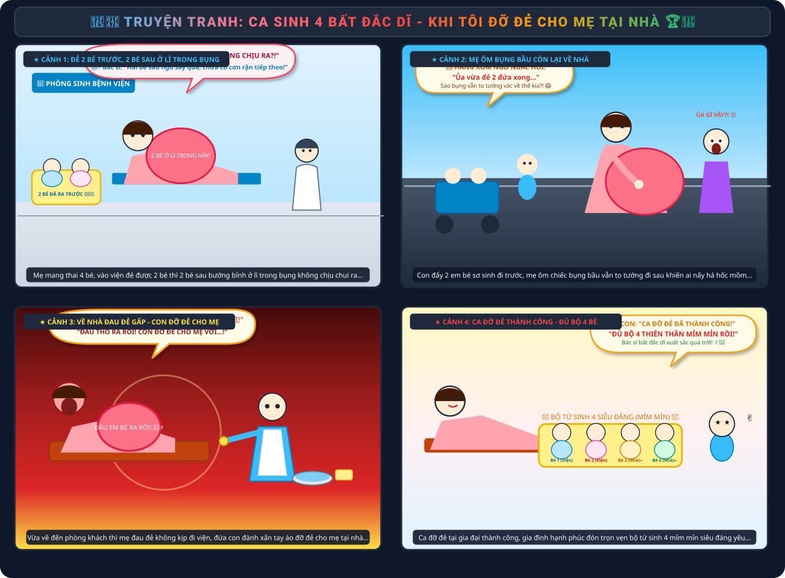
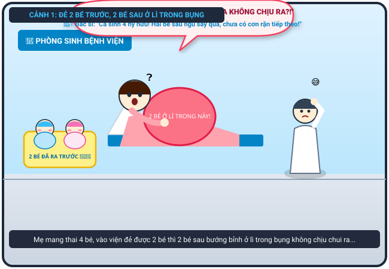
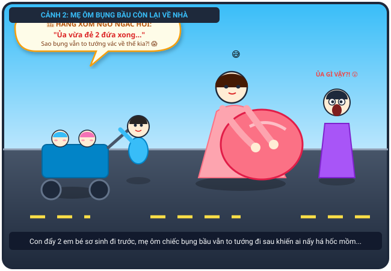
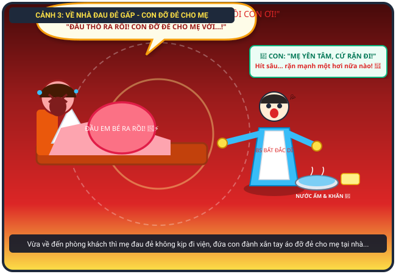
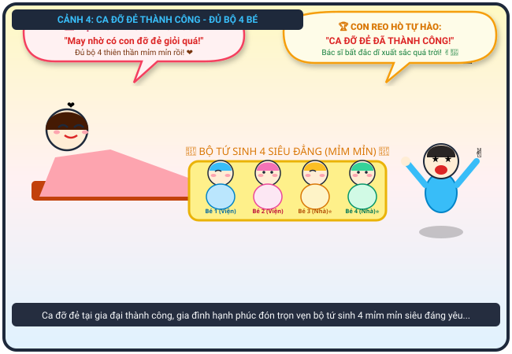

# 🍃 🏥👶 Truyện Tranh Hài Hước: Ca Sinh 4 Ly Kỳ Của Mẹ - Bác Sĩ Bất Đắc Dĩ Đỡ Đẻ Tại Nhà

> *Chuyện thật như đùa: Mẹ mang thai 4 bé, vào viện đẻ được 2 bé thì 2 bé sau ở lì trong bụng không chịu ra. Mẹ đành ôm bụng bầu còn lại về nhà, ai ngờ vừa tới nơi lại đau đẻ gấp, đứa con phải làm "bác sĩ bất đắc dĩ" và cái kết đại thành công!*

---

## 🎨 Trọn Bộ Truyện Tranh (Comic Strip)

---

## 📖 Chi Tiết Từng Phân Cảnh (Comic Panels)

### 🌟 Cảnh 1: Đẻ Được 2 Bé Đầu, 2 Bé Sau Ở Lì Trong Bụng

> **Dẫn truyện:** Mẹ tôi mang thai với chiếc bụng bầu siêu to khổng lồ, to đến mức tưởng như che khuất cả tầm nhìn. Khi vào viện khám, bác sĩ giật mình thông báo mẹ sắp đẻ. Sau bao phen gồng mình rặn đẻ, mẹ đã hạ sinh thành công 2 bé đầu tiên trắng trẻo, khỏe mạnh. Thế nhưng điều kỳ lạ là sau khi sinh xong 2 bé, chiếc bụng mẹ vẫn to đùng! Siêu âm lại mới phát hiện mẹ mang thai tận 4 bé (sinh tư), nhưng 2 bé còn lại cứ nằm ngủ say sưa, ở lì trong bụng nhất quyết không chịu chui ra!
> 
> 🤰 **Mẹ (nằm trên giường đẻ, hai tay ôm chiếc bụng vẫn to tướng thắc mắc):** *“Bác sĩ ơi! Con tôi ra được 2 đứa rồi, sao 2 đứa kia cứ nằm im thin thít ở lì trong bụng không chịu ra thế này?!”*
> 
> 👨‍⚕️ **Bác sĩ (gãi đầu bối rối toát mồ hôi hột):** *“Trường hợp sinh 4 hiếm có khó tìm! Cơn co tử cung tạm thời dừng lại rồi, 2 bé sau đang ngủ say quá. Chị cứ về nhà nghỉ ngơi theo dõi, khi nào có cơn đau chuyển dạ tiếp theo thì quay lại viện nhé!”*

---

### 🚶‍♀️ Cảnh 2: Mẹ Ôm Bụng Bầu Còn Lại Đi Bộ Về Nhà

> **Dẫn truyện:** Thế là một cảnh tượng có một không hai đã diễn ra trên phố! Tôi hớn hở đẩy chiếc xe nôi đôi chở 2 em bé sơ sinh vừa chào đời đi trước. Đi ngay phía sau là mẹ tôi, hai tay ôm khư khư lấy chiếc bụng bầu vẫn nhô cao khệ nệ như thể chưa hề đi đẻ. Hàng xóm láng giềng hai bên đường túa ra xem, ai nấy mắt tròn mắt dẹt, lác mắt không hiểu chuyện gì đang xảy ra!
> 
> 👵 **Hàng xóm (đứng bên đường, há hốc mồm chỉ trỏ):** *“Ủa kì lạ vậy ta?! Rõ ràng thấy con bé đẩy 2 đứa bé đỏ hỏn vừa đẻ xong, sao bụng cái Mai vẫn to như cái trống vác về nhà thế kia?!”*
> 
> 🤰 **Mẹ (vừa đi vừa ôm bụng cười trừ):** *“Bác ơi, cháu mới đẻ được có nửa đàn thôi! Hai đứa sau nó lười, nó bảo trong bụng ấm hơn nên chưa thèm ra ạ! 😅”*

---

### ⚡ Cảnh 3: Về Nhà Đau Đẻ Gấp – Con Làm Bác Sĩ Bất Đắc Dĩ

> **Dẫn truyện:** Vừa mới đặt chân vào đến phòng khách còn chưa kịp cởi đôi dép, mẹ tôi bỗng hét toáng lên một tiếng thất thanh xé toạc căn nhà! Cơn gò dữ dội như sóng thần ập đến, mẹ ngã gập người xuống ghế sofa, ôm chặt lấy bụng. Lần này 2 bé sau thức giấc và đòi chui ra cấp tốc, không còn kịp gọi xe cấp cứu hay quay lại bệnh viện nữa! Trong giây phút ngàn cân treo sợi tóc, tôi đành phải xắn tay áo, đeo găng tay nilon, bưng chậu nước ấm và khăn sạch làm “bác sĩ đỡ đẻ bất đắc dĩ” cho mẹ!
> 
> 😱 **Mẹ (nằm gồng mình trên sofa, cắn chặt góc gối gào to):** *“Á Á Á...! KHÔNG KỊP NỮA RỒI CON ƠI! NÓ RA THẬT RỒI! THẤY ĐẦU EM BÉ THÒ RA RỒI, CON ĐỠ ĐẺ CHO MẸ VỚI...!”*
> 
> 🧒 **Tôi (toát mồ hôi hột, tay cầm khăn sạch hô vang như bác sĩ chuyên nghiệp):** *“Mẹ bình tĩnh! Hít một hơi thật sâu... ngậm miệng lại... một... hai... ba, rặn mạnh một hơi nữa đi mẹ, con đón được đầu em bé rồi nè! 💨”*

---

### 🏆 Cảnh 4: Đại Thành Công – Trọn Bộ 4 Bé Mỉm Mỉn Siêu Đáng Yêu!

> **Dẫn truyện:** Nhờ sự phối hợp nhịp nhàng và dũng cảm phi thường của hai mẹ con, hai tiếng khóc oe oe giòn giã vang lên rộn rã khắp phòng khách! Ca đỡ đẻ tại gia nghẹt thở đã thành công mỹ mãn! Mẹ thở phào nhẹ nhõm nằm trên sofa, chiếc bụng to tướng giờ đã xẹp xuống hoàn toàn. Tôi mồ hôi nhễ nhại, giơ hai ngón tay chữ V tự hào như vừa lập chiến công hiển hách. Trên chiếc nôi ấm áp, 4 thiên thần nhỏ sinh tư (2 bé sinh ở viện, 2 bé sinh tại nhà) nằm xếp hàng đều tăm tắp, má bánh bao phúng phính trắng hồng "mỉm mỉn" siêu đáng yêu!
> 
> 🥰 **Mẹ (mỉm cười hạnh phúc, ôm con gái/trai vào lòng):** *“May mà có con dũng cảm đỡ đẻ giỏi quá! Bác sĩ bất đắc dĩ của mẹ xuất sắc nhất trần đời! Đủ bộ 4 thiên thần mỉm mỉn của mẹ rồi! ❤️”*
> 
> 🧒 **Tôi (nhảy cẫng lên reo hò chiến thắng):** *“CA ĐỠ ĐẺ TẠI GIA ĐẠI THÀNH CÔNG RỒI MẸ ƠI! Em nào nhìn cũng mỉm mỉn, má núng nính cưng xỉu luôn! Sau này lớn lên con sẽ kể cho 2 em nghe chuyện con đỡ đẻ cho hai đứa! ✌️🎉”*

---

## 📸 Những Khoảnh Khắc Đáng Yêu & Ý Nghĩa

| 🏥 Sinh 2 Bé Ở Viện | 🏠 Cơn Đau Đẻ Bất Ngờ Tại Nhà | 👶 Trọn Bộ 4 Bé Mỉm Mỉn |
| :---: | :---: | :---: |
|  |  |  |
| *Mẹ xuất viện bế 2 bé về, bụng vẫn tròn xoe* | *Con nhỏ nhanh trí làm bác sĩ đỡ đẻ cho mẹ* | *4 thiên thần nhỏ má phúng phính đáng yêu* |

---

## 💬 Bài Học & Góc Cười

- 🤰 **Sự kỳ diệu của người mẹ:** Vượt qua hai lần sinh nở chỉ trong vòng ít ngày, mẹ đã chứng minh sức mạnh phi thường và đức hy sinh vô bờ bến của người phụ nữ.
- 💡 **Bạn nhỏ dũng cảm và nhanh trí:** Sự bình tĩnh, tự tin và khéo léo của người con khi làm "bác sĩ bất đắc dĩ" đã cứu mẹ và đón hai em chào đời an toàn.
- 🍼 **Gia đình ngập tràn tiếng cười:** Sự có mặt của 4 thiên thần nhỏ "mỉm mỉn" mang lại niềm hạnh phúc vô bờ bến cho cả gia đình!

---

*#truyencuoi #truyentranh #comic #sinhbon #dode #mimmim #mebau #giadinh #chamsocme #dungcam*
