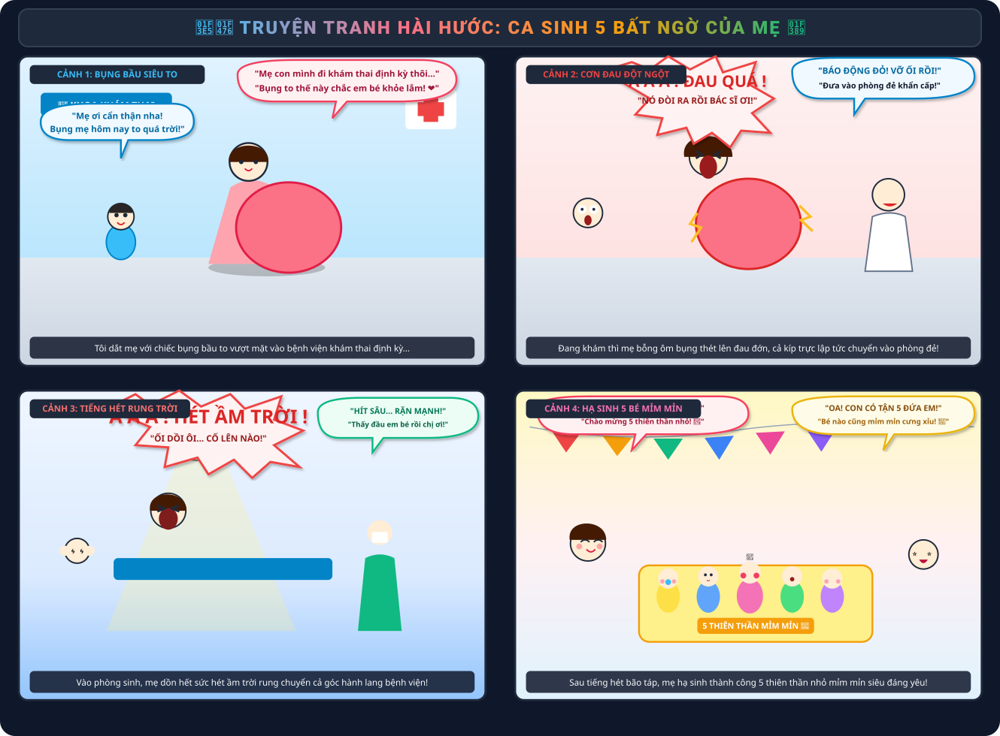
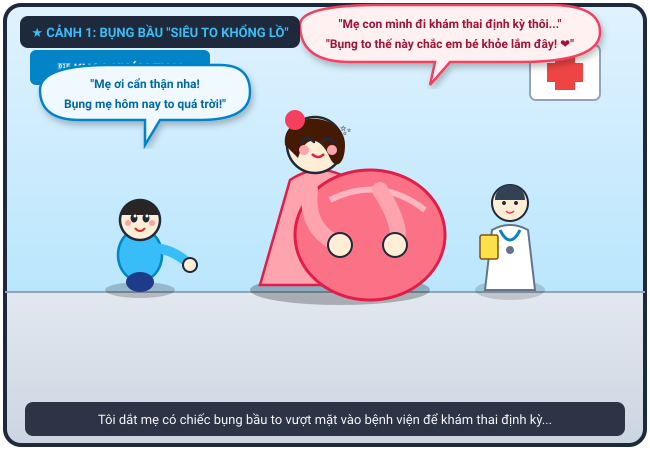
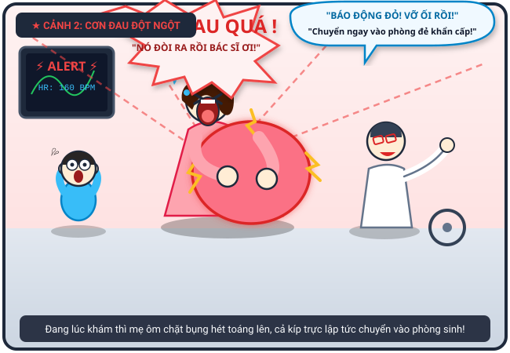
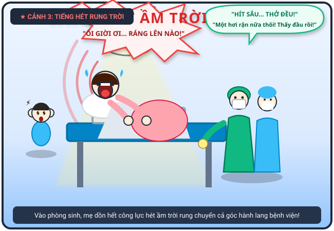
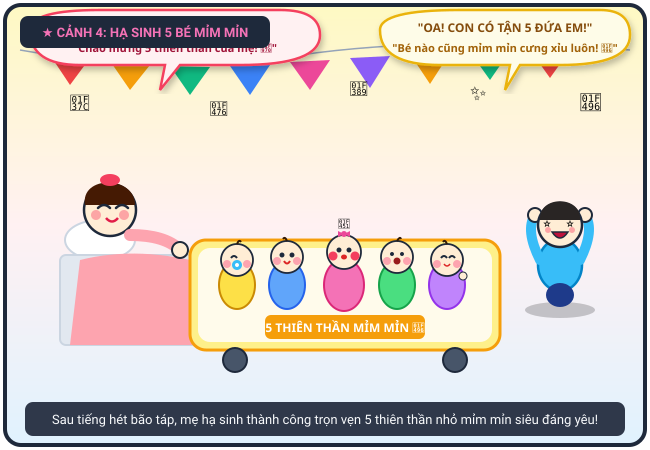

# 🍃 🏥👶 Truyện Tranh Hài Hước: Tôi Và Mẹ Đi Đẻ - Ca Sinh 5 Năm Bé Mỉm Mỉn

> *Chuyến đi khám thai bất ngờ nhớ đời của hai mẹ con: từ chiếc bụng bầu siêu to khổng lồ, tiếng hét rung chuyển cả bệnh viện khi các bé bướng bỉnh không chịu ra, đến khoảnh khắc vỡ òa hạnh phúc đón chào 5 thiên thần sinh năm mỉm mỉn trắng hồng!*

---

## 🎨 Trọn Bộ Truyện Tranh (Comic Strip)

---

## 📖 Chi Tiết Từng Phân Cảnh (Comic Panels)

### 🌟 Cảnh 1: Bụng Bầu "Siêu To Khổng Lồ" Đi Vào Viện Khám

> **Dẫn truyện:** Hôm ấy, tôi được giao nhiệm vụ quan trọng là tháp tùng mẹ vào viện khám thai định kỳ. Bụng mẹ dạo này to vượt mặt, to tròn như giấu cả một rổ dưa hấu khổng lồ trong chiếc váy bầu hồng. Mẹ bước đi khệ nệ, nghiêng bên nọ lắc bên kia từng bước một. Tôi lon ton đi bên cạnh, hai tay cẩn thận đỡ lấy cánh tay mẹ như hộ tống hoàng hậu vi hành.
> 
> 🧒 **Tôi (mắt tròn xoe ngước nhìn chiếc bụng to tướng):** *“Mẹ ơi đi chậm chậm thôi nha! Bụng mẹ hôm nay to tròn quá trời luôn, con nhìn mà cảm tưởng sắp chạm cả tới cằm mẹ rồi ấy!”*
> 
> 🤰 **Mẹ (hai tay xoa chiếc bụng bầu, mỉm cười hiền hậu):** *“Mẹ con mình chỉ đi khám định kỳ xem em bé thế nào thôi con... Bụng to thế này chắc bên trong em bé háu ăn, khỏe mạnh lắm đây! ❤️”*

---

### ⚡ Cảnh 2: Vừa Vào Khám Thì Bác Sĩ Báo "Sắp Đẻ Rồi!"

> **Dẫn truyện:** Vừa mới bước chân vào phòng khám còn chưa kịp ngồi ấm chỗ để bác sĩ đặt máy siêu âm, mẹ tôi bỗng nhiên đổi sắc mặt. Cơn gò tử cung ập đến bất thình lình, hai tay mẹ ôm ghì lấy chiếc bụng bầu tròn xoe khổng lồ, cả người gập xuống, hét toáng lên một tiếng rung rinh cả cửa kính phòng khám!
> 
> 😱 **Mẹ (ôm chặt bụng bầu, mặt nhăn nhó gào to):** *“Á Á Á...! ĐAU QUÁ CON ƠI! HÌNH NHƯ... HÌNH NHƯ MẸ SẮP ĐẺ RỒI! NÓ ĐÒI RA RỒI! BÁC SĨ ƠI CỨU TÔI VỚI!”*
> 
> 😨 **Tôi (ôm chặt hai má, giật thót tim nhảy dựng lên):** *“Ối trời ơi! Mẹ ơi sao thế?! Bác sĩ ơi mẹ cháu sắp đẻ ngay tại phòng khám rồi!”*
> 
> 👨‍⚕️ **Bác sĩ (giật mình rơi cả bút, cuống cuồng bấm chuông báo động):** *“Báo động đỏ! Vỡ ối rồi, cổ tử cung mở trọn rồi, đầu em bé đã tụt xuống! Kíp trực đâu, mau đẩy cáng chuyển sản phụ vào phòng đẻ khẩn cấp ngay lập tức!”*

---

### 🔊 Cảnh 3: Bé Chưa Chịu Ra, Mẹ Rặn Đau Hét Rung Trời

> **Dẫn truyện:** Mẹ được đẩy thẳng vào phòng sinh dưới ánh đèn mổ sáng choang. Nhưng éo le thay, các em bé trong bụng dường như còn bướng bỉnh chưa chịu chui ra! Mẹ tôi phải dồn hết 200% công lực gồng mình rặn đẻ trong cơn đau thấu trời. Tiếng hét của mẹ vang dội qua từng lớp cửa kính, làm rung chuyển cả hành lang bệnh viện khiến ai đi qua cũng phải rợn tóc gáy! Tôi đứng bên ngoài chỉ biết bịt chặt hai tai, mồ hôi hột thi nhau túa ra vì lo lắng.
> 
> 🔊 **Mẹ (nắm chặt thành giường sắt, mặt đỏ bừng gào to rách họng):** *“Á Á Á Á Á...! SAO MÀ LÌ THẾ HẢ CÁC CON, KHÔNG CHỊU RA HẢ?! ĐAU QUÁ TRỜI ƠI... RẶN ĐỨT CẢ RUỘT NÈ... RẶN NỮA LÀ NGẤT ĐẤY... HÉT ẦM TRỜI LUÔN NÈ...!”*
> 
> 🌀 **Tôi (bịt chặt hai tai, hoa mắt chóng mặt vì sóng âm):** *“Mẹ hét to như còi báo động phòng không luôn á... Mẹ ơi cố lên, rặn một hơi nữa thôi!”*
> 
> 👨‍⚕️ **Bác sĩ & Nữ hộ sinh (toát mồ hôi hột, đập tay cổ vũ):** *“Hít một hơi thật sâu... ngậm miệng lại và dồn lực rặn xuống dưới! Một... hai... ba, thấy đầu bé thứ nhất rồi! Rặn thêm một hơi dài nữa nào chị ơi!”*

---

### 🎉 Cảnh 4: Cái Kết Hạnh Phúc – Hạ Sinh 5 Bé "Mỉm Mỉn"!

> **Dẫn truyện:** Sau chuỗi âm thanh rặn đẻ long trời lở đất, không gian phòng sinh bỗng chốc lắng lại, rồi vỡ òa trong 5 tiếng khóc oe oe trong trẻo rộn rã đồng thanh nối tiếp nhau. Chiếc bụng to tướng của mẹ giờ đã xẹp xuống nhẹ nhõm. Trên chiếc nôi ấm áp bên cạnh giường bệnh là trọn vẹn 5 thiên thần sinh năm "mỉm mỉn", má phúng phính trắng hồng núng nính như những chiếc bánh bao sữa! Mẹ nằm tựa gối, mồ hôi đầm đìa nhưng nụ cười mãn nguyện, hạnh phúc ngập tràn ánh mắt.
> 
> 🤩 **Tôi (nhảy cẫng lên reo hò, mắt sáng lấp lánh):** *“OA OA OA! Không phải một đứa đâu mẹ ơi, mà là con có tận 5 ĐỨA EM luôn kìa! Bé nào nhìn cũng mỉm mỉn, má phúng phính trắng hồng cưng xỉu luôn! 💖👶👶👶👶👶”*
> 
> 🥰 **Mẹ (thở phào nhẹ nhõm, hạnh phúc vuốt ve chiếc nôi):** *“Hèn chi bụng to như cái trống, lại còn bướng bỉnh bắt mẹ rặn muốn đứt ruột mới chịu ra! Bõ công mẹ hét banh nóc bệnh viện! Chào mừng 5 thiên thần mỉm mỉn của mẹ nhé! ❤️”*
> 
> 👨‍⚕️ **Bác sĩ (cười tươi lau mồ hôi trên trán, ngạc nhiên tột độ):** *“Chúc mừng gia đình! Một ca sinh 5 kỳ tích mẹ tròn con vuông hiếm có khó tìm, 5 bé đều cực kỳ kháu khỉnh, bụ bẫm và đáng yêu!”*

---

## 📸 Những Khoảnh Khắc Đáng Yêu & Ý Nghĩa

| 🏥 Đi Khám Thai Bất Ngờ | 💥 Tiếng Hét Rung Phòng Sinh | 👶 5 Thiên Thần Mỉm Mỉn |
| :---: | :---: | :---: |
|  |  |  |
| *Mẹ mang bụng bầu siêu to đi kiểm tra định kỳ* | *Cơn rặn đẻ dồn sức hét vang khắp hành lang viện* | *5 bé sinh năm má phúng phính trắng hồng* |

---

## 💬 Bài Học & Góc Cười

- 🤰 **Đằng sau chiếc bụng bầu siêu to:** Bụng bầu to bất thường thường ẩn chứa những điều bất ngờ vô cùng ngọt ngào — một ca sinh 5 kỳ tích nhân năm niềm vui và hạnh phúc gia đình!
- 🔊 **Tiếng hét "thần thánh" của mẹ:** Tiếng hét khi chuyển dạ là minh chứng cho sự hy sinh và sức mạnh phi thường của người phụ nữ để mang lại sự sống cho những thiên thần nhỏ.
- 👶 **Mỉm mỉn nhân năm:** Năm em bé sinh năm bụ bẫm, má bánh bao núng nính là phần thưởng xứng đáng nhất xua tan mọi đau đớn vất vả của ca vượt cạn!

---

## 📜 Câu Chuyện Gốc

> *"Tôi và mẹ [có bầu rất to] vào viện khám thai. Trong lúc khám, mẹ tôi bỗng nhiên ôm bụng hét to: Á á! Đau quá! Tôi và mẹ vào phòng đẻ nhưng khi vào phòng sinh thì mẹ tôi hét ầm trời! Cuối cùng thì mẹ hạ sinh 5 đứa mỉm mỉn."*

---

*#truyencuoi #truyentranh #comic #doisong #sinhnam #mimmim #haivai #giadinh*
