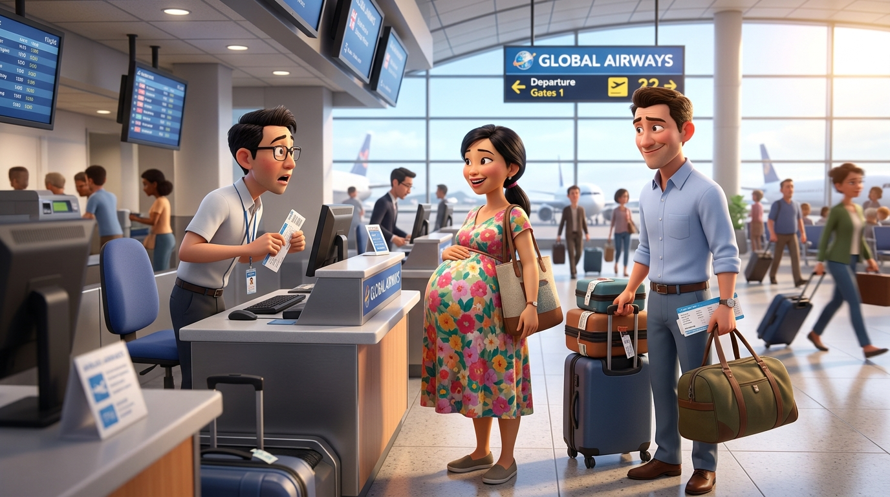
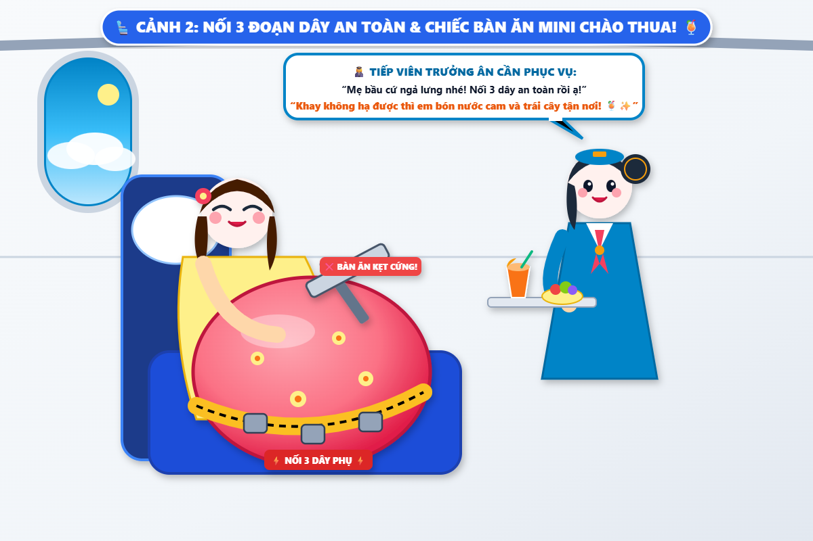
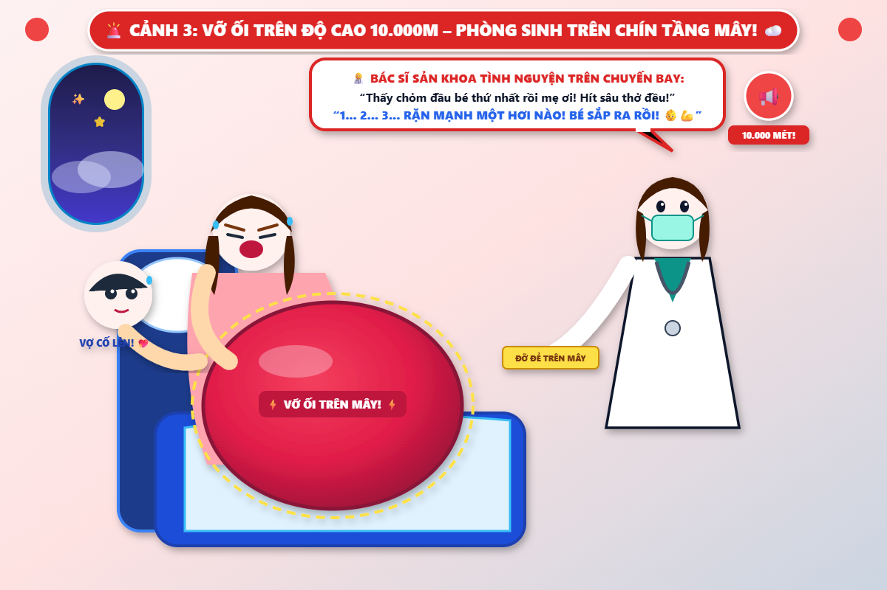
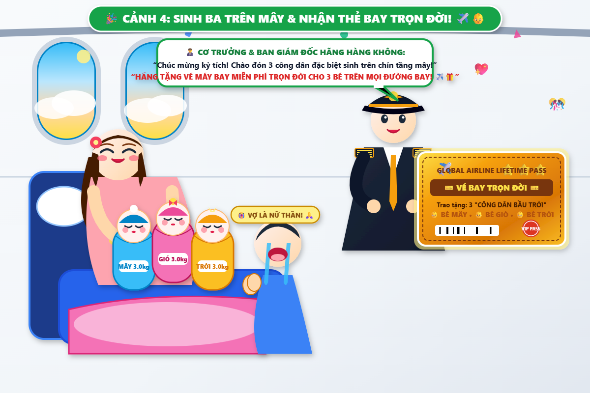

# 🍃 ✈️🤰 Truyện Tranh Hài Hước: Chiếc Bụng Bầu 160cm Đi Máy Bay & Ca Sinh Nở Trên Chín Tầng Mây!

> *Một mẩu chuyện cười "chấn động ngành hàng không" về chiếc bụng bầu ngoại cỡ 160cm của mẹ bầu mang thai ba: Nhân viên check-in sân bay tưởng mẹ giấu khinh khí cầu trong áo vội nâng hạng lên vé VIP First Class; lên máy bay phải nối thêm 3 đoạn dây an toàn phụ và chiếc bàn ăn mini chào thua; đang bay trên độ cao 10.000m bỗng dưng vỡ ối khiến cơ trưởng phát loa khẩn cấp toàn máy bay; và kết thúc bằng ca sinh ba kỳ tích đón 3 "công dân bầu trời" được hãng hàng không trao tặng vé bay miễn phí trọn đời!*

---

## 🎨 Tranh Hoạt Hình 3D Pixar Sống Động (16:9 - 1376 × 768)

---

## 📖 Chi Tiết Từng Phân Cảnh (Comic Scenes)

### ✈️ Cảnh 1: Sự Cố Cân Hành Lý Tại Quầy Check-in Sân Bay!

> **Bối cảnh:** Sáng sớm tại nhà ga quốc tế sân bay Tân Sơn Nhất, mẹ bầu mang thai ba tròn 37 tuần cùng chồng làm thủ tục lên chuyến bay về quê dưỡng sinh. Mẹ diện một chiếc váy bầu hoa rực rỡ, nhưng chiếc bụng bầu 160cm nhô dài về phía trước hơn 1 mét như một quả khí cầu khổng lồ.
> 
> Vừa bước tới quầy check-in, anh nhân viên hàng không đeo kính cận tròn xoe mắt, chiếc bút bi trên tay rơi đánh *"cạch"* xuống bàn. Anh ta nhìn chằm chằm vào chiếc bụng tròn vo rồi nuốt nước bọt ừng ực:
> 
> 👨‍💼 **Nhân viên check-in (giọng run rẩy, mở to mắt):**  
> *“Dạ... em chào chị ạ! Cho em hỏi... chị có giấu kiện hành lý xách tay quá khổ hay quả bóng bay khổng lồ nào dưới lớp váy hoa không ạ? Chiếc bụng này mà tính cước hành lý vượt kích thước thì phải mua thêm vé riêng mất thôi!”*
> 
> 🤰 **Mẹ bầu (hai tay ôm bụng bầu, cười rạng rỡ):**  
> *“Hành lý xách tay gì đâu em ơi! Đây là 3 đứa nhỏ nhà chị đang đòi đi du lịch ngắm mây đấy! Em xem có chỗ nào rộng rãi nhét vừa chiếc bụng 160cm này của chị không?”*
> 
> Thấy tình huống đặc biệt có một không hai, anh nhân viên lập tức in ngay 2 tấm vé VIP: **“NÂNG HẠNG MIỄN PHÍ LÊN KHOANG THƯƠNG GIA FIRST CLASS!”** để phục vụ mẹ bầu tối đa!

---

### 💺 Cảnh 2: Nối 3 Đoạn Dây An Toàn & Bàn Ăn Mini Chào Thua!

> **Dẫn truyện:** Lên máy bay, mẹ bầu tiến vào khoang thương gia sang trọng. Dù ghế ngồi rộng thênh thang, nhưng khi cài dây an toàn máy bay, chiếc dây tiêu chuẩn chỉ ôm được... một nửa vòng bụng!
> 
> Cô tiếp viên trưởng nhanh trí mang ngay **3 chiếc dây nối phụ (seatbelt extension)** bấm *"cách... cách... cách"* nối dài thành một sợi đai vàng óng quấn quanh chiếc bụng tròn căng như quả cầu. Chưa hết, chiếc bàn ăn mini trên lưng ghế gập xuống nửa chừng thì bị chiếc bụng bầu chặn cứng ngắc không thể hạ phẳng được!
> 
> 👩‍✈️ **Tiếp viên trưởng (nở nụ cười thân thiện, ân cần phục vụ):**  
> *“Mẹ bầu cứ yên tâm nằm ngả lưng nhé! Khay ăn không hạ được thì em sẽ cầm ly nước cam ép và hoa quả bón tận nơi cho chị! Phi hành đoàn hôm nay xin phục vụ Mẹ Siêu Nhân hết mình! 🍹✨”*
> 
> 👨 **Bố (ngồi bên cạnh ôm túi tã sữa, thở phào nhẹ nhõm):**  
> *“Đúng là nhờ chiếc bụng 160cm của vợ mà cả đời anh lần đầu tiên được trải nghiệm dịch vụ chăm sóc VIP như nguyên thủ quốc gia! 🤩”*

---

### ☁️ Cảnh 3: Vỡ Ối Trên Độ Cao 10.000m – Phòng Sinh Dã Chiến Trên Mây!

> **Dẫn truyện:** Khi máy bay đang lướt êm ái trên tầng mây xanh ở độ cao 10.000 mét, bỗng nhiên mẹ bầu ôm chặt bụng khẽ reo lên một tiếng: *"Á! Anh ơi... hình như em vỡ ối rồi!"*. Cơn co thắt dồn dập báo hiệu các thiên thần nhỏ đòi ra ngoài ngắm mây trời sớm!
> 
> 🚨 **Cơ trưởng phát loa khẩn cấp rung chuyển cả chuyến bay:**  
> *"TÙNG... TÙNG... Xin hành khách chú ý! Chuyến bay VN-160 đang có một ca chuyển dạ khẩn cấp của mẹ bầu mang thai ba! Trên máy bay có bác sĩ sản khoa nào xin vui lòng liên hệ ngay với tiếp viên!"*.
> 
> May mắn thay, một nữ bác sĩ sản khoa đang đi du lịch liền xung phong chạy lên! Các tiếp viên cuống cuồng lấy chăn ấm, nước nóng, khăn vô trùng, biến toàn bộ khoang thương gia thành một phòng sinh dã chiến trên chín tầng mây! Cả máy bay nín thở, chắp tay cầu nguyện cho mẹ tròn con vuông!
> 
> 👩‍⚕️ **Bác sĩ (đeo găng tay y tế, động viên mẹ):**  
> *“Hít sâu thở đều nào mẹ ơi! Thấy chỏm đầu em bé thứ nhất rồi! 1... 2... 3... RẶN MẠNH MỘT HƠI NÀO!”*

---

### 🎉 Cảnh 4: Hạ Cánh An Toàn – Sinh Ba Trên Mây & Tấm Thẻ Bay Trọn Đời!

> **Dẫn truyện:** *"OE... OE... OA!"* – Ba tiếng khóc trong trẻo, vang dội liên tiếp cất lên xé toạc không gian tĩnh lặng trên tầng mây!
> 
> 👶 **Bé Mây (Anh cả):** Nặng **3.0kg**!  
> 👶 **Bé Gió (Chị hai):** Nặng **3.0kg**!  
> 👶 **Bé Trời (Em út):** Nặng **3.0kg**!  
> 
> Tổng cộng **9.0kg** thịt thơm tho bụ bẫm chào đời ngay trên máy bay! Khi bánh đáp phi cơ chạm đường băng hạ cánh an toàn, cả chuyến bay vỡ òa trong tràng pháo tay sấm sét!
> 
> 🎫✈️ **Món quà lịch sử của Hãng Hàng Không:**  
> Đích thân Cơ trưởng và Ban giám đốc sân bay lên tận máy bay trao tặng mẹ một tấm thẻ vàng danh dự khổng lồ:
> **"TẶNG VÉ MÁY BAY MIỄN PHÍ TRỌN ĐỜI TRÊN MỌI ĐƯỜNG BAY CHO 3 CÔNG DÂN BẦU TRỜI!"**
> 
> 😭 **Bố (quỳ gối ôm chân vợ khóc nấc vì tự hào):**  
> *“Vợ ơi... Em không phải người thường nữa rồi! Em là Nữ Thần Bầu Trời! Một chuyến bay mà em rinh về hẳn 3 đứa con bụ bẫm lẫn 3 tấm vé bay miễn phí trọn đời! Anh xin tôn vợ làm Thần Tượng số 1 thế giới! 😭🙏💖”*

---

## 💬 Bài Học & Góc Cười

- 🤰 **Sức mạnh kỳ diệu của người mẹ:** Dù ở dưới mặt đất hay trên độ cao 10.000 mét giữa chín tầng mây, bản năng người mẹ vẫn luôn kiên cường, vượt qua mọi hoàn cảnh để đưa con chào đời bình an.
- 💖 **Tình người ấm áp trên những chuyến bay:** Sự chung tay của phi hành đoàn, bác sĩ tình nguyện và sự nhường nhịn, cổ vũ của tất cả hành khách đã tạo nên một câu chuyện cổ tích hiện đại đầy nhân văn.
- ✈️ **Kỷ niệm để đời:** Ba bé Mây - Gió - Trời chắc chắn sẽ có câu chuyện sinh nhật độc nhất vô nhị để kể lại cho con cháu sau này!

---

*#truyencuoi #truyentranh #hoathinh3d #pixar #mebau #bungbau160cm #sinhba #trenmaybay #10000m #vemaybaytrondoi #giadinhhanhphuc #kyniemkhongquen*
