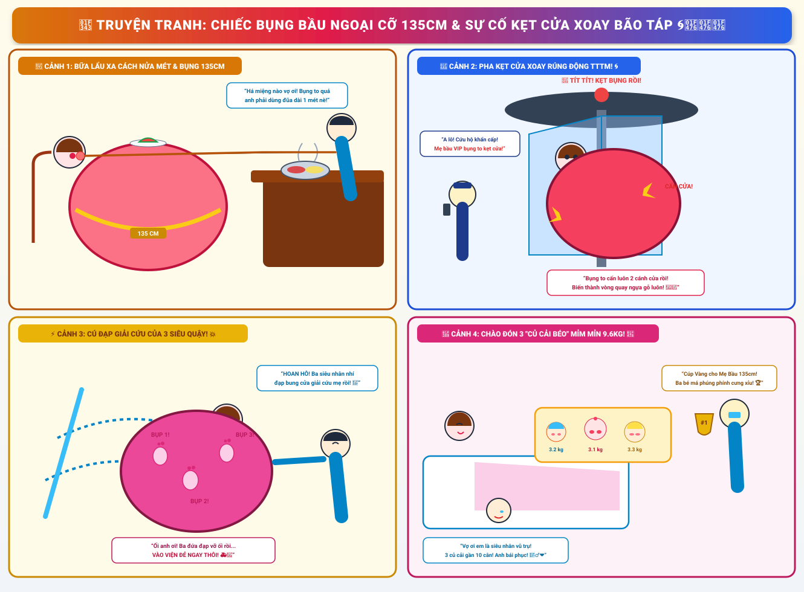
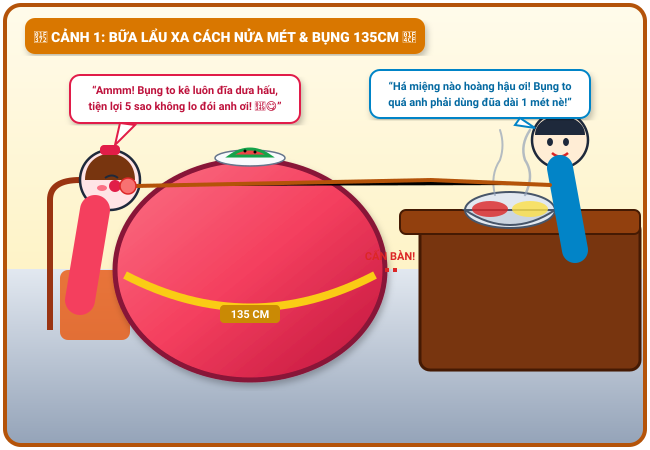
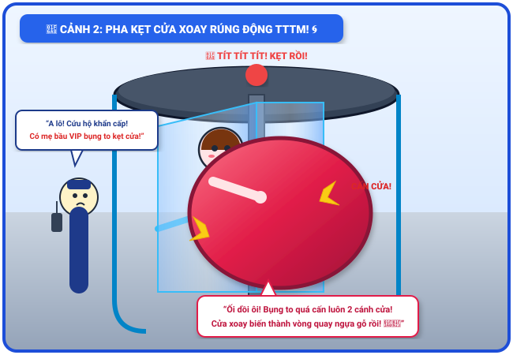
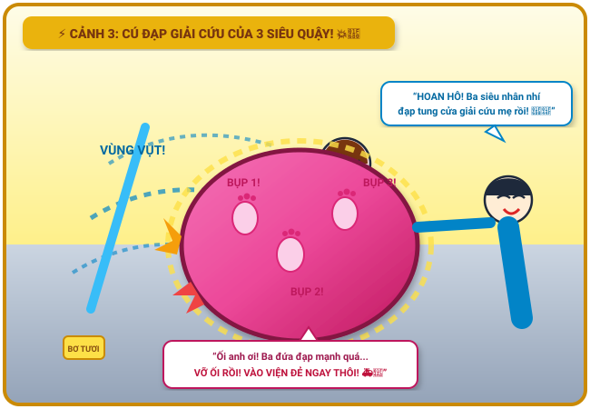
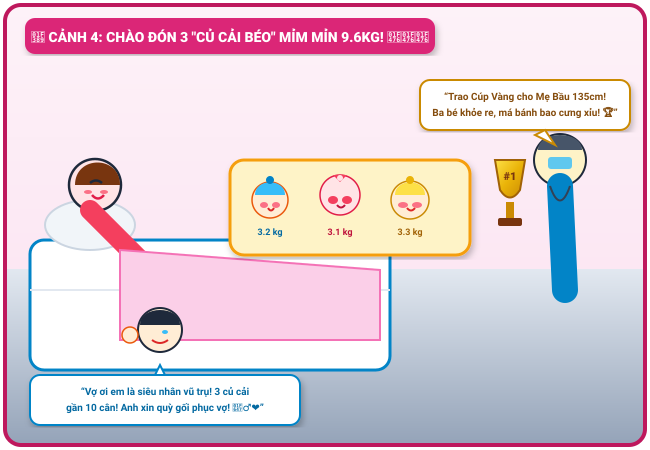

# 🍃 🤰🌀 Truyện Tranh Hài Hước: Chiếc Bụng Bầu Ngoại Cỡ 135cm & Sự Cố Kẹt Cửa Xoay Bão Táp

> *Một câu chuyện cười ra nước mắt, dí dỏm và ngập tràn tình yêu thương về chiếc bụng bầu "vượt mọi chuẩn mực kích thước" 135cm của mẹ: từ bữa tiệc lẩu ngồi cách xa nửa mét phải dùng đũa câu cá gắp tôm, sự cố kẹt cứng giữa hai cánh cửa xoay tự động rúng động cả trung tâm thương mại, cuộc giải cứu bằng bơ thực vật kết hợp cú đạp phản lực sấm sét của ba chú siêu quậy, cho tới màn vượt cạn thần tốc đón trọn 3 "chú củ cải béo" mỉm mỉn nặng gần 10kg!*

---

## 🎨 Trọn Bộ Truyện Tranh (Comic Strip)

---

## 📖 Chi Tiết Từng Phân Cảnh (Comic Panels)

### 🍲 Cảnh 1: Bữa Lẩu Xa Cách Nửa Mét & Chiếc Bàn Ăn Bất Khả Thi

> **Dẫn truyện:** Bước sang tuần thứ 38 của thai kỳ tam thai, chiếc bụng bầu của mẹ đã đạt đến cảnh giới "thần sầu quỷ khốc". Với chu vi đo bằng thước dây thợ may lên tới **135 centimet**, chiếc bụng tròn vo, căng bóng và nhô thẳng về phía trước chẳng khác nào mẹ đang giấu nguyên một quả khinh khí cầu mini dưới lớp váy bầu màu hồng sen rực rỡ.
> 
> Để tẩm bổ cho người vợ anh hùng trước ngày lâm bồn, tối cuối tuần bố quyết định đưa mẹ đi ăn nhà hàng lẩu băng chuyền cao cấp. Thế nhưng, vừa bước vào bàn tiệc, một bài toán hình học hóc búa bậc nhất đời người đã xảy ra:
> - Mẹ kéo ghế lại gần bàn thì... **KHỰC!** Chiếc bụng bầu tròn xoe chạm cứng ngắc vào mép bàn gỗ trước tiên!
> - Khoảng cách từ thân người và hai cánh tay của mẹ tới mặt bàn bị chiếc bụng cản trở, tạo thành một "vùng đệm an toàn" rộng tới... **nửa mét**! Mẹ dù có rướn người hết cỡ cũng chỉ với tới chiếc khăn giấy đặt ở rìa bàn!
> 
> 🎣 **Tuyệt chiêu đũa câu cá của ông bố:**  
> Không hề nao núng, bố lập tức gọi phục vụ mượn một đôi đũa nấu ăn chuyên dụng dài cả mét. Bố đứng hẳn sang mép đối diện, đóng vai một "cần thủ cự phách": nhúng bò Wagyu, vớt tôm viên đỏ mọng rồi vươn đũa qua chiếc bụng bầu khổng lồ đút tận miệng cho vợ!
> 
> 🍉 **Tiện ích bàn phụ di động:**  
> Độc lạ hơn nữa, đỉnh chiếc bụng bầu tròn căng của mẹ quá bằng phẳng và êm ái, thế là mẹ thản nhiên kê luôn một chiếc đĩa sứ đựng dưa hấu tráng miệng và cốc nước cam lên đỉnh bụng để vừa nhâm nhi vừa thư giãn!
> 
> 👨 **Bố (vừa vớt tôm vừa lau mồ hôi trán, cười ha hả):**  
> *“Há miệng to nào hoàng hậu ơi! Bụng em to kỷ lục thế này làm anh phục vụ bàn phải sắm đũa dài một mét mới với tới miệng vợ! Hôm nay anh xin làm shipper tận răng cho bốn mẹ con luôn! 🥢🦐”*
> 
> 🤰 **Mẹ (nhai tôm viên nhồm nhoàm, xoa xoa đỉnh bụng):**  
> *“Ammm! Ngon tuyệt cú mèo! Bụng to thế này tiện lợi 5 sao anh ơi, khỏi cần với tay mỏi lưng, kê luôn đĩa dưa hấu lên đỉnh bụng ăn tráng miệng vừa êm vừa mát! Ba em bé bên trong còn đang lắc lư theo điệu nhạc nhà hàng nữa kìa! 🍉🎶”*

---

### 🚨 Cảnh 2: Pha Kẹt Cửa Xoay Rúng Động Trung Tâm Thương Mại

> **Dẫn truyện:** Ăn no nê nứt bụng, hai vợ chồng thong thả dạo bộ xuống sảnh chính trung tâm thương mại để chuẩn bị đón taxi về nhà. Lối ra của tòa nhà là chiếc **cửa kính xoay tự động 4 cánh** khổng lồ, sáng loáng và xoay tròn nhịp nhàng đón hàng ngàn lượt khách mỗi ngày.
> 
> Người mẹ tự tin bước vào một khoang cánh cửa xoay. Thế nhưng, người tính không bằng... chiếc bụng tính!
> 
> 🌀 **Sự cố cấn bụng thế kỷ:**  
> Khi cánh cửa kính phía sau vừa đẩy tới lưng mẹ, thì chiếc bụng bầu siêu to nhô ra 135cm đã **chạm cứng vào cánh cửa kính phía trước**!
> - Khoảng cách giữa hai cánh cửa chỉ thiết kế cho người bình thường (khoảng 60cm).
> - Trong khi tổng chiều dài từ lưng đến đỉnh bụng bầu của mẹ đã chạm ngưỡng... **75cm**!
> 
> 🚨 **Chuông báo động vang rền:**  
> Cảm biến lực và cảm biến quang học của cánh cửa tự động lập tức nhận diện chướng ngại vật cấn kẹt:
> **“TÍT... TÍT... TÍT... BÍP BÍP BÍP! PHÁT HIỆN SỰ CỐ CỨNG KẸT! HỆ THỐNG PHANH KHẨN CẤP KÍCH HOẠT!”**  
> Chiếc cửa xoay dừng khựng lại ngay lập tức! Mẹ bầu đứng sừng sững giữa hai cánh kính trong suốt ở tư thế nửa người trong sảnh, nửa bụng ngoài trời, tròn trĩnh và đáng yêu hệt như một cô búp bê Matryoshka khổng lồ được trưng bày trong lồng kính VIP!
> 
> 👮‍♂️ **Bác bảo vệ sảnh (hốt hoảng cầm bộ đàm hét to vào loa):**  
> *“A lô! Trưởng ca trực nghe rõ trả lời! Lối vào cửa số 1 có tình huống khẩn cấp! Một mẹ bầu VIP mang chiếc bụng bầu kỷ lục đang bị kẹt cứng giữa hai cánh cửa xoay! Yêu cầu mang dầu ăn và đội cứu hộ tới ngay lập tức!”*
> 
> 🤰 **Mẹ bầu (hai tay ôm chặt chiếc bụng tròn vo, cười ngặt nghẽo):**  
> *“Ối dồi ôi cứu mẹ con em với! Bụng to quá đi đâu bụng cũng chạm đích trước cả người thế này! Bây giờ em thành nhân vật chính trong trò chơi vòng quay ngựa gỗ của trung tâm thương mại rồi các bác ơi! 🎠🤣”*
> 
> 👨 **Bố (bên ngoài vách kính đứng ôm đầu mếu máo nhưng miệng vẫn ngoác ra cười):**  
> *“Vợ ơi bình tĩnh thở sâu nhé! Anh đã bảo bụng em to bằng cả quả địa cầu rồi mà em cứ đòi chen vào cửa xoay công nghệ cao cơ! Để anh kéo em ra!”*

---

### ⚡ Cảnh 3: Cuộc Giải Cứu Dở Khóc Dở Cười & Cú Đạp Phản Lực Của 3 Siêu Quậy

> **Dẫn truyện:** Chỉ trong vòng 3 phút, cửa xoay trung tâm thương mại đã chật kín hàng trăm khách mua sắm đứng vây quanh cổ vũ nhiệt tình. Đội ngũ kỹ thuật tòa nhà và bác bảo vệ mang tới hai hộp **bơ thực vật** và nước xà phòng ấm, cẩn thận bôi trơn hai mép cánh cửa kính để tìm cách kéo mẹ trượt ra ngoài. Bố đứng phía trước nắm chặt lấy hai bàn tay vợ, vừa đếm nhịp vừa kéo: *"1... 2... 3... Cố lên vợ ơi!"*.
> 
> Nhưng chiếc bụng bầu 135cm đàn hồi quá tốt, vừa kéo ra được hai phân thì lại nảy ngược trở lại vị trí cũ như một chiếc đệm lò xo cao su thiên nhiên!
> 
> 💥 **Cú hiệp lực của ba "chiến binh nhí":**  
> Dường như cảm nhận được mẹ đang bị mắc kẹt, ba bạn nhỏ trong bụng mẹ quyết định không thể ngồi yên khoanh tay nhìn!  
> Bất ngờ, ba bàn chân bé xíu xiu đồng loạt nhô lên thành ba cục u tròn trĩnh trên thành bụng mẹ:
> - **Cục thứ nhất:** *"BỤP!"* – Bé anh cả đạp thẳng vào cánh cửa kính phía trước!
> - **Cục thứ hai:** *"BỤP!"* – Bé thứ hai đạp chéo vào thanh nhôm bên hông!
> - **Cục thứ ba:** *"BỤP!"* – Bé út bồi thêm một cú song phi phản lực cực mạnh!
> 
> 🚀 **Vọt ra ngoài như tên lửa phóng:**  
> Lực đàn hồi từ chiếc bụng bầu kết hợp với lớp bơ trơn trượt và ba cú đạp sấm sét đã tạo nên một lực đẩy phản lực vô tiền khoáng hậu!  
> **"VÙNG VỤT... BOINGGGGGG!"** – Cánh cửa xoay quay tít mù một vòng, đẩy mẹ bầu phóng vọt ra khỏi lồng kính, hạ cánh êm ru trọn vẹn vào vòng tay dang rộng của bố!
> 
> 👏 **Tiếng vỗ tay rung chuyển trung tâm thương mại:**  
> Hàng trăm người chứng kiến đồng loạt hò reo, vỗ tay rầm rộ như đội tuyển bóng đá vừa ghi bàn thắng vàng ở phút 90!
> 
> 👨 **Bố (ôm chặt lấy mẹ, mắt sáng rực tự hào):**  
> *“TUYỆT VỜI! HOAN HÔ BA SIÊU NHÂN NHÍ CỦA BA! Chưa ra đời mà đã biết tung cước giải cứu mẹ khỏi cửa xoay rồi! Đẳng cấp vô địch thiên hạ!”*
> 
> 🤰 **Mẹ (bỗng giật nảy mình, hai tay ôm lấy đáy bụng):**  
> *“Ối... ối anh ơi! Ba đứa nhỏ đạp bung cửa xong hình như... VỠ ỐI LUÔN RỒI! Dòng nước ấm tràn ra rồi anh ơi! GỌI CẤP CỨU 115 ĐƯA EM VÀO VIỆN ĐẺ GẤP! 🚑💨”*

---

### 🎉 Cảnh 4: Màn Vượt Cạn Sấm Sét – Chào Đón 3 "Củ Cải Béo" Mỉm Mỉn 9.6kg!

> **Dẫn truyện:** Tiếng còi xe cứu thương *"Í... O... Í... O...!"* xé toạc màn đêm đưa mẹ thẳng tiến vào phòng sinh cấp cứu bệnh viện phụ sản trung ương. Toàn bộ kíp trực gồm 2 bác sĩ trưởng khoa và 4 nữ hộ sinh đã sẵn sàng nghênh đón chiếc bụng bầu kỷ lục 135cm.
> 
> ⚡ **Cơn đau chuyển dạ và tiếng thét nội lực:**  
> Khác với những ca sinh nở mệt mỏi kéo dài cả ngày trời, ba bạn nhỏ sau màn khởi động "đạp tung cửa xoay" ở trung tâm thương mại dường như đã vô cùng nóng lòng muốn ra ngoài nhìn ngắm thế giới!
> 
> Mẹ nằm trên bàn sinh, hai tay nắm chặt tay vịn thép, hít một hơi sâu căng tràn lồng ngực rồi tung ra ba cú rặn sấm sét:
> - **Hơi rặn thứ nhất:** Bé trai đầu lòng (tã xanh dương) vọt ra ngoài, nặng tròn trĩnh **3.2 kg**!
> - **Hơi rặn thứ hai:** Bé gái thứ hai (tã hồng đính nơ) oe oe chào đời, má phúng phính bánh bao nặng **3.1 kg**!
> - **Hơi rặn thứ ba:** Bé trai út (tã vàng tươi) bụ bẫm bung ra, nặng kỷ lục **3.3 kg**!
> 
> 👶👶👶 **Tổng trọng lượng kỳ tích: 9.6 KG!**  
> Gần 10 cân thịt thơm tho bụ bẫm, da dẻ trắng hồng hào, ba khuôn mặt tròn xoe "mỉm mỉn" xếp thành hàng ngang trên chiếc nôi sưởi ấm áp! Chiếc bụng bầu 135cm khổng lồ của mẹ sau khi hoàn thành nhiệm vụ thiêng liêng đã nhẹ nhõm xẹp xuống trong niềm hạnh phúc vô biên.
> 
> 🏆 **Lễ trao cúp vàng vô tiền khoáng hậu:**  
> Bác sĩ trưởng khoa tay cầm chiếc cúp vàng lưu niệm của bệnh viện, trân trọng trao tặng tận tay người mẹ siêu nhân:
> 
> 👨‍⚕️ **Bác sĩ trưởng khoa (cúi đầu thán phục):**  
> *“Tôi đỡ đẻ hơn 30 năm nay, nhưng mang tam thai mà bé nào cũng trên 3 ký, tổng cộng gần 10 ký thịt mà sinh thường khỏe re thế này thì đúng là đệ nhất kỳ quan y học! Xin trao tặng mẹ chiếc cúp vô địch 'Bà Mẹ Của Năm'!”*
> 
> 👨 **Bố (quỳ gối bên giường bệnh, một tay nắm tay vợ, một tay gạt nước mắt xúc động):**  
> *“Vợ ơi em là vị thánh sống của đời anh! Thảo nào bụng em to 135cm đi đâu cũng cấn! Ba củ cải béo múp míp thế này thì từ mai bố nguyện xin nghỉ phép 6 tháng ở nhà pha sữa, giặt tã và phục vụ bốn mẹ con suốt đời! 😭💖”*
> 
> 🤰 **Mẹ (mỉm cười rạng rỡ, ôm ba thiên thần nhỏ vào lòng):**  
> *“Mọi sự cố kẹt cửa xoay hay đi ăn lẩu xa nửa mét giờ đổi lại ba củ cải béo mỉm mỉn này, mẹ thấy xứng đáng gấp ngàn lần! Cảm ơn ba thiên thần đã đến với ba mẹ nhé! ❤️”*

---

## 📸 Bảng Tổng Hợp Những Kỷ Lục Độc Lạ Trong Chuyến Vượt Cạn

| Hạng Mục Kỷ Lục | Con Số / Chi Tiết Thực Tế | Ý Nghĩa / Bình Luận Hài Hước |
| :--- | :---: | :--- |
| 📏 **Chu vi chiếc bụng bầu** | **135 cm** | To hơn cả vòng eo của sumo, dùng thước dây may đồ mới đo trọn |
| 🥢 **Chiều dài đôi đũa của bố** | **100 cm (1 mét)** | Dài như cần câu cá để với qua chiếc bụng tiếp tế đồ ăn |
| 🌀 **Thời gian kẹt cửa xoay** | **8 phút 15 giây** | Trở thành "búp bê lồng kính VIP" thu hút 500 khán giả cổ vũ |
| 🧈 **Vật liệu giải cứu** | **2 hộp bơ thực vật + 3 cú đạp** | Bơ bôi trơn kết hợp phản lực tên lửa của 3 em bé trong bụng |
| 👶 **Tổng cân nặng tam thai** | **9.6 kg** (3.2kg + 3.1kg + 3.3kg) | Kỷ lục bệnh viện, ba em bé má bánh bao mỉm mỉn cưng xỉu |
| 🏆 **Giải thưởng vinh danh** | **Cúp Vàng "Bà Mẹ Của Năm"** | Bác sĩ trưởng khoa đích thân trao tặng ngay tại phòng hậu sản |

---

## 💬 Góc Bình Luận & Bài Học Yêu Thương

> [!TIP]
> **Bài học rút ra cho các ông bố và mẹ bầu:**
> 1. **Về hình học không gian:** Khi bụng bầu đã vượt mốc 120cm, hãy luôn tránh xa các loại cửa xoay tự động, cửa quay tàu điện ngầm và lối đi hẹp ở rạp chiếu phim! Sự lựa chọn an toàn nhất là cửa mở hai cánh hoặc cửa cuốn rộng rãi!
> 2. **Về tình cảm gia đình:** Đằng sau chiếc bụng bầu to vượt mặt và những bước đi "chim cánh cụt" nặng nề là sự hy sinh vô bờ bến của người phụ nữ. Một người chồng tâm lý, biết cầm đũa dài đút từng miếng ăn và luôn bên cạnh che chở sẽ là chỗ dựa tuyệt vời nhất để mẹ vượt cạn thành công!
> 3. **Niềm vui làm cha mẹ:** Mọi mệt mỏi, khó khăn hay những pha dở khóc dở cười suốt 9 tháng 10 ngày đều sẽ tan biến như một giấc mơ khi nghe tiếng khóc chào đời và ngắm nhìn những thiên thần nhỏ mỉm mỉn nằm trọn trong vòng tay yêu thương! 🥰💖
