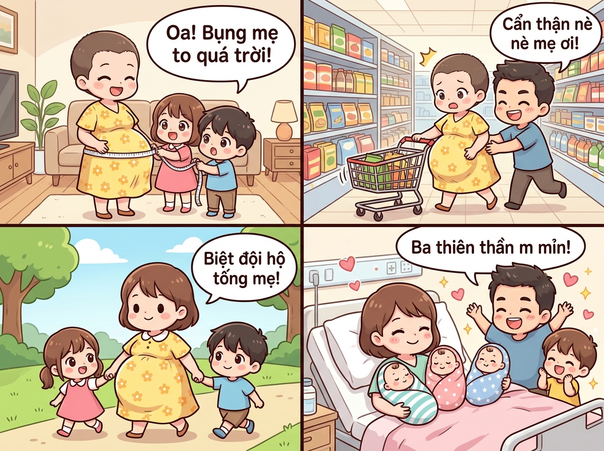
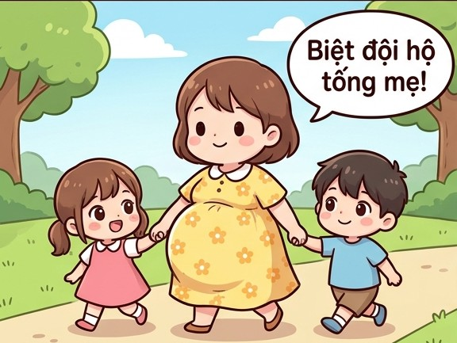
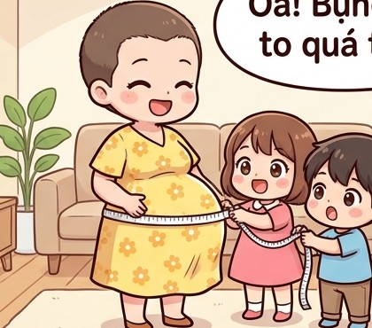

# 🍃 🤰🍉 Truyện Tranh Dài: Chiếc Bụng Bầu "Siêu To Khổng Lồ" Của Mẹ & Biệt Đội Hộ Tống Nhí

> *Câu chuyện gia đình siêu hài hước, ấm áp và ngập tràn niềm vui về chiếc bụng bầu "siêu to kỷ lục" của mẹ: từ màn đo bụng bằng thước dây thợ may, sự cố ủi xe đẩy tự động trong siêu thị, cho đến sự ra đời kỳ diệu của ba thiên thần nhỏ mỉm mỉn!*

---

## 🎨 Trọn Bộ Truyện Tranh Hoạt Hình (Comic Strip)

---

## 📖 Chi Tiết Từng Hồi Truyện Hài Hước

### 📏 Hồi 1: Chiếc Thước Dây Kỷ Lục – "Oa! Bụng Mẹ To Quá Trời!"

Vào một buổi chiều cuối tuần ấm áp, mẹ đang ngồi nghỉ ngơi trên chiếc ghế sofa quen thuộc trong phòng khách. Mẹ đang ở tháng thứ 8 của thai kỳ. Khác với những lần mang thai trước, lần này chiếc bụng bầu của mẹ phát triển với tốc độ "tên lửa", tròn xoe, căng bóng và nhô cao vượt mặt, nhìn từ đằng trước chẳng khác nào giấu nguyên một quả dưa hấu khổng lồ dưới lớp váy bầu vàng hoa nhí xinh xắn.

Thấy mẹ ngồi thở phù phù vì nặng nề, hai nhóc tì nhà mẹ là bé Bống (6 tuổi) và cu Bi (4 tuổi) liền nảy ra một ý tưởng tinh nghịch. Bi lon ton chạy vào phòng ngủ của bà ngoại, lục tung hộp đồ may vá và lôi ra một chiếc thước dây thợ may màu trắng dài ngoằng:

> 👦 **Cu Bi (mắt sáng rực, giơ sợi thước dây):** *“Chị Bống ơi! Mau lại đây, hôm nay tụi mình làm kỹ sư đo xem bụng mẹ to bao nhiêu mét nào!”*  
> 👧 **Bé Bống (khoái chí vỗ tay):** *“Hay quá! Để chị giữ một đầu, em kéo đầu kia quấn quanh bụng mẹ nha!”*

Hai đứa nhỏ cẩn thận vòng sợi thước dây quanh chiếc bụng bầu tròn trịa núng nính của mẹ. Bố đứng bên cạnh cầm sổ bút ghi chép như trọng tài Olympic. Khi hai đầu dây chạm vào nhau, con số hiện ra khiến cả ba bố con đều trố tròn mắt há hốc mồm:

> 👧 **Bé Bống (reo tướng lên kinh ngạc):** *“OA OA! BỤNG MẸ TO QUÁ TRỜI LUÔN NÈ BỐ ƠI! Hơn 120 centimet rồi á! Bụng mẹ to bằng cả quả khinh khí cầu luôn rồi!”*  
> 🤰 **Mẹ (xoa chiếc bụng to tròn, cười hiền dịu):** *“Mấy đứa này nghịch quá cơ! Bụng mẹ to thế này là vì bên trong các em đang lớn nhanh như thổi, quậy tưng bừng suốt ngày đấy!”*  
> 👨 **Bố (cười nghiêng ngả):** *“Bụng to thế này thì bố phải đổi sang xe 7 chỗ mới chở hết hoàng thái hậu và em bé đi dạo phố mất thôi!”*

---

### 🛒 Hồi 2: Đại Náo Siêu Thị – Pha "Ủi Xe Đẩy" Bằng Bụng Bầu Tự Động!

Đến tháng thứ 9, bác sĩ khuyên mẹ nên đi bộ nhẹ nhàng để chuẩn bị vượt cạn. Thế là tối hôm đó, bố quyết định hộ tống mẹ cùng hai con đi siêu thị sắm thêm tã bỉm và đồ sơ sinh.

Vừa bước vào cổng siêu thị, chiếc bụng bầu siêu to của mẹ đã lập tức trở thành tâm điểm thu hút mọi ánh nhìn ngưỡng mộ của các cô bác xung quanh. Mẹ bước đi khệ nệ, nghiêng bên trái một nhịp, lắc bên phải một nhịp hệt như một chú chim cánh cụt dễ thương.

Và rồi, sự cố "cười ra nước mắt" đã xảy ra tại gian hàng bánh kẹo:
- Trong lúc mải nhìn ngắm hộp sữa bột trên kệ cao, mẹ khẽ rướn người tới trước.
- Vì chiếc bụng bầu nhô ra quá xa tầm nhìn, mẹ không hề hay biết chiếc xe đẩy hàng đang nằm ngay sát phía trước!
- **HÙM!** Chiếc bụng to tròn của mẹ khẽ tì nhẹ vào thanh nắm xe đẩy, thế là chiếc xe đẩy... tự động bon bon trượt về phía trước một đoạn dài!

> 😱 **Mẹ (giật mình đỏ bừng mặt, hai tay ôm vội chiếc bụng):** *“Ôi trời đất ơi! Bụng to quá, đi đâu là bụng chạm đích trước cả người luôn nè! Xe tự chạy luôn rồi anh ơi!”*  
> 👨 **Bố (chạy vội lại nắm chặt đuôi xe, cười ha hả):** *“Cẩn thận nè mẹ nó ơi! Bụng bầu này có trang bị động cơ đẩy phản lực hay sao mà xe chạy ro ro vậy kìa! Để anh giữ xe cho, em cứ thong thả chọn đồ nha!”*  
> 👧👦 **Hai đứa nhỏ (ôm bụng cười ngặt nghẽo):** *“Haha, bụng mẹ đẩy xe giỏi hơn cả ba luôn!”*

---

### 🌳 Hồi 3: Biệt Đội Hộ Tống Mẹ – Vệ Sĩ Nhí Xuất Trận!

Mỗi buổi sáng nắng sớm, mẹ đều ra công viên gần nhà để tản bộ hít thở không khí trong lành. Để đảm bảo an toàn tuyệt đối cho chiếc bụng bầu quý giá của mẹ, hai nhóc Bống và Bi đã tự phong cho mình chức danh: **"BIỆT ĐỘI HỘ TỐNG BỤNG BẦU"**.

Hình ảnh một bà mẹ mang chiếc bụng bầu to tướng tròn xoe đi giữa, hai bên là hai đứa trẻ con nắm chặt tay mẹ, mặt mũi nghiêm túc như những vệ sĩ chuyên nghiệp đã khiến cả công viên ai nhìn cũng phải mỉm cười thích thú:

> 👧 **Bé Bống (tay trái nắm tay mẹ, dõng dạc hô to):** *“Mọi người chú ý! Biệt đội hộ tống mẹ bầu siêu to đang đi ngang qua! Xin nhường đường cho mẹ con đi dạo nào!”*  
> 👦 **Cu Bi (tay phải nắm chặt tay mẹ, ngẩng đầu tự hào):** *“Mẹ đi chậm thôi nha, có hòn đá nhỏ phía trước kìa, để Bi dọn đường cho mẹ!”*  
> 🤰 **Mẹ (ngập tràn hạnh phúc, nhìn hai con âu yếm):** *“Mẹ cảm ơn hai vệ sĩ nhí của mẹ nhé! Có hai con đi kèm thế này thì mẹ và các em trong bụng an tâm trăm phần trăm luôn!”*

Từng bước chân chim cánh cụt của mẹ trên con đường rợp bóng cây xanh rộn rã tiếng cười, xua tan đi mọi mệt mỏi và cảm giác nặng nề của những ngày cuối thai kỳ.

---

### 🎉 Hồi 4: Ngày Vượt Cạn Kỳ Tích – Chào Đón "Ba Thiên Thần Mỉm Mỉn"!

Rồi ngày trọng đại nhất cũng đã điểm! Đêm hôm ấy, cơn đau chuyển dạ xuất hiện dồn dập. Bố tức tốc lái xe đưa mẹ vào viện phụ sản. Khi bác sĩ kiểm tra và đưa mẹ vào phòng sinh, cả gia đình hồi hộp đứng chờ bên ngoài cánh cửa.

Bên trong phòng sinh, dưới sự hỗ trợ tận tình của ê-kíp y bác sĩ, mẹ đã dồn hết sức mạnh và lòng dũng cảm của người phụ nữ để rặn đẻ vượt cạn. Và sự thật về chiếc bụng bầu "siêu to khổng lồ" cuối cùng đã được giải đáp một cách ngoạn mục nhất:

**Không phải một em bé... Cũng không phải sinh đôi... Mà là một ca SINH BA kỳ tích!**

Ba tiếng khóc **“Oe oe oe...!”** nối tiếp nhau vang lên trong trẻo và rộn rã:
1. Bé thứ nhất: Bé trai kháu khỉnh, nặng 2.4 kg.
2. Bé thứ hai: Bé gái trắng hồng, nặng 2.3 kg.
3. Bé thứ ba: Bé trai bụ bẫm, má bánh bao núng nính nặng 2.5 kg!

Cả ba em bé đều khỏe mạnh tuyệt đối, da dẻ hồng hào, má phúng phính "mỉm mỉn" như ba chiếc bánh bao sữa ấm áp xếp cạnh nhau!

Tại phòng hậu sản ngập tràn ánh nắng ban mai, mẹ nằm tựa lưng êm ái trên giường bệnh, nở nụ cười rạng ngời hạnh phúc. Bố và hai con ùa vào phòng, mắt ai cũng sáng lấp lánh niềm vui sướng không kể xiết:

> 👨 **Bố (giơ hai tay reo hò, nước mắt hạnh phúc rưng rưng):** *“Trời ơi tuyệt vời quá vợ ơi! BA THIÊN THẦN MỈM MỈN luôn kìa! Thảo nào bụng em to bằng cả quả địa cầu như thế! Em giỏi nhất trên đời!”*  
> 👧 **Bé Bống & Cu Bi (nhón chân ngắm ba em bé):** *“Oa... Ba em bé dễ thương quá ba ơi! Má em nào cũng phúng phính cưng xỉu! Tụi con có tận ba người bạn nhỏ để chơi cùng rồi!”*  
> 🤰 **Mẹ (xoa đầu các con, ôm trọn ba thiên thần nhỏ vào lòng):** *“Mọi mệt nhọc của chiếc bụng bầu to tướng suốt 9 tháng qua giờ đổi lại ba thiên thần mỉm mỉn này, mẹ thấy xứng đáng vô cùng! Cảm ơn cả nhà đã luôn là chỗ dựa vững chắc cho mẹ con mình nhé! ❤️”*

---

## 📸 Những Khoảnh Khắc Đáng Yêu & Ý Nghĩa

| 📏 Màn Đo Bụng Kỷ Lục | 🛒 Sự Cố Ủi Xe Siêu Thị | 👶 Ba Thiên Thần Mỉm Mỉn |
| :---: | :---: | :---: |
|  |  |  |
| *Bé Bống và Cu Bi đo bụng mẹ hơn 120cm* | *Bụng bầu to chạm đích ủi xe đẩy tự bon bon* | *Niềm hạnh phúc trọn vẹn của cả gia đình* |

---

## 💬 Bài Học & Góc Cười

- 🤰 **Sức chứa kỳ diệu của bụng mẹ:** Chiếc bụng bầu siêu to không chỉ mang trọng lượng của những đứa con, mà còn chứa đựng cả một kho tàng tình yêu thương bao la của người mẹ dành cho mầm sống.
- 👨‍👩‍👧‍👦 **Sức mạnh của sự gắn kết gia đình:** Những cử chỉ quan tâm giản dị như đo bụng bầu, đi siêu thị cùng nhau hay làm "vệ sĩ" hộ tống mẹ đi dạo chính là liều thuốc tinh thần tuyệt vời nhất giúp mẹ bầu vượt qua mọi khó khăn.
- 🍼 **Hạnh phúc nhân ba:** Ba em bé "mỉm mỉn" chào đời bình an là phần thưởng vô giá khép lại hành trình mang thai đầy ắp tiếng cười và mở ra một chương mới ngập tràn hạnh phúc cho cả gia đình!

---

*#truyencuoi #truyendai #hoathinh #comic #bungbausieuto #sinhba #mimmim #giadinh #chamsocme #hanhphuc*
