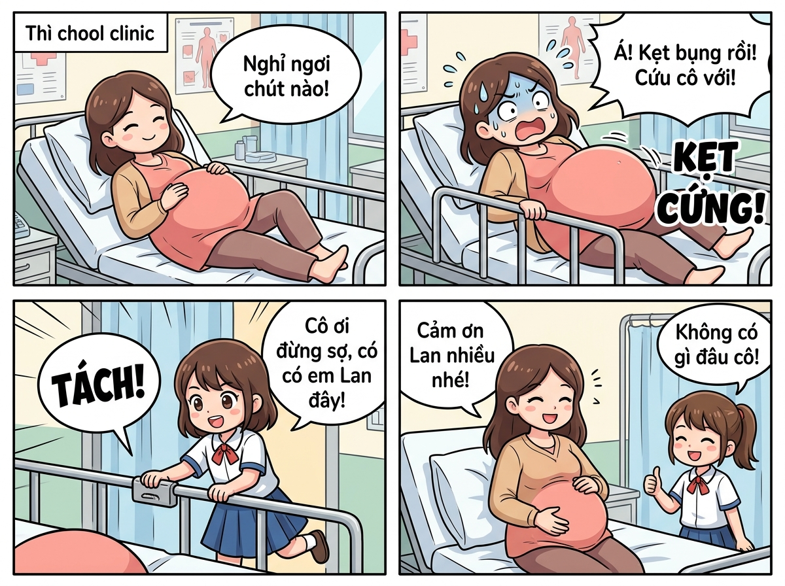

# 🍃 🏥🤰 Truyện Tranh Hài Hước: Cô Bị Kẹt Bụng Bầu Vào Thanh Giường Y Tế

> *Kỷ niệm "dở khóc dở cười" mà vô cùng ấm áp: Cô mang thai tháng cuối với chiếc bụng bầu siêu to khổng lồ, khi nằm nghỉ ở phòng y tế thì chiếc bụng bầu bị kẹt cứng ngắc vào thanh chắn giường. Lúc đó xung quanh vắng tanh không có ai, cô phải toát mồ hôi hột tự loay hoay xoay sở. Đúng lúc nguy nan, bạn Lan [nữ] vừa bước vào phòng thăm cô đã nhanh trí giải cứu chiếc bụng bầu an toàn!*

---

## 🎨 Trọn Bộ Truyện Tranh (Comic Strip)

---

## 📖 Chi Tiết Từng Phân Cảnh (Comic Panels)

### 🌟 Cảnh 1: Phòng Y Tế Bình Yên & Chiếc Bụng Bầu "Vượt Mặt"

> **Dẫn truyện:** Hôm ấy, cô cảm thấy trong người hơi mệt và nặng nề vì đang mang thai ở những tháng cuối. Chiếc bụng bầu của cô to vượt mặt, tròn xoe núng nính như ôm cả một quả dưa hấu khổng lồ bên trong chiếc váy bầu hồng xinh xắn. Cô khẽ bước vào phòng y tế trường học để nằm nghỉ ngơi một chút cho đỡ mỏi lưng. Không gian phòng y tế yên ắng, tiếng lá cây xào xạc bên ô cửa sổ, cô nằm tựa lưng êm ái trên chiếc giường bệnh màu trắng có thanh chắn an toàn hai bên, vừa thư giãn vừa âu yếm vuốt ve sinh linh bé bỏng.
> 
> 🤰 **Cô (tay nhẹ nhàng xoa xoa chiếc bụng bầu tròn xoe, mỉm cười hiền dịu):** *“Nằm nghỉ một xíu cho đỡ mỏi lưng nào... Mấy hôm nay em bé trong bụng cô quậy nhiệt tình quá, đạp bum búp suốt thôi! Chiếc bụng to tướng này làm đi lại cũng thấy khệ nệ ghê! ❤️”*
> 
> 🍃 **Không gian phòng y tế:** Tĩnh lặng, thoang thoảng mùi dầu gió dịu nhẹ, rèm cửa xanh ngọc đung đưa đón từng tia nắng vàng ấm áp...

---

### ⚡ Cảnh 2: Trở Mình Định Mệnh – Bụng Bầu Kẹt Cứng Vào Thanh Giường!

> **Dẫn truyện:** Nằm được một lúc, cô cảm thấy hơi mỏi một bên sườn nên quyết định cựa mình xoay người sang phía ngoài giường. Thế nhưng, người tính không bằng... chiếc bụng bầu tính! Trong lúc cô nghiêng người, do chiếc bụng bầu quá to và tròn, nó đã trượt tọt một nửa qua khoảng cách giữa hai thanh gióng chắn giường bằng kim loại rồi... KẸT CỨNG NGẮC! Cô muốn rút bụng lại cũng không được, mà muốn nhoài người ra phía trước cũng chẳng xong. Trớ trêu thay, nhân viên y tế vừa ra ngoài lấy thêm vật tư, trên bàn chỉ để lại mẩu giấy nhắn "Vắng mặt 10 phút". Trong phòng vắng tanh không một bóng người, cô vừa xấu hổ vừa bối rối, hai tay ra sức đẩy gióng giường, vặn vẹo người toát mồ hôi hột mà chiếc bụng to tròn vẫn dính chặt không nhúc nhích!
> 
> 😱 **Cô (mặt đỏ bừng, toát mồ hôi hột, hai tay bám chặt thanh giường dở khóc dở cười):** *“ỐI TRỜI ĐẤT ƠI! SAO TỰ DƯNG KẸT CỨNG NGẮC THẾ NÀY?! Bụng ơi là bụng, sao lại chui tọt vô gióng giường cơ chứ?! Phòng y tế lại chẳng có ai... Giờ tự gỡ mà bụng to quá không nhúc nhích nổi luôn rồi! Có ai cứu mẹ con cô với! 😭💦”*
> 
> 💥 **Tình thế cấp bách:** Chiếc bụng bầu tròn xoe bị ép chặt giữa hai thanh sắt, càng vùng vẫy càng mắc kẹt dở khóc dở cười!

---

### 💡 Cảnh 3: Bạn Lan [Nữ] Bước Vào Thăm & Pha Giải Cứu Kịp Thời

> **Dẫn truyện:** Giữa lúc cô đang lâm vào tình cảnh "tiến thoái lưỡng nan", vừa buồn cười vừa bất lực, thì tiếng cọt kẹt ở cánh cửa vang lên. Cánh cửa phòng y tế nhẹ nhàng mở ra, bạn Lan [nữ] tay xách túi quà và hộp sữa tươi rón rén bước vào định thăm cô. Vừa ngẩng đầu lên, Lan đứng hình mất hai giây khi thấy cô đang trong tư thế kỳ lạ: nằm nghiêng ép chặt chiếc bụng bầu khổng lồ vào lan can giường sắt, mặt mày nhăn nhó toát mồ hôi. Nhận ra tình huống trớ trêu, Lan vội vàng buông túi sữa, lao nhanh tới cạnh giường trấn an cô và bắt tay vào giải cứu! Lan quan sát rất nhanh cơ chế khóa của giường bệnh, đôi bàn tay khéo léo tìm ngay đến chiếc lẫy chốt an toàn và ấn mạnh xuống: "TÁCH!" - Thanh chắn giường lập tức được hạ xuống, giải phóng không gian cho chiếc bụng bầu!
> 
> 👧 **Bạn Lan [nữ] (nhanh nhẹn chạy ào tới, tay bấm chốt hạ thanh giường):** *“Cô ơi cô đừng hoảng, có em Lan đây rồi ạ! Bụng cô kẹt vô thanh chắn giường đúng không cô? Đừng gồng người nha cô... để em bấm chốt hạ thanh sắt xuống là xong ngay ạ! 1... 2... TÁCH! Ra rồi cô ơi! ❤️”*
> 
> 🤰 **Cô (thở phào nhẹ nhõm, mừng rỡ rơm rớm nước mắt):** *“Phù... May quá Lan ơi! Em vào đúng lúc như một vị cứu tinh vậy, chứ không cô với em bé nằm dính ở đây tới chiều mất thôi! Cảm ơn con nhiều lắm! 😭❤️”*

---

### 🎉 Cảnh 4: Thoát Nạn Ngoạn Mục – Cô Cảm Ơn Bạn Lan Rất Nhiều!

> **Dẫn truyện:** Chiếc bụng bầu siêu to tròn đã được giải cứu hoàn toàn nguyên vẹn, không hề có một vết xước! Cô giáo ngồi dậy ngay ngắn bên mép giường, hai bàn tay nhẹ nhàng vỗ về đứa con trong bụng. Nhìn bạn Lan [nữ] với gương mặt rạng ngời, vừa nhanh nhẹn vừa ân cần, cô cảm động nắm chặt lấy tay Lan gửi lời cảm ơn rối rít. Lan tươi cười rạng rỡ, giơ ngón tay "like" đầy tự hào. Cả hai cô trò nhìn nhau rồi cùng bật cười sảng khoái vì tai nạn hài hước có một không hai trong phòng y tế hôm nay!
> 
> 🤰 **Cô (nụ cười rạng rỡ, nắm chặt tay Lan xúc động):** *“Cô cảm ơn bạn Lan [nữ] rất nhiều nhé! Vừa chu đáo vào thăm cô, lại vừa nhanh trí, tốt bụng giải cứu hai mẹ con cô kịp thời! Em bé trong bụng cũng phải gửi lời cảm ơn chị Lan siêu nhân đấy nhé! 🥰✨”*
> 
> 👧 **Bạn Lan [nữ] (mặt ửng hồng vui sướng, cười tít mắt giơ ngón tay like):** *“Dạ không có gì đâu cô ơi! Thấy cô và em bé an toàn, khỏe mạnh là em mừng nhất rồi ạ! Sau này em bé ra đời chắc chắn sẽ nhớ kỷ niệm mẹ bị kẹt bụng giường bệnh này cho xem! Hi hi! 👍💕”*

---

## 📸 Trọn Bộ Tranh Khổ Lớn Từng Phân Cảnh

*Cảnh 1: Mẹ bầu nằm nghỉ ngơi bên chiếc bụng tròn xinh*

*Cảnh 2: Chiếc bụng bầu siêu to mắc kẹt cứng ngắc vào gióng giường y tế*

*Cảnh 3: Cứu tinh Lan nhanh trí ấn chốt gạt thanh giường "TÁCH"*

*Cảnh 4: Giải cứu thành công, cô xúc động cảm ơn bạn Lan tốt bụng*

---

## 💬 Bài Học & Góc Cười

- 🤰 **Chiếc bụng bầu siêu to và những pha "mắc kẹt" kinh điển:** Mang thai tháng cuối với chiếc bụng bầu vượt mặt là một trải nghiệm thiêng liêng nhưng cũng đi kèm vô vàn tình huống dở khóc dở cười vì kích thước "ngoại cỡ" của chiếc bụng.
- 💡 **Sự nhanh trí và chu đáo của bạn Lan [nữ]:** Bạn Lan xứng đáng nhận trọn 10 điểm tinh tế: vừa biết quan tâm vào phòng y tế thăm cô, vừa bình tĩnh quan sát lẫy khóa giường để xử lý sự cố trong tích tắc.
- ❤️ **Tình cảm ấm áp & Kỷ niệm khó quên:** Một sự cố nhỏ tại phòng y tế bỗng chốc trở thành một kỷ niệm đáng yêu, gắn kết thêm tình cảm chân thành giữa cô và bạn học trò ngoan ngoãn.

---

## 📝 Nhật Ký Kỷ Niệm (Câu Chuyện Gốc)

> *"cô tôi [ có bầu rất to] nằm ở phòng y tế thì cô bị kẹt bụng bầu vào thanh giường nhưng lúc đó không có ai cả cô phải tự mình giải quyết cùng lúc đó có bạn vào thặm cô và phát hiện cô bị kẹt bụng bầu bạnays giúp cô thoát khỏi giường cô cảm ơn bạn lan [nữ] rất nhiều"*

---

*#truyencuoi #truyentranh #comic #phongyte #bungbau #kethanhgiuong #banlan #giaicuu #amap #kyoc*
