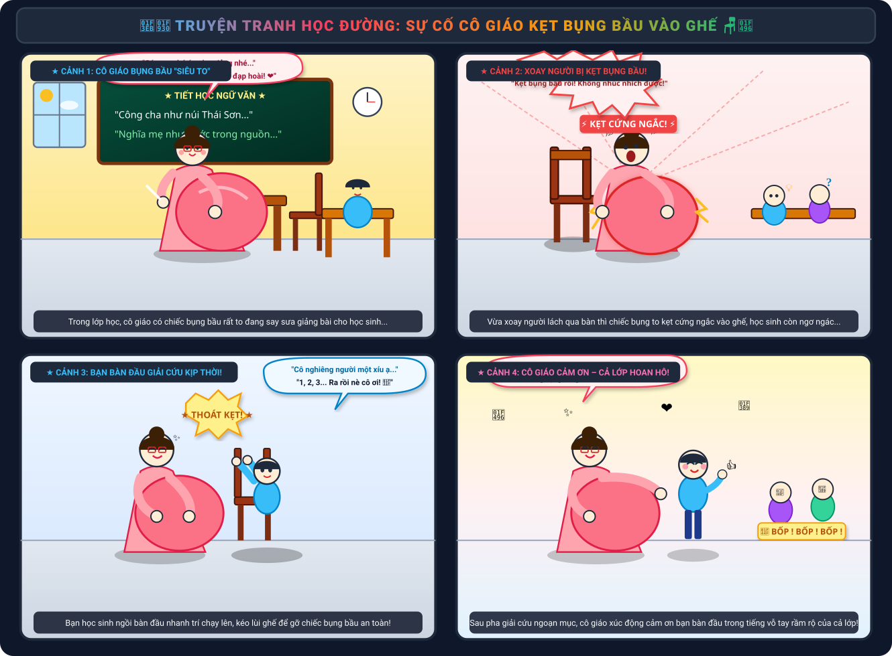
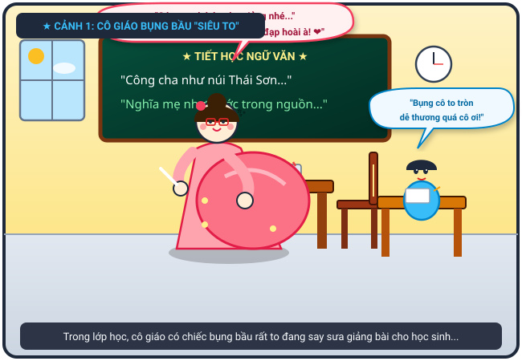
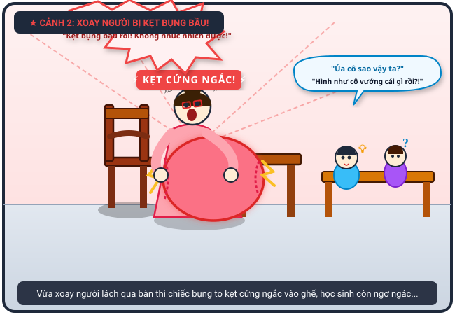
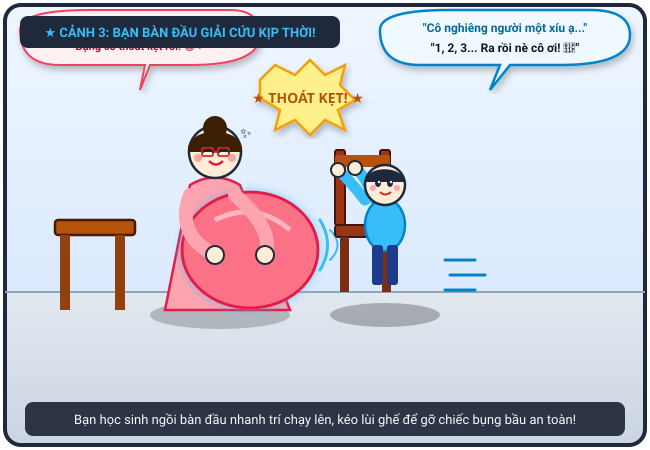
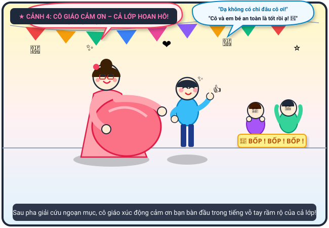

# 🍃 🏫🤰 Truyện Tranh Học Đường: Cô Giáo Bị Kẹt Bụng Bầu Vào Ghế

> *Kỷ niệm học trò "dở khóc dở cười" mà ấm áp: Cô giáo mang bụng bầu siêu to khổng lồ, khi xoay người lách qua bàn thì chiếc bụng bầu bị kẹt cứng ngắc vào khe ghế. Cả lớp còn đang ngơ ngác chưa hiểu chuyện gì thì bạn học sinh ngồi ngay bàn đầu đã nhanh trí chạy lên giải cứu chiếc bụng bầu an toàn!*

---

## 🎨 Trọn Bộ Truyện Tranh (Comic Strip)

---

## 📖 Chi Tiết Từng Phân Cảnh (Comic Panels)

### 🌟 Cảnh 1: Tiết Học Chăm Chú & Chiếc Bụng Bầu "Siêu To Khổng Lồ"

> **Dẫn truyện:** Hôm ấy, tôi và cả lớp đang ngồi ngay ngắn, chăm chú lắng nghe cô giáo giảng bài Ngữ văn. Cô giáo đang mang thai ở những tháng cuối, chiếc bụng bầu to vượt mặt tròn xoe như giấu cả quả dưa hấu khổng lồ trong chiếc váy bầu hồng xinh xắn. Dù đi lại có phần khệ nệ, nặng nề nhưng nét mặt cô lúc nào cũng hiền từ, ánh mắt rạng ngời truyền cảm hứng cho cả lớp.
> 
> 👩‍🏫 **Cô giáo (tay cầm viên phấn, tay nhẹ nhàng xoa bụng bầu cười hiền):** *“Các em chép bài cẩn thận nhé... Mấy hôm nay em bé trong bụng cô quẫy nhiệt tình quá trời, chiếc bụng to vượt mặt luôn rồi này! ❤️”*
> 
> 🧒 **Tôi & Các bạn (mắt tròn mắt dẹt thì thầm ngưỡng mộ):** *“Bụng cô hôm nay to tròn núng nính ghê tụi mày ơi! Nhìn cô vừa phúc hậu vừa đáng yêu ghê!”*
> 
> 👦 **Bạn ngồi bàn đầu (ngước nhìn cô kính cẩn):** *“Bụng cô to tròn thế này chắc em bé sau này khỏe mạnh và kháu khỉnh lắm cô nhỉ!”*

---

### ⚡ Cảnh 2: Cú Xoay Người Định Mệnh – Bụng Bầu Kẹt Cứng Vào Ghế!

> **Dẫn truyện:** Giảng xong một đoạn văn, cô giáo bước về phía bục giảng để ngồi nghỉ chân. Thế nhưng, trong lúc xoay người lách qua khe hẹp giữa mép bàn và chiếc ghế gỗ tựa lưng, một sự cố "hy hữu" đã xảy ra: Chiếc bụng bầu siêu to khổng lồ của cô bị kẹt cứng ngắc vào thành ghế! Cô không thể tiến tới mà cũng chẳng thể lùi lại, cả người bị ép chặt, mặt mũi đỏ bừng, toát mồ hôi hột vì bối rối. Trong khi đó, cả lớp phía dưới vẫn đang ngơ ngác tròn mắt nhìn nhau, chưa hiểu chuyện gì đang xảy ra trên bục giảng.
> 
> 😱 **Cô giáo (hai tay ôm ghì chiếc bụng bầu, dở khóc dở cười kêu thét):** *“ÚI TRỜI ĐẤT ƠI! SAO TỰ NHIÊN KẸT CỨNG NGẮC THẾ NÀY?! Bụng to quá, xoay người một cái là mắc kẹt luôn vào ghế rồi... Không nhúc nhích ra được nữa!”*
> 
> 🎒 **Cả lớp (nháo nhào xì xào, ngơ ngác):** *“Ủa, cô sao vậy ta?”, “Cô đang đứng làm gì mà mặt đỏ bừng thế kia?”, “Hình như cô vướng cái gì rồi tụi mày ơi!”*

---

### 💡 Cảnh 3: Bạn Bàn Đầu Nhanh Trí Ra Tay "Giải Cứu Bụng Bầu"

> **Dẫn truyện:** Giữa lúc cả lớp còn đang hoang mang chưa kịp hiểu mô tê gì, bạn học sinh ngồi ngay bàn đầu đã cực kỳ tinh ý phát hiện ra cô giáo đang bị kẹt chiếc bụng bầu. Không một giây chần chừ, bạn liền bật dậy chạy thoăn thoắt lên bục giảng. Bằng sự khéo léo và nhanh nhẹn, bạn hai tay bám chắc vào lưng chiếc ghế gỗ, cẩn thận kéo lùi ghế ra sau tạo khoảng trống, đồng thời ân cần hướng dẫn cô nghiêng nhẹ người để trượt chiếc bụng bầu ra ngoài an toàn!
> 
> 👦 **Bạn ngồi bàn đầu (hai tay giữ chặt ghế, nhẹ nhàng kéo lùi lại):** *“Cô ơi cô đứng yên nhé, đừng lo! Để em kéo lùi chiếc ghế ra sau cho cô! Cô từ từ nghiêng người sang bên này một xíu ạ... 1... 2... 3... Ra rồi nè cô ơi!”*
> 
> 👩‍🏫 **Cô giáo (thở phào nhẹ nhõm, hai tay vỗ về chiếc bụng bầu tròn xoe):** *“Phù... May quá em ơi! Cảm ơn em nhiều lắm, chứ không cô đứng kẹt dính ở đây tới hết tiết mất thôi! 😅❤️”*
> 
> 👏 **Tôi và các bạn (trầm trồ thán phục):** *“Uầy, thằng Nam bàn đầu đỉnh thật sự!”, “Pha xử lý nhanh như chớp luôn!”*

---

### 🎉 Cảnh 4: Thoát Nạn Ngoạn Mục – Cô Giáo Cảm Ơn & Cả Lớp Hoan Hô!

> **Dẫn truyện:** Chiếc bụng bầu đã được giải phóng an toàn tuyệt đối, không một vết trầy xước! Cô giáo đứng thẳng người, nở nụ cười rạng rỡ và xúc động xoa đầu bạn bàn đầu. Cô công khai gửi lời cảm ơn chân thành và khen ngợi sự ga lăng, tinh tế của bạn trước toàn thể lớp học. Cả lớp tôi đồng thanh nổ tung một tràng pháo tay rầm rộ, vỗ tay rộn rã khiến bạn bàn đầu mặt đỏ ửng, gãi tai cười toe toét trong niềm tự hào ngập tràn!
> 
> 👩‍🏫 **Cô giáo (nụ cười rạng ngời hạnh phúc, đặt tay lên vai bạn học sinh):** *“Cô cảm ơn em rất nhiều nhé! Vừa nhanh trí, vừa tốt bụng lại cực kỳ ga lăng! Em bé trong bụng cũng gửi lời cảm ơn sâu sắc đến anh hai bàn đầu đã cứu viện kịp thời nhé! Cả lớp cho bạn một tràng pháo tay thật lớn nào! 🎉❤️”*
> 
> 👦 **Bạn ngồi bàn đầu (mặt ửng hồng, cười toe toét giơ ngón tay like):** *“Dạ không có gì đâu cô ơi! Cô và em bé an toàn là em mừng lắm rồi ạ! Hi hi! 👍🥰”*
> 
> 👏 **Cả lớp (đồng thanh vỗ tay rầm rộ, reo hò phấn khích):** *“BỐP! BỐP! BỐP! 🎉👏 Hoan hô bạn bàn đầu! 10 điểm tinh tế và dũng cảm! Xứng danh anh hùng cứu nguy của lớp mình!”*

---

## 📸 Những Khoảnh Khắc Đáng Yêu & Ý Nghĩa

|           📚 Bục Giảng & Chiếc Bụng Tròn           |           😱 Bụng Bầu Mắc Kẹt Vào Ghế            |              👏 Cả Lớp Hoan Hô Cứu Tinh               |
| :------------------------------------------------: | :----------------------------------------------: | :---------------------------------------------------: |
|  |  |  |
|       *Cô giáo dịu dàng bước lên bục giảng*        |    *Chiếc bụng tròn kẹt dính dở khóc dở cười*    |     *Cả lớp vỗ tay cảm ơn bạn bàn đầu nhanh trí*      |

---

## 💬 Bài Học & Góc Cười

- 🤰 **Chiếc bụng bầu siêu to và những tình huống bất ngờ:** Mang thai ở những tháng cuối với chiếc bụng bầu vượt mặt luôn đi kèm những tình huống dở khóc dở cười nhưng vô cùng đáng yêu của người phụ nữ.
- 💡 **Tinh ý & Nhanh nhẹn:** Bạn học sinh bàn đầu xứng đáng nhận điểm 10 vì sự quan sát nhạy bén, không ngần ngại đứng lên giúp đỡ cô giáo ngay lập tức.
- ❤️ **Tình cảm thầy trò ấm áp:** Khoảnh khắc cô trò cùng cười xòa và lời cảm ơn chân thành từ đáy lòng làm cho tiết học trở thành một kỷ niệm học đường vô giá!

---

## 📝 Nhật Ký Kỷ Niệm Học Trò (Câu Chuyện Gốc)

> *"Tôi ở trong lớp học, cô [có bầu rất to], xoay người thì bụng bầu của cô bị kẹt lại. Học sinh chưa biết gì thì bạn ngồi bàn đầu đã giúp cô gỡ bụng bầu ra khỏi ghế. Cô giáo cảm ơn bạn ấy rất nhiều."*

---

*#truyencuoi #truyentranh #comic #hocduong #cogiao #bungbau #ketghe #banbandau #amap #giadinh*
