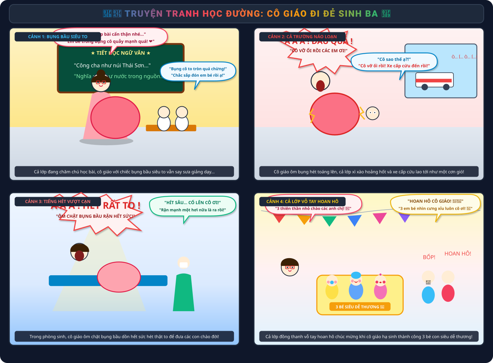
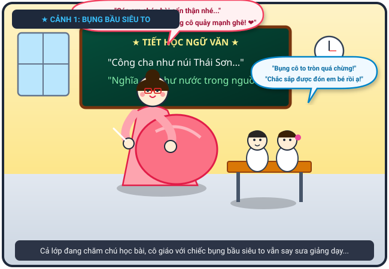
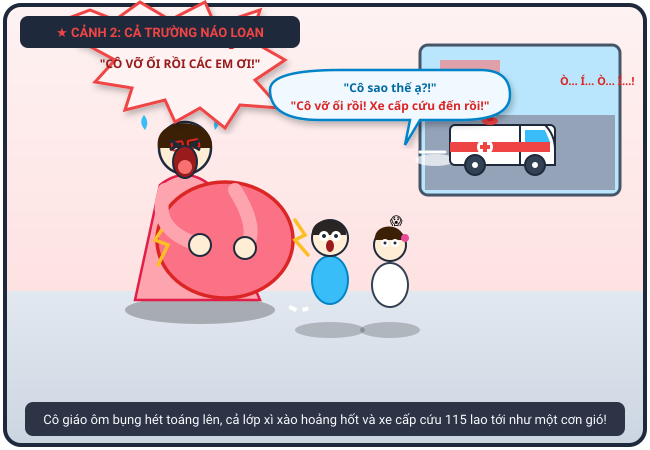
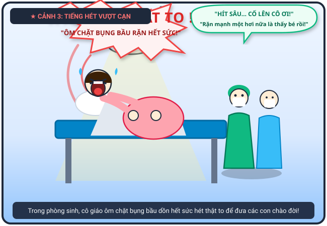
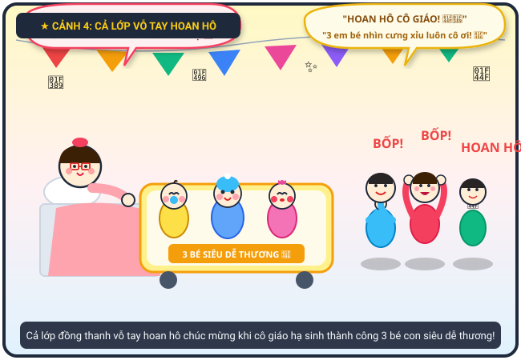

# 🍃 🏫👶 Truyện Tranh Học Đường: Cô Giáo Đi Đẻ Sinh Ba

> *Kỷ niệm học trò nhớ đời: từ tiết học đang yên ắng bỗng cô giáo chuyển dạ vỡ ối, xe cấp cứu hụ còi náo loạn cả trường đến cái kết ngọt ngào khi cả lớp vỗ tay chúc mừng cô hạ sinh 3 thiên thần nhỏ siêu dễ thương!*

---

## 🎨 Trọn Bộ Truyện Tranh (Comic Strip)

---

## 📖 Chi Tiết Từng Phân Cảnh (Comic Panels)

### 🌟 Cảnh 1: Tiết Học Chăm Chú & Chiếc Bụng Bầu Siêu To

> **Dẫn truyện:** Hôm ấy, cả lớp chúng tôi đang ngồi trật tự nghe cô giáo giảng bài. Cô giáo đang mang bầu rất to, chiếc bụng tròn xoe vượt mặt khiến cô đi lại có phần khệ nệ nhưng nét mặt cô lúc nào cũng hiền từ, nụ cười rạng rỡ truyền cảm hứng cho cả lớp.
> 
> 👩‍🏫 **Cô giáo (tay cầm phấn, tay xoa bụng cười ấm áp):** *“Các em chép bài cẩn thận nhé... Hôm nay mấy cô cậu nhóc trong bụng cô quẫy nhiệt tình quá, chắc cũng muốn học bài cùng các em đấy! ❤️”*
> 
> 🎒 **Cả lớp (chăm chú nhìn cô, thì thầm):** *“Bụng cô hôm nay to tròn quá chừng luôn tụi mày ơi! Nhìn cô vừa phúc hậu vừa đáng yêu ghê, chắc sắp tới ngày đón em bé rồi!”*

---

### 🚨 Cảnh 2: Cơn Đau Đột Ngột – Cả Trường Náo Loạn!

> **Dẫn truyện:** Giữa lúc tiết học đang êm đềm, viên phấn trên tay cô bỗng rơi đánh cộp xuống sàn. Cô giáo hai tay ôm ghì lấy bụng bầu, mặt biến sắc, nhắm nghiền mắt hét toáng lên đau đớn. Tiếng hét làm cả trường chấn động, học sinh và thầy cô các lớp nháo nhào chạy ra hành lang. Cả lớp tôi xì xào hoảng hốt, và chỉ vài phút sau, tiếng còi xe cấp cứu 115 đã hụ vang sân trường!
> 
> 😱 **Cô giáo (ôm chặt bụng bầu, hét lớn):** *“Á Á Á...! ĐAU QUÁ CÁC EM ƠI! CÔ VỠ ỐI RỒI...!”*
> 
> 😨 **Cả lớp (nháo nhào xì xào, nhảy dựng lên khỏi ghế):** *“Trời ơi! Cô vỡ ối rồi!”, “Cô sao thế ạ?!”, “Bác bảo vệ ơi mở cổng, xe cấp cứu tới rồi kìa!”*
> 
> 🚑 **Xe cấp cứu 115 (phanh kin kít giữa sân trường):** *“Ò... Í... Ò... Í...! Kíp cấp cứu đến ngay đây!”*

---

### 🔥 Cảnh 3: Tiếng Hét Vượt Cạn Rung Trời Trong Phòng Sinh

> **Dẫn truyện:** Cô giáo được đưa thẳng vào phòng sinh bệnh viện. Nằm trên chiếc giường đẻ dưới ánh đèn mổ rực sáng, cô giáo hai tay ôm ghì lấy bụng bầu, nắm chặt thành giường và dồn hết sức bình sinh hét thật to. Tiếng hét dũng cảm của người mẹ vượt cạn vang dội khắp cả hành lang khoa sản!
> 
> 🔊 **Cô giáo (ôm bụng bầu, hét rất to):** *“Á Á Á Á Á...! HÉT THẬT TO NÀO! CỐ LÊN CÁC CON ƠI! ỐI DỒI ÔI...!”*
> 
> 👨‍⚕️ **Bác sĩ & Y tá (tập trung cao độ, động viên hết lời):** *“Hít một hơi thật sâu... rặn mạnh theo nhịp đếm nào cô giáo ơi! Một... hai... ba, thấy đầu em bé đầu tiên rồi!”*

---

### 🎉 Cảnh 4: Hạ Sinh 3 Bé Siêu Dễ Thương – Cả Lớp Vỗ Tay Hoan Hô!

> **Dẫn truyện:** Sau cơn đau bão táp, căn phòng ngập tràn tiếng khóc chào đời của các thiên thần nhỏ. Cô giáo đã vượt cạn thành công xuất sắc, hạ sinh trọn vẹn 3 em bé (sinh ba) cực kỳ kháu khỉnh, đôi má bánh bao bầu bĩnh, quấn tã ngũ sắc đáng yêu hết phần thiên hạ. Nghe tin lành, cả lớp chúng tôi vỡ òa sung sướng, cùng nhau vỗ tay rầm rộ hoan hô chúc mừng cô giáo thân yêu!
> 
> 👏 **Cả lớp (đồng thanh vỗ tay rầm rộ, nhảy cẫng lên reo hò):** *“BỐP! BỐP! BỐP! HOAN HÔ CÔ GIÁO! 🎉👏 CÔ GIỎI QUÁ ĐI MẤT! 3 em bé nhìn cưng xỉu, dễ thương quá cô ơi!”*
> 
> 🥰 **Cô giáo (nở nụ cười hiền hậu, hạnh phúc rơi nước mắt):** *“Cảm ơn cả lớp thân yêu của cô rất nhiều! Ba thiên thần nhỏ gửi lời chào các anh chị nhé!”*

---

## 📸 Những Khoảnh Khắc Đáng Yêu & Ý Nghĩa

| 📚 Bụng Bầu Vượt Mặt Khi Giảng Bài | 🚑 Cơn Đau Đẻ & Xe Cấp Cứu | 👶 3 Thiên Thần Nhỏ Cực Đáng Yêu |
| :---: | :---: | :---: |
|  |  |  |
| *Cô giáo ôm bụng bầu to tướng đứng lớp* | *Cả trường náo loạn gọi xe cấp cứu tới đón cô* | *3 em bé sơ sinh má bánh bao cưng xỉu* |

---

## 💬 Bài Học & Góc Cười

- 🤰 **Sức mạnh phi thường của mẹ:** Mang đa thai sinh ba vô cùng nặng nề và vất vả, tiếng hét khi vượt cạn thể hiện trọn vẹn tình mẫu tử thiêng liêng.
- 🏫 **Tình cảm thầy trò thân thương:** Cả trường xôn xao lo lắng và vỗ tay hoan hô khi nghe tin cô vượt cạn thành công thể hiện tình thầy trò gắn bó keo sơn.
- 👶 **Món quà ngọt ngào:** 3 thiên thần nhỏ chào đời khỏe mạnh là niềm hạnh phúc ngập tràn của cả gia đình và lớp học!

---

## 📜 Câu Chuyện Gốc

> *"Cả lớp tôi đang học cô [có bầu rất to] đang dạy học, bỗng nhiên cô ôm bụng hét lên: Á á đau quá! Cả trường náo loạn, cả lớp tôi xì xào: Cô vỡ ối rồi! Cô sao thế! Xe cấp cứu đến rất nhanh! Khi đẻ cô hét rất to và ôm bụng bầu, cuối cùng cả lớp vỗ tay hoan hô vì cô đã hạ sinh 3 đứa rất dễ thương."*
