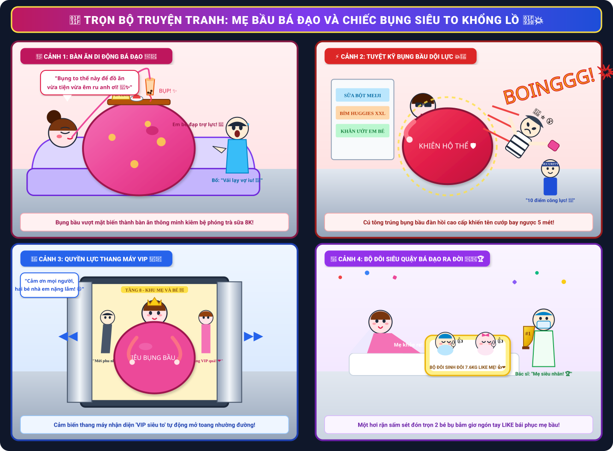
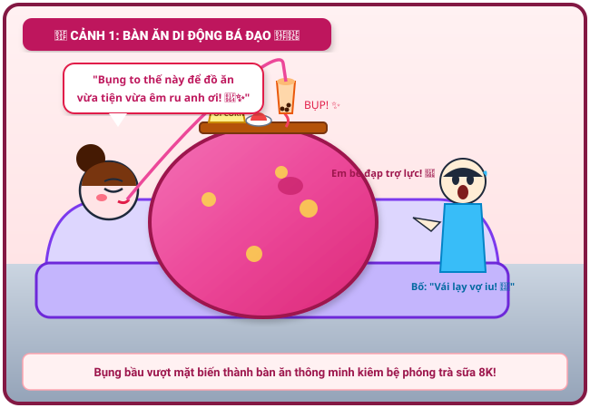
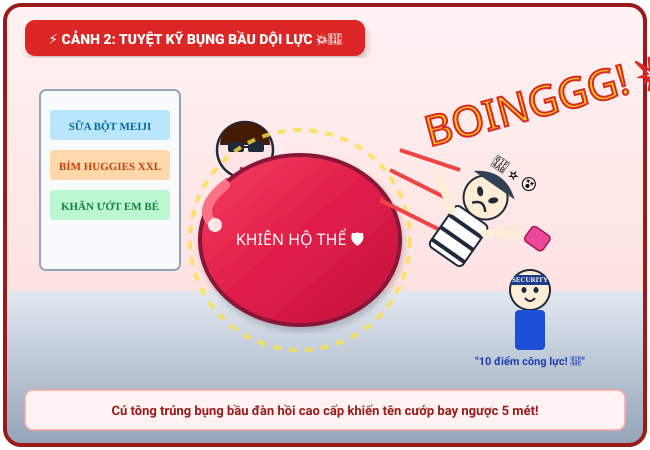
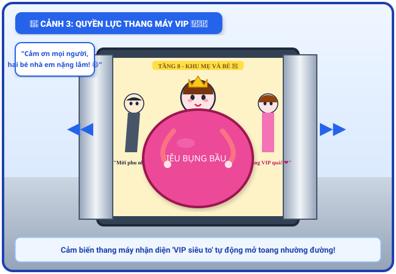
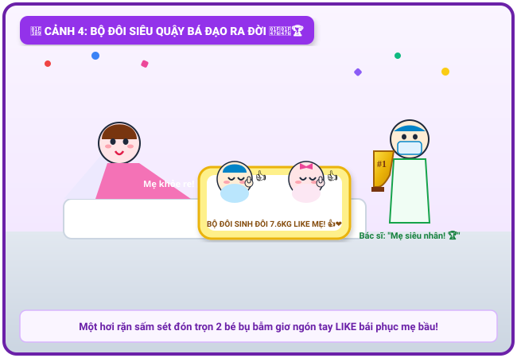

# 🍃 🤰💥 Truyện Tranh Hài Hước: Mẹ Bầu Bá Đạo Và Chiếc Bụng Siêu To Khổng Lồ

> *Một câu chuyện cười "bá đạo vô đối" về người mẹ mang song thai tháng cuối với chiếc bụng bầu tròn xoe siêu to khổng lồ: biến bụng thành bàn ăn di động kiêm bệ phóng trà sữa 8K, tuyệt kỹ "bụng bầu dội lực" búng bay tên cướp ở siêu thị, quyền lực thang máy VIP và màn vượt cạn sấm sét đón hai thiên thần nhỏ giơ tay LIKE bái phục mẹ!*

---

## 🎨 Trọn Bộ Truyện Tranh (Comic Strip)

---

## 📖 Chi Tiết Từng Phân Cảnh (Comic Panels)

### 🌟 Cảnh 1: Bàn Ăn Di Động & Bệ Phóng Trà Sữa 8K

> **Dẫn truyện:** Bước sang tuần thứ 37 của thai kỳ song thai, chiếc bụng bầu của mẹ phát triển vượt bậc, tròn căng và siêu to khổng lồ như đang ôm trọn một quả khinh khí cầu mini dưới lớp váy bầu màu hồng sen rực rỡ. Thay vì cảm thấy nặng nề ủ rũ, người mẹ "bá đạo" này đã biến chiếc bụng ngoại cỡ thành một tiện ích độc nhất vô nhị! Mỗi buổi tối xem phim truyền hình trên sofa, mẹ ung dung kê cả một chiếc khay gỗ lên đỉnh bụng bầu: một đĩa bắp rang bơ vàng rực, một đĩa hoa quả tươi ngon và đặc biệt là một ly trà sữa trân châu full topping!
> 
> 🧋 **Cơ chế nảy trà sữa tự động:** Kỳ diệu hơn cả, hai bé bi trong bụng dường như cũng là những "tín đồ trà sữa". Cứ mỗi khi mẹ khát nước, em bé bên trong lại đạp nhẹ "BỤP!" một cái vào thành bụng, chiếc ly nảy lên đúng tầm miệng để mẹ cắn ống hút mút một hơi sảng khoái!
> 
> 🤰 **Mẹ (ngửa lưng thư thái, nhai trân châu nhồm nhoàm):**  
> *“Bụng to thế này để đồ ăn vừa tiện vừa êm ru anh ơi! Khỏi cần bàn cà phê, khỏi cần với tay mỏi lưng! Hai em bé bên trong còn biết đạp trợ lực búng ly trà sữa lên cho mẹ uống nữa nè! Tiện ích 5 sao luôn! 🥤✨”*
> 
> 😱 **Bố (đứng bên cạnh chắp hai tay vái lạy bái phục):**  
> *“Trời đất quỷ thần ơi! Công nghệ chống rung quang học của Apple với NASA cũng phải bái chiếc bụng của vợ làm cụ tổ! Để nguyên đĩa thức ăn mà không đổ một hạt bắp rang bơ nào, anh xin phục sát đất luôn! 🙏❤️”*

---

### ⚡ Cảnh 2: Chạm Trán Tên Cướp & Tuyệt Kỹ "Bụng Bầu Dội Lực"

> **Dẫn truyện:** Cuối tuần, mẹ bầu khoác áo mới, đeo kính râm sành điệu đi siêu thị sắm nốt đồ sơ sinh cho hai con. Đang thong thả chọn bỉm tã ở gian hàng mẹ và bé, bỗng một tiếng thét thất thanh vang lên: *"CƯỚP! CƯỚP TÚI XÁCH! BẮT LẤY NÓ!"*. Một tên trộm mặc áo sọc đen trắng tay cầm túi xách giật được, cắm đầu cắm cổ phóng thục mạng về phía cửa thoát hiểm với vận tốc 40km/h. Mọi người hoảng loạn né dạt sang hai bên.
> 
> 🥋 **Pha nghênh chiến chấn động:** Nhìn thấy tên cướp đang lao thẳng về phía mình, mẹ bầu không hề lùi bước nửa phân! Mẹ đứng sừng sững giữa lối đi, hai tay chống nạnh, hít một hơi thật sâu và... **ƯỠN CHIẾC BỤNG BẦU SIÊU TO KHỔNG LỒ RA PHÍA TRƯỚC!**
> 
> 💥 *“RẦM... BOINGGGGGGG!”*  
> Tên cướp lao đầu thẳng vào tâm chiếc bụng bầu đàn hồi cao cấp của mẹ. Nhưng thay vì xô ngã mẹ bầu, một luồng kình lực dội ngược cực mạnh từ chiếc bụng đàn hồi phát ra! Tên cướp bị bật văng ngược trở lại trên không trung cả 5 mét, xoay ba vòng rưỡi rồi rơi "BẸT!" xuống đống bỉm sữa, mắt nổ đom đóm ngất xỉu tại chỗ!
> 
> 🕶️ **Mẹ bầu (nhếch mép cười khẩy, chỉnh lại kính râm):**  
> *“Muốn vượt qua mẹ con ta à? Chưa đủ tuổi đâu con trai! Bụng bầu này là bọc đệm khí đàn hồi chống đạn cấp vũ trụ đấy nhé! 💅✨”*
> 
> 👏 **Bác bảo vệ & Khách hàng (vỗ tay rầm rộ như sấm):**  
> *“ĐỈNH CAO! KHIÊN HỘ THỂ BÁ ĐẠO NHẤT SIÊU THỊ! 10 điểm công lực cho mẹ bầu siêu nhân! 👏🎉”*

---

### 🚀 Cảnh 3: Quyền Lực Thang Máy VIP & Tấm Thẻ Ưu Tiên Vũ Trụ

> **Dẫn truyện:** Rời khỏi siêu thị, mẹ bước tới sảnh thang máy trung tâm thương mại để lên tầng khu vui chơi trẻ em. Đúng giờ cao điểm, chiếc thang máy chật ních người đang chuẩn bị khép cửa lại. Khoảng trống giữa hai cánh cửa chỉ còn vỏn vẹn một gang tay hẹp té. Ai nấy đều nghĩ: *"Chiếc bụng bầu to thế kia thì làm sao mà chen vừa được!"*.
> 
> 👑 **Quyền năng "Mẹ Bầu Tổng Tài":** Mẹ bầu nở nụ cười tự tin ngút ngàn, ung dung sải bước tới. Chiếc bụng tròn xoe vừa chạm nhẹ vào mép cửa thì... hệ thống cảm biến quang học của thang máy lập tức reo chuông báo động: *"TÍT TÍT TÍT! PHÁT HIỆN KHÁCH VIP NGOẠI CỠ!"*, hai cánh cửa kim loại tự động mở toang hết cỡ sang hai bên!
> 
> 🏢 **Khung cảnh kính cẩn:** Toàn bộ hành khách trong thang máy – từ các quý ông lịch lãm đến các cô nàng công sở – đồng loạt dạt sát vào vách tường, cúi đầu 45 độ cung kính:
> 
> 👥 **Đám đông (đồng thanh kính cẩn):**  
> *“Dạ mời phu nhân và hai tiểu bảo bối vào thang máy ạ! Xin nhường trọn góc VIP rộng rãi nhất cho chiếc bụng quyền lực!”*
> 
> 🤰 **Mẹ bầu (nở nụ cười hoa hậu, hai tay xoa bụng âu yếm):**  
> *“Cảm ơn mọi người nhiều nhé! Bụng mẹ con em hơi choán chỗ một xíu, nhưng bù lại rất êm ái và mang lại may mắn đấy ạ! Hi hi! 🥰💖”*

---

### 🎉 Cảnh 4: Màn Vượt Cạn Sấm Sét – Bộ Đôi Siêu Quậy Giơ Tay "LIKE"

> **Dẫn truyện:** Ngày lâm bồn định mệnh cuối cùng cũng đã đến. Chiếc bụng bầu to đến mức kỷ lục khiến chiếc taxi đưa đón mẹ phải hạ hẳn ghế phụ để mẹ nằm duỗi người. Khi vào phòng sinh bệnh viện phụ sản, các bác sĩ và nữ hộ sinh ai nấy đều chuẩn bị tinh thần cho một ca vượt cạn cam go nhiều giờ đồng hồ. Nhưng người mẹ bá đạo lại có một kế hoạch hoàn toàn khác!
> 
> ⚡ **Cú rặn "chấn động khoa sản":** Mẹ nằm trên giường đẻ, hai tay nắm chặt thanh vịn, hít một hơi dài căng tràn lồng ngực rồi dõng dạc ra hiệu:
> 
> 🔊 **Mẹ bầu (giọng vang rền như sấm sét):**  
> *“CẢ EKIP CHUẨN BỊ XONG CHƯA?! 1... 2... 3... ĐÓN CÚ RẶN HUYỀN THOẠI ĐÂY NÀY! HỰYYYYYYYYYY...!”*
> 
> 👶👶 **Kỳ tích y học:** Đúng MỘT HƠI RẶN DUY NHẤT! Hai tiếng khóc "OE... OE... OA!" vang rền xé toạc không gian phòng sinh! Không cần rặn hơi thứ hai, hai bé bi sinh đôi một trai một gái – mỗi bé nặng tròn trĩnh 3.8kg (tổng cộng 7.6kg) – đã phóng vèo ra ngoài an toàn tuyệt đối!
> 
> 👍 **Pha tạo dáng bất hủ:** Chiếc bụng bầu khổng lồ của mẹ lập tức xẹp xuống nhẹ nhõm. Trên chiếc nôi hoàng gia màu vàng, hai thiên thần nhỏ má bánh bao phúng phính trắng hồng, vừa mở mắt nhìn đời đã đồng loạt giơ ngón tay cái: **"LIKE 👍👍"** bái phục người mẹ siêu nhân!
> 
> 🏆 **Bác sĩ trưởng khoa (xúc động trao chiếc cúp vàng #1 cho mẹ):**  
> *“Tôi đỡ đẻ 30 năm nay chưa từng thấy ca sinh đôi nào bá đạo và tốc độ như thế này! Xin trao tặng mẹ chiếc cúp vô địch 'Bà Mẹ Của Năm'! Một hơi rặn hạ sinh hai bé nặng gần 8 ký mà vẫn cười tươi rói! Quá đẳng cấp!”*
> 
> 🥰 **Bố và cả nhà (vỡ òa trong tiếng cười và nước mắt hạnh phúc):**  
> *“Mẹ con em là số 1 thế giới! Vừa kiên cường, vừa hài hước lại siêu cấp bá đạo! Hoan hô ba mẹ con!”*

---

## 📸 Những Khoảnh Khắc Đáng Yêu & Ý Nghĩa

| 🌟 Bàn Ăn Di Động & Trà Sữa Nảy | 💥 Tuyệt Kỹ Bụng Bầu Búng Tên Cướp | 🏆 Bộ Đôi 7.6kg Giơ Tay Like Mẹ |
| :---: | :---: | :---: |
|  |  |  |
| *Bụng tròn làm bàn để bắp rang và trà sữa 8K* | *Cú dội lực búng bay tên cướp xa 5 mét* | *Hai thiên thần nhỏ 3.8kg chào đời giơ tay like mẹ* |

---

## 💬 Bài Học & Góc Cười

- 🤰 **Sức mạnh và tinh thần lạc quan phi thường:** Mang thai đôi ở tháng cuối với chiếc bụng vượt mặt là một thử thách vô cùng nặng nề. Nhưng bằng tinh thần vui vẻ, hài hước và lạc quan, người mẹ có thể biến mọi khó khăn thành những kỷ niệm ngập tràn tiếng cười.
- 🥋 **Tình mẫu tử là lá chắn kiên cố nhất:** Chiếc bụng bầu không chỉ bao bọc sinh linh bé bỏng mà còn là nguồn sức mạnh tinh thần to lớn giúp người phụ nữ trở nên mạnh mẽ, dũng cảm và "bá đạo" hơn bao giờ hết.
- 👶 **Món quà thiêng liêng vô giá:** Nụ cười và sự an toàn khỏe mạnh của hai thiên thần nhỏ chính là phần thưởng xứng đáng nhất xua tan mọi nhọc nhằn của hành trình mang thai 9 tháng 10 ngày!

---

*#truyencuoi #truyentranh #comic #mebaubadao #bungbausieuto #sinhdoi #chuyenda #giadinh #tiengcuoi #badao*
