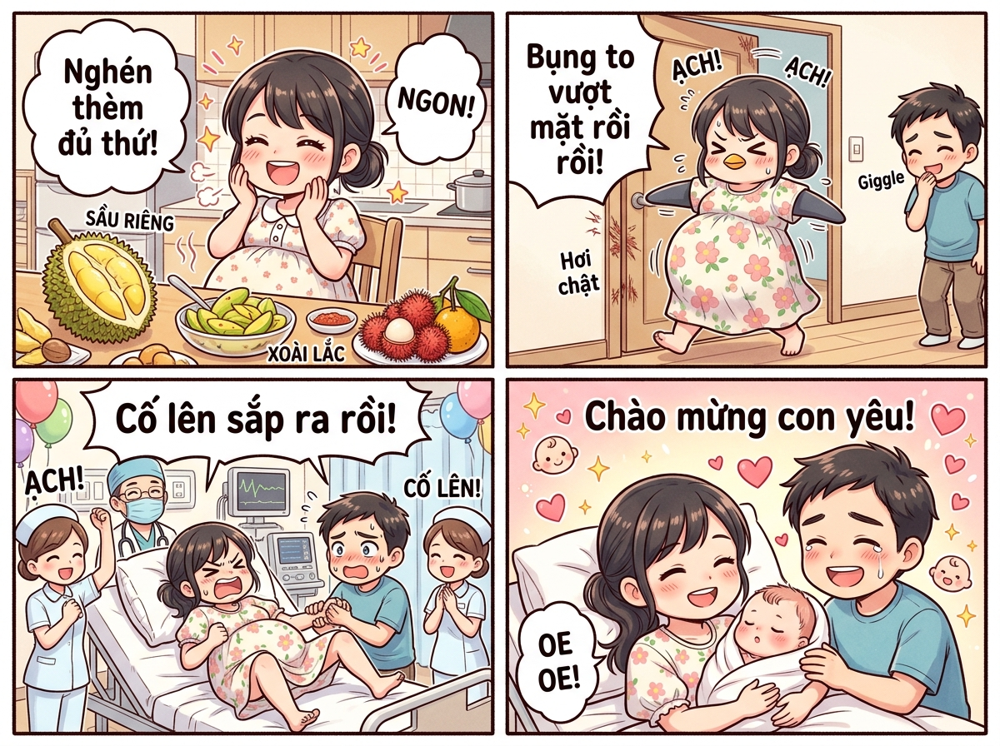
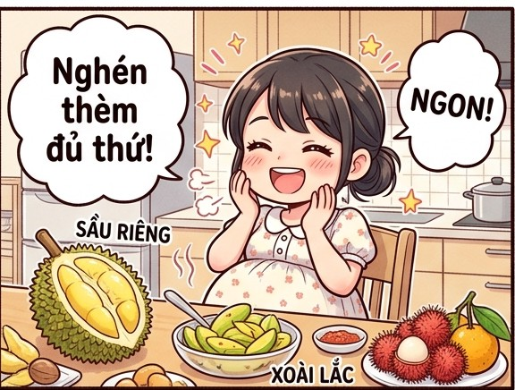
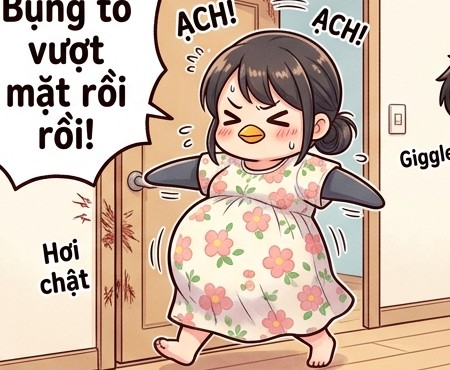

# 🍃 🤰📖 Nhật Ký Mang Bầu Siêu Hài Hước: 9 Tháng 10 Ngày "Dở Khóc Dở Cười"

> *Chuyện kể về hành trình mang thai đầy sóng gió nhưng ngập tràn tiếng cười và tình yêu thương của cô Lan: từ những cơn nghén "độc lạ Bình Dương", chiếc bụng bầu to vượt mặt với những pha mắc kẹt kinh điển, đến cuộc vượt cạn rung chuyển bệnh viện để đón thiên thần nhỏ "mỉm mỉn" chào đời!*

---

## 🎨 Trọn Bộ Truyện Tranh (Comic Strip)

---

## 🌸 Phần 1: Chiếc Que Thử Hai Vạch & Cơn Nghén "Độc Lạ"

Mọi chuyện bắt đầu vào một buổi sáng mùa thu trong trẻo. Cầm trên tay chiếc que thử thai hiện rõ hai vạch đỏ chót, anh Hưng (chồng cô Lan) mừng rỡ đến mức đánh rơi cả bàn chải đánh răng xuống sàn, ôm chầm lấy vợ nhảy tưng tưng như vừa trúng độc đắc. Cả hai vợ chồng rưng rưng nước mắt hạnh phúc vì sau bao ngày mong ngóng, mầm sống bé bỏng đã đến với tổ ấm nhỏ.

Thế nhưng, tuần trăng mật của niềm vui nhanh chóng nhường chỗ cho "cơn bão" mang tên: **ỐM NGHÉN**.

Khác với những bà bầu bình thường chỉ nghén chua hay nghén ngọt, cô Lan sở hữu một khẩu vị nghén "vô tiền khoáng hậu":
- **Mùi hương kỳ lạ:** Cứ hễ ngửi mùi cơm sôi hay mùi nước hoa thơm tho là cô nôn thốc nôn tháo, nhưng hễ ngửi thấy... mùi dầu xe máy của chồng vừa đi làm về thì cô lại hít hà khen: *"Trời ơi sao thơm dịu dàng, quyến rũ như nước hoa Paris vậy anh?!"* Anh Hưng nghe xong mà dựng tóc gáy, không biết nên khóc hay nên cười.
- **Thực đơn lúc 2 giờ sáng:** Đang nửa đêm ngủ say, cô Lan bỗng bật dậy lay chồng:
  > 🤰 **Lan (mắt long lanh):** *"Anh ơi, em thèm sầu riêng chấm mắm tôm, kèm theo nửa trái xoài lắc muối ớt siêu cay quá! Không ăn chắc em bé khóc ngập bụng mất!"*  
  > 👨 **Hưng (mắt nhắm mắt mở, hoảng hốt):** *"Em ơi, 2 giờ sáng kiếm đâu ra sầu riêng chấm... mắm tôm hả trời?! Ăn xong có đau bụng không em?!"*  
  > 🤰 **Lan (chu mỏ rơm rớm nước mắt):** *"Anh hết thương mẹ con em rồi đúng không... Hu hu..."*

Thế là anh Hưng đành phải khoác vội chiếc áo khoác, phóng xe máy lùng sục khắp các chợ đêm để mua cho bằng được sầu riêng và xoài cóc cho vợ. Nhìn cô Lan ngồi chén tì tì đĩa xoài chua loét với múi sầu riêng béo ngậy, miệng tấm tắc khen ngon, anh Hưng chỉ biết chắp tay lạy trời thầm cảm phục sức mạnh của hoóc-môn thai kỳ!

---

## 🍈 Phần 2: Chiếc Bụng Bầu "Lớn Nhanh Như Thổi" & Dáng Đi Chim Cánh Cụt

Bước sang tháng thứ 6 rồi tháng thứ 8, chiếc bụng của cô Lan bắt đầu bước vào giai đoạn "tăng tốc vượt bậc". Bụng cô tròn xoe, căng bóng và nhô cao vượt mặt, nhìn từ xa chẳng khác nào giấu cả một quả bóng đá khổng lồ dưới lớp váy hoa nhí.

Từ một cô gái nhỏ nhắn nhanh nhẹn, cô Lan chính thức biến hình thành một chú **chim cánh cụt**:
- Đi lại khệ nệ: Mỗi bước đi là cả người lắc lư sang trái một nhịp, sang phải một nhịp.
- Cúi nhặt đồ là điều bất khả thi: Mỗi lần làm rơi chiếc bút hay đôi dép, cô phải đứng nhìn trân trân xuống đất rồi thở dài:
  > 🤰 **Lan:** *"Thôi, cái gì rơi xuống sàn thì tạm thời thuộc về chủ quyền của sàn nhà, khi nào chồng về nhặt sau vậy!"*
- Giày dép trở thành kẻ thù: Chiếc chân phù to như cái bánh mì kẹp thịt, anh Hưng mỗi sáng phải quỳ gối xỏ giày và buộc dây cho vợ như phục vụ công chúa.

Và hài hước nhất là những **tai nạn mắc kẹt** do chiếc bụng "ngoại cỡ" gây ra:
1. **Kẹt cửa thang máy:** Có hôm vội vào thang máy chung cư, cửa vừa khép lại thì chiếc bụng bầu to tướng va ngay vào cảm ứng cửa, khiến thang máy mở toang ra réo chuông inh ỏi. Cả thang máy nhìn chiếc bụng tròn trịa cười ồ thích thú, còn cô Lan thì đỏ ửng mặt ngượng ngùng xoa bụng.
2. **Kẹt bàn ăn:** Đi ăn nhà hàng, cái bàn cố định không di chuyển được, cô Lan lách mãi không vào được ghế. Chồng phải nhấc bổng cô lên đặt vào trong, lúc đứng dậy thì chiếc bụng gạt bay cả hộp khăn giấy!
3. **Kẹt giường ngủ:** Nằm ngửa thì khó thở, nằm nghiêng thì cái bụng lăn lông lốc. Anh Hưng phải chèn xung quanh vợ một "pháo đài" gồm 6 chiếc gối chữ U, gối ôm, gối tựa thì cô mới có thể yên giấc!

---

## 🥊 Phần 3: "Võ Sĩ Nhí" Trong Bụng & Những Cú Song Phi Đỉnh Cao

Bước vào tháng thứ 9, em bé trong bụng dường như đã chán nằm yên và bắt đầu tập luyện bộ môn... võ tổng hợp MMA!

Cứ mỗi tối khi hai vợ chồng nằm xem phim là trên bụng cô Lan lại diễn ra một "đại hội võ thuật":
- Lúc thì chiếc bụng trồi lên một cục tròn cứng ngắc (cùi chỏ của bé).
- Lúc thì một vệt gợn sóng lượn từ mạn sườn trái trượt sang mạn sườn phải như cá heo bơi lội.
- Thậm chí có những cú đạp "thần sầu" khiến cốc nước anh Hưng đặt hờ trên bụng vợ nảy tưng tưng!

> 👨 **Anh Hưng (áp sát tai vào bụng vợ thầm thì):** *"Bé con ơi, con gái con lứa mà quậy quá chừng! Ở trong đó con đang tập nhảy hip-hop hay tập đá cầu vậy con?"*  
> ⚡ **BỐP!** Một cú đạp dội thẳng vào tai anh Hưng.  
> 👨 **Anh Hưng (ngã ngửa ra sau, ôm tai cười lớn):** *"Úi chà! Cú song phi này chắc chắn tương lai làm thủ môn đội tuyển quốc gia rồi vợ ơi!"*  
> 🤰 **Lan (vừa xoa bụng vừa mếu máo):** *"Con ơi con nhẹ tay cho mẹ thở với! Đạp gì mà mẹ muốn vỡ cả bàng quang luôn nè!"*

Tuy đau và tức bụng, nhưng nhìn những đợt sóng nhấp nhô trên bụng bầu, hai vợ chồng lại nhìn nhau cười rạng rỡ. Đó là thứ cảm giác kỳ diệu nhất trên đời mà chỉ những ai từng mang bầu mới có thể thấu hiểu trọn vẹn.

---

## 🚨 Phần 4: Chuyến Đi Đẻ "Bão Táp" Giữa Đêm Khuya

Đúng ngày dự sinh, vào lúc 12 giờ đêm, cô Lan đang say giấc nồng thì bỗng cảm thấy một dòng nước ấm tràn ra, kèm theo một cơn gò thắt quặn từ vùng bụng dưới: **VỠ ỐI RỒI!**

Cả căn nhà nhỏ lập tức chuyển sang chế độ **BÁO ĐỘNG ĐỎ CẤP 1**:
- Anh Hưng bật dậy như lò xo, hoảng loạn đến mức mặc ngược cả áo thun, chân xỏ chiếc dép tổ ong bên xanh bên đỏ.
- Chạy vào phòng lấy giỏ đồ đi sinh mà anh quýnh quáng vơ nhầm luôn... cái chảo chống dính và chiếc điều khiển ti vi nhét vào balo!
- Cô Lan ôm chiếc bụng to tướng, vừa vịn tường vừa quát chồng:
  > 🤰 **Lan (nhăn nhó toát mồ hôi):** *"Anh ơi! Đi đẻ chứ có phải đi dã ngoại cắm trại đâu mà anh vác chảo đi làm gì?! Giỏ tã bỉm ở dưới gầm giường kìa!"*  
  > 👨 **Hưng (mặt xanh như tàu lá chuối, thở dốc):** *"Dạ dạ... anh quýnh quá! Bình tĩnh em ơi, hít sâu... thở đều... 1, 2, 3 lên xe anh chở!"*

Chiếc taxi lao vun vút trong đêm khuya đưa mẹ bầu bụng to vượt mặt đến thẳng khoa Phụ sản Bệnh viện Từ Dũ. Trên đường đi, mỗi lần xe đi qua gờ giảm tốc là cô Lan lại níu chặt áo chồng hét lên một tiếng khiến bác tài xế taxi cũng phải toát mồ hôi hột, tay lái vững như đinh đóng cột phóng thẳng vào cổng cấp cứu!

---

## 👶 Phần 5: Màn Rặn Đẻ "Sư Tử Hống" & Nụ Cười Của Thiên Thần

Vừa vào phòng sinh, nữ hộ sinh kiểm tra và hô to: *"Mở 8 phân rồi! Đẩy ngay vào phòng sinh thường, chuẩn bị đón bé!"*

Dưới ánh đèn mổ sáng choang, cô Lan nằm trên bàn sinh, hai tay bám chặt vào hai thanh gióng giường inox. Anh Hưng được phép vào phòng sinh cùng vợ, đứng cạnh nắm chặt tay cô để tiếp thêm sức mạnh:
- 👨‍⚕️ **Bác sĩ trưởng khoa (giọng dõng dạc, chuyên nghiệp):** *"Nào chị Lan, nhìn lên trần nhà, hít sâu một hơi thật dài bằng mũi... Giữ hơi... Cắn chặt răng và dồn toàn bộ lực rặn xuống dưới mông! Một... hai... ba... RẶN!"*
- 🤰 **Lan (dồn 300% công lực, mặt đỏ bừng, hét vang rung chuyển cả căn phòng):**  
  *“Á Á Á Á Á...! TRỜI ĐẤT ƠI...! RA NHANH ĐI CON ƠI...! ĐAU QUÁ TRỜI ĐẤT ƠI...! HƯNG ƠI SAU ĐỢT NÀY BÀ BẮT ÔNG ĐẺ THAY TÔI ĐẤY NHÉ... ẠCH...!”*
- 👨 **Hưng (bị vợ bóp nát bàn tay đến mức tím tái, nước mắt ngắn dài cổ vũ):**  
  *“Đúng rồi vợ ơi! Rặn đi em! Bóp gãy tay anh cũng được! Thấy đầu con rồi... tóc nhiều lắm em ơi!”*
- 👩‍⚕️ **Các cô y tá vỗ tay rầm rộ:**  
  *“Giỏi lắm chị ơi! Cố lên một hơi dài nữa nào! Bé sắp chui ra rồi! 1... 2... 3...!”*

Và rồi... một tiếng **“OEEEEEE! OEEEEEE!”** trong trẻo, vang dội xé toang không gian phòng sinh!

Cả căn phòng như vỡ òa. Bác sĩ nở nụ cười tươi bế em bé đặt lên ngực mẹ trong phương pháp "da kề da":
- Một bé gái bụ bẫm nặng đúng **3.6 kg**, hai má phúng phính trắng hồng "mỉm mỉn" như hai chiếc bánh bao nóng hổi, đôi mắt đen láy ti hí nhìn mẹ.
- Cô Lan nằm vật ra gối, tóc ướt đẫm mồ hôi, bao nhiêu đau đớn dữ dội vừa trải qua bỗng chốc tan biến sạch sẽ như chưa từng tồn tại. Cô nhẹ nhàng chạm những ngón tay run run lên đôi gò má mềm mại của con gái nhỏ, hai hàng nước mắt hạnh phúc lăn dài trên má.
- Anh Hưng đứng bên cạnh, một người đàn ông vốn mạnh mẽ thường ngày nay khóc nức nở như một đứa trẻ, cúi xuống hôn lên trán vợ rồi hôn lên bàn chân bé xíu của con: *"Cảm ơn vợ... Vợ siêu nhân của anh giỏi lắm! Chào mừng con yêu đến với thế giới của ba mẹ!"*

---

## 📸 Những Khoảnh Khắc Đáng Yêu & Ý Nghĩa

| 🍈 Cơn Nghén "Độc Lạ" | 🐧 Dáng Đi Cánh Cụt Kẹt Cửa | 👶 Thiên Thần Nhỏ Chào Đời |
| :---: | :---: | :---: |
|  |  |  |
| *Chén tì tì đĩa sầu riêng chấm mắm tôm và xoài lắc* | *Bụng to vượt mặt kẹt cửa đi lắc lư như cánh cụt* | *Tiếng khóc oe oe vỡ òa hạnh phúc của ba mẹ* |

---

## 💖 Lời Kết: Phép Màu Đằng Sau Chiếc Bụng Bầu

Mang bầu 9 tháng 10 ngày chưa bao giờ là một hành trình dễ dàng. Đó là chuỗi ngày mẹ phải đánh đổi vóc dáng, chịu đựng những cơn nghén cồn cào, những đêm mất ngủ vì chiếc bụng nặng nề, và cả những cơn đau chuyển dạ thấu tận tâm can.

Thế nhưng, khi nhìn thấy thiên thần nhỏ nằm trọn trong vòng tay, nghe tiếng con ọ ẹ đòi bú và nụ cười rạng rỡ của gia đình, người mẹ nào cũng sẽ mỉm cười và nhận ra rằng: **Mọi vất vả, mọi cơn đau và cả những kỷ niệm mắc kẹt dở khóc dở cười đều xứng đáng vô cùng!**

---

*#truyencuoi #truyendai #mangbau #chuyenda #sinhcon #mimmim #giadinh #tinhme #nhatkybau*
