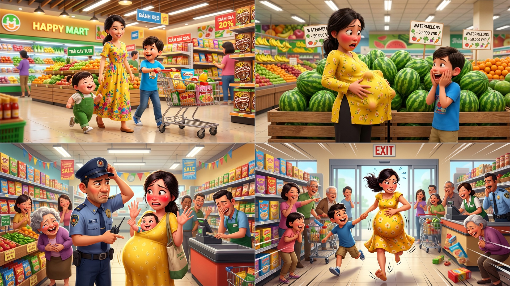
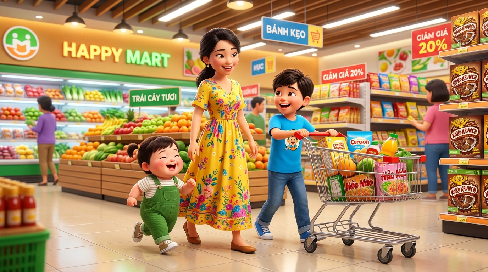
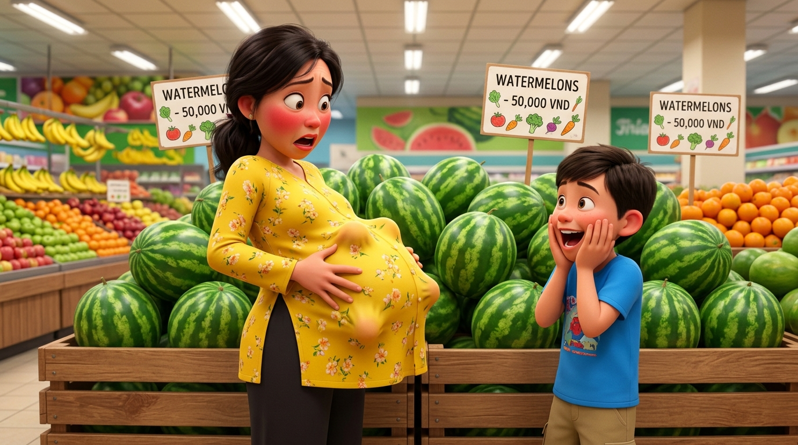

# 🍃 🛒👶 Truyện Tranh Hài Hước: Sự Cố Em Bé Chui Tọt Vào Bụng Mẹ Ở Siêu Thị

> *Một chuyến đi siêu thị mua sắm cuối tuần "bão táp" bậc nhất lịch sử của ba mẹ con tôi: từ chiếc váy suông maxi rộng thùng thình của mẹ, trò trốn tìm tinh quái của cu Tí khi bất thình lình chui tọt vào trong váy biến mẹ thành "bà bầu vượt mặt 120cm" ngọ nguậy u lên từng cục, cho đến hiểu nhầm tai quái nghi giấu trộm dưa hấu siêu thị và màn ôm bụng chạy tháo thân hối hả làm rung chuyển tiếng cười của tất cả các quầy hàng xung quanh!*

---

## 🎬 Trình Chiếu Video Hoạt Hình & Lồng Tiếng Điện Ảnh

<iframe src="video_su_co_em_be_chui_tot_vao_bung_me_o_sieu_thi.html" width="100%" height="680" style="border: none; border-radius: 16px; box-shadow: 0 12px 36px rgba(0,0,0,0.5); margin: 12px 0 18px 0;" allow="autoplay"></iframe>

> 💡 **Xem video tương tác rạp chiếu phim (Cinema Theater):**
> - Bấm nút **▶ Phát Phim** ở khung trên để trải nghiệm video với hiệu ứng chuyển cảnh điện ảnh Ken Burns, phụ đề đồng bộ từng nhân vật và hòa âm lồng tiếng sống động!
> - 🎪 Trình phát rạp chiếu phim độc lập: [video_su_co_em_be_chui_tot_vao_bung_me_o_sieu_thi.html](video_su_co_em_be_chui_tot_vao_bung_me_o_sieu_thi.html)
> - 📥 Tích hợp nút **Xuất / Tải Video MP4** trực tiếp ngay trên thanh điều khiển của trình phát.

---

### 🎨 Trọn Bộ Truyện Tranh Hoạt Hình 3D Pixar (Comic Strip)

---

## 📖 Chi Tiết Từng Phân Cảnh Hoạt Hình 3D (Comic Scenes)

### 🛒 Cảnh 1: Ba Mẹ Con Tung Tăng Dạo Siêu Thị & Chiếc Đầm Maxi Thần Thánh

> **Dẫn truyện:** Chiều Chủ Nhật đẹp trời, mẹ quyết định thưởng cho hai anh em tôi một chuyến đi siêu thị đại siêu thị sầm uất nhất thành phố để sắm sửa thực phẩm và đồ ăn vặt cho cả tuần.
> 
> Để đi lại thoải mái giữa các dãy kệ hàng dài hun hút, mẹ diện một chiếc **váy đầm suông maxi hoa nhí màu vàng tươi rộng thùng thình**, chất vải voan bồng bềnh mát rượi. Tôi lớn hơn, nhận trọng trách làm "tài xế" đẩy chiếc xe đẩy hàng kim loại sáng loáng. Còn cu Tí – cậu em trai 3 tuổi má bánh bao bụ bẫm, tròn xoe "mỉm mỉn" – thì khoái chí mặc bộ đồ yếm xanh lá, lon ton chạy nhảy lăng xăng bên cạnh gấu váy mẹ như một chú chim non.
> 
> 👩 **Mẹ (vừa ngắm nghía quầy rau củ tươi vừa mỉm cười rạng rỡ):**  
> *“Hôm nay mẹ sẽ mua sườn non, tôm tươi và thật nhiều rau củ quả về nấu lẩu tẩm bổ cho cả nhà nhé! Hai anh em thích ăn gì cứ bỏ vào xe đẩy cho mẹ!”*
> 
> 🧒 **Tôi (hai tay giữ chặt tay cầm xe đẩy, hào hứng hưởng ứng):**  
> *“Mẹ ơi, con ghé lấy thêm hai hộp sữa tươi với bánh quy bơ nhé! Cu Tí ngoan ngoãn đi sát mẹ nghe chưa, siêu thị đông người lắm đấy!”*
> 
> 👶 **Cu Tí (nhảy chân sáo, cười toe toét khoe hai lúm đồng tiền):**  
> *“Aaa siêu thị mát lạnh to quá mẹ ơi! Kẹo mút với bim bim ở đâu ạ? Mẹ đi nhanh lên nào! 🍭🏃‍♂️”*

---

### ⚡ Cảnh 2: Trò Trốn Tìm Tai Quái – Em Bé Chui Tọt Vào Váy, Bụng Mẹ To 120cm!

> **Dẫn truyện:** Khi ba mẹ con tiến tới quầy trái cây nhiệt đới, mẹ dừng lại bên cạnh tháp **dưa hấu tròn vo loại ngoại cỡ 5kg/quả** để lựa trái dưa ngon nhất. 
> 
> Thấy mẹ mải mê gõ *“bộp bộp”* thử dưa, cu Tí bỗng nảy ra ý định chơi trò trốn tìm! Nhìn thấy vạt váy maxi của mẹ rủ xuống rộng thênh thang như một chiếc lều cắm trại, cậu nhóc không một chút đắn đo, liền cúi rạp người xuống rồi... **XOẸT!** – chui tọt tót vào bên trong váy mẹ!
> 
> Chưa dừng lại ở đó, cu Tí hai tay ôm chặt cứng lấy eo mẹ, chân đu tòng teng rồi rúc trọn cả đầu và người vào trước bụng mẹ để trốn!
> 
> 💥 **Chiếc "bụng bầu thần tốc" phồng to kỷ lục:**  
> - Chỉ sau đúng 3 giây, chiếc váy đầm suông đang phẳng phiu của mẹ bỗng nhiên **căng phồng tròn ủng**, nhô thẳng ra phía trước với chu vi ước tính không dưới **120 centimet**!
> - Đã thế, cu Tí bên trong váy thấy tối om và ấm áp nên thích chí ngọ nguậy, giãy giụa liên hồi.
> - Cùi chỏ và gót chân nhỏ xíu của cu cậu thúc liên tục vào lớp vải voan, làm mặt trước "chiếc bụng bầu" của mẹ u lên từng cục, lồi lõm nhấp nhô chẳng khác nào sóng thần cuộn trào!
> 
> 😱 **Mẹ (giật nảy mình suýt đánh rơi quả dưa hấu, hai tay vội ôm đỡ lấy khối tròn ngọ nguậy):**  
> *“ỐI GIỜI ƠI TÍ ƠI! Con chui vào đâu đấy hả con?! Chui tọt vào bụng mẹ thế này thì ai nhìn vào cũng tưởng mẹ đang mang bầu 9 tháng sắp đẻ rơi đẻ vãi ngay giữa siêu thị bây giờ! Mau chui ra ngay cho mẹ!”*
> 
> 👶 **Cu Tí (tiếng cười khanh khách nghẹt nghẹt phát ra từ bên trong váy):**  
> *“Kí kì... mẹ không tìm thấy con đâu! Con trốn trong bụng mẹ êm ru nè mẹ ơi! Mẹ bế con luôn đi! 🤣”*
> 
> 🧒 **Tôi (đứng bên cạnh há hốc mồm, hai tay ôm chặt má kinh hoàng):**  
> *“Ối trời ơi mẹ ơi! Bụng mẹ tự nhiên to đùng như quả bóng bay khổng lồ lại còn biết lắc lư nữa kìa! Mọi người đang nhìn mẹ con mình kìa mẹ ơi!”*

---

### 🍉 Cảnh 3: Báo Động Hiểu Nhầm – Bác Bảo Vệ Nghi Giấu Dưa Hấu & Bàn Tay Bé Vẫy Chào!

> **Dẫn truyện:** Tiếng la thất thanh của mẹ cùng hình dáng chiếc bụng nhấp nhô kỳ dị đã lập tức thu hút ánh mắt của hàng chục khách mua sắm xung quanh. 
> 
> Bác bảo vệ ca trực – một người đàn ông trung niên đeo nón đồng phục nghiêm nghị – vừa cầm bộ đàm đi tuần tra qua liền giật mình khựng lại. Bác trố tròn hai mắt nhìn chằm chằm vào chiếc bụng tròn vo to bất thường của mẹ, rồi lại nhìn sang tháp dưa hấu 5kg bên cạnh với vẻ mặt đầy nghi vấn.
> 
> 👮‍♂️ **Bác bảo vệ (bước vội tới, tay cầm bộ đàm chỉ vào chiếc bụng đang cựa quậy):**  
> *“Ủa chị gái ơi! Tôi đứng ở quầy camera quan sát từ nãy... Rõ ràng 5 phút trước thấy chị dáng người thon gọn, sao vừa ghé qua quầy hoa quả một cái là bụng đã to vượt mặt thế kia?! Chị... chị giấu trộm nguyên quả dưa hấu 5 ký vào bụng hay là mang bầu chuyển dạ sắp đẻ thế hả chị?!”*
> 
> 👥 **Khách mua sắm xung quanh (xúm lại chỉ trỏ, cười khúc khích):**  
> *“Kìa nhìn kìa! Bụng bầu gì mà quẫy đạp dữ dội như cá voi vậy trời!”*  
> *“Chắc sắp vỡ ối sinh ba rồi, gọi cấp cứu đi bà con ơi!”*
> 
> 🤰 **Mẹ (mặt đỏ bừng bừng như quả gấc chín, toát mồ hôi hột ra sức thanh minh):**  
> *“Không phải dưa hấu đâu bác ơi! Oan cho em quá! Em không có trộm cắp gì đâu! Đây là con em... thằng bé nó nghịch chui tọt vào trong váy em đấy ạ!”*
> 
> 🖐️ **Pha tương tác "đỉnh cao" của cu Tí:**  
> Dường như nghe thấy tiếng người lạ rôm rả bên ngoài, cu Tí ở trong bụng mẹ tưởng mẹ đang chơi trò ú òa tập thể! Bất ngờ, cu cậu luồn một bàn tay bé xíu xiu trắng hồng qua cạp váy của mẹ, thò hẳn bàn tay ra ngoài rồi... **ngoe nguẩy vẫy chào bác bảo vệ**!
> 
> 🤣 **CẢ KHU VỰC QUẦY HÀNG CƯỜI ẦM LÊN NHƯ SẤM:**  
> Chứng kiến cảnh tượng chiếc "bụng bầu dưa hấu" bỗng nhiên mọc ra một bàn tay trẻ con biết vẫy chào thân thiện, toàn bộ khách mua sắm, cô thu ngân và bác bảo vệ không thể nào nhịn nổi nữa, đồng loạt ôm bụng cười nghiêng ngả, cười bò lê bò càng giữa lối đi siêu thị!

---

### 🏃‍♀️💨 Cảnh 4: Màn Tháo Chạy Hối Hả & Cả Siêu Thị Cười Nghiêng Ngả Rúng Động!

> **Dẫn truyện:** Không còn mặt mũi nào đứng lại giữa vòng vây của hàng trăm tiếng cười giòn giã, mẹ tôi quyết định tung ra hạ sách cuối cùng: **THÁO CHẠY!**
> 
> Nhưng khổ nỗi, cu Tí bên trong váy vẫn ôm ghì lấy eo mẹ không chịu tuột ra. Thế là mẹ một tay túm chặt vạt váy, một tay nâng đỡ "chiếc bụng bầu em bé" tròn ủng nặng gần 15kg, dồn hết sức bình sinh phi nước đại! Tôi vội vàng buông chiếc xe đẩy hàng lại cho nhân viên siêu thị, nắm chặt lấy tay mẹ dẫn đường mở lối.
> 
> 💨 **Cuộc đua marathon có một không hai:**  
> Hai mẹ con tôi guồng chân chạy thục mạng qua từng dãy kệ hàng: từ khu bánh kẹo, khu đồ đông lạnh, lướt qua quầy thu ngân cho tới cửa kính tự động ở sảnh chính. Váy mẹ bay phần phật trong gió, tạo thành vệt bụi cuốn bay mù mịt phía sau!
> 
> 🧒 **Tôi (vừa chạy kéo tay mẹ vừa thở không ra hơi, vừa cười sặc sụa):**  
> *“Chạy nhanh mẹ ơi! Cửa ra phía trước rồi! Chạy lẹ không người ta tưởng mẹ sắp đẻ rơi giữa siêu thị bây giờ! Ha ha ha!”*
> 
> 🤰 **Mẹ (hai chân guồng hết tốc lực, thở phì phò, mặt đỏ tía tai nhưng miệng vẫn cười trừ):**  
> *“Ôi giời đất ơi... xấu hổ muốn xỉu luôn con ơi! Chạy nhanh lên! Tí ơi là Tí, về nhà mẹ tét mông nghe chưa! 🏃‍♀️💨”*
> 
> 👶 **Cu Tí (bên trong bụng mẹ rung lắc dữ dội, thích thú reo vang):**  
> *“Vù vù... tên lửa mẹ bay nhanh quá! Hoan hô mẹ ơi! 🚀👶”*
> 
> 📢 **TIẾNG CƯỜI RẤT TO VANG RỀN TOÀN BỘ KHU SIÊU THỊ:**  
> Hình ảnh một "mẹ bầu bất đắc dĩ" với chiếc bụng tròn căng đang ôm bụng chạy marathon với tốc độ âm thanh, đằng sau là đứa con trai lớn vừa chạy vừa chỉ đường, đã khiến tất cả các khu vực từ bảo vệ, thu ngân đến quầy ăn uống cười nghiêng cười ngả, cười chảy cả nước mắt, tiếng cười rộn rã rúng động cả trung tâm thương mại chiều hôm ấy!

---

## 🖼️ Thư Viện Tổng Hợp 4 Phân Cảnh Hoạt Hình 3D

| 🛒 Cảnh 1: Ba Mẹ Con Dạo Siêu Thị | ⚡ Cảnh 2: Cu Tí Chui Bụng 120cm |
| :---: | :---: |
|  |  |

| 🍉 Cảnh 3: Bác Bảo Vệ Nghi Dưa Hấu | 🏃‍♀️ Cảnh 4: Mẹ Bầu Chạy Marathon |
| :---: | :---: |
|  |  |

## 📊 Bảng Thống Kê Những Kỷ Lục Hài Hước Trong Sự Cố Siêu Thị

| Hạng Mục Kỷ Lục | Con Số / Chi Tiết Thực Tế | Ý Nghĩa / Bình Luận Hài Hước |
| :--- | :---: | :--- |
| 👗 **Trang phục gây họa** | **Váy maxi suông hoa nhí** | Thiết kế rộng rãi vô tình biến thành "lều cắm trại" lý tưởng cho bé |
| ⏱️ **Thời gian "mang thai"** | **Đúng 3 giây** | Kỷ lục mang bầu nhanh nhất lịch sử y học: chui tọt vào là bụng to ngay |
| 📏 **Kích thước chiếc bụng** | **120 cm** | Tròn căng như quả bóng bay khổng lồ, nhấp nhô cùi chỏ và bàn chân bé |
| 🍉 **Vật thể bị nghi ngờ** | **Quả dưa hấu siêu thị 5kg** | Bác bảo vệ nghi giấu dưa hấu vì bụng to tròn quá bất thường |
| 🖐️ **Hành động gây bùng nổ** | **Bé thò bàn tay ra vẫy chào** | Phát súng chốt hạ khiến toàn bộ khách hàng và bảo vệ cười xỉu |
| 🏃‍♀️ **Tốc độ tháo chạy** | **25 km/h** | Tốc độ chạy phi nước đại của mẹ bầu bất đắc dĩ lao thẳng ra cửa |
| 📢 **Mức độ tiếng cười** | **Rung chuyển cả siêu thị** | Tất cả các khu quầy hàng xung quanh đều ôm bụng cười rất to |

---

## 💬 Góc Bình Luận & Bài Học Yêu Thương

> [!TIP]
> **Bài học rút ra cho các mẹ dắt con nhỏ đi siêu thị:**
> 1. **Cảnh giác với váy maxi thụng:** Khi đi siêu thị cùng các bé ở độ tuổi 2-4 thích chơi trốn tìm, mẹ nên cân nhắc trang phục gọn gàng hơn hoặc luôn để mắt tới gấu váy, tránh để bé biến mẹ thành "sản phụ lâm bồn đột xuất"!
> 2. **Trò đùa ngây thơ của trẻ nhỏ:** Hành động chui vào bụng mẹ của bé xuất phát từ cảm giác muốn được che chở, ấm áp và gần gũi với mẹ như hồi còn trong bụng mẹ.
> 3. **Tiếng cười gắn kết gia đình:** Dù tình huống có dở khóc dở cười và ngượng chín cả mặt giữa chốn đông người, nhưng đây chắc chắn sẽ là một kỷ niệm vô giá, mỗi lần nhắc lại là cả nhà lại được một trận cười nghiêng ngả! 🥰💖

---

*#truyencuoi #truyentranh #comic #sieuthi #chuitotvaobung #mimmim #mecon #haivai #giadinh #lam*
