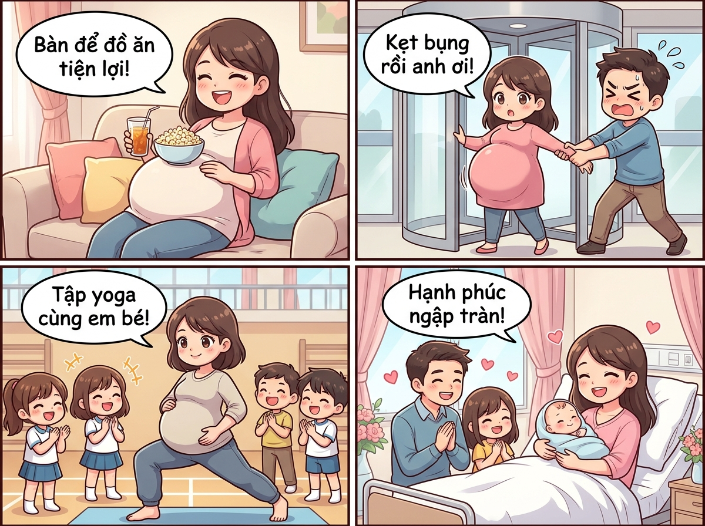

# 🍃 🤰🎉 Tuyển Tập 7 Câu Chuyện Hài Hước Về Chiếc Bụng Bầu "Siêu To Khổng Lồ"

> *Tuyển tập 7 mẩu chuyện cười học đường và gia đình vô cùng ấm áp, hóm hỉnh về những tình huống "dở khóc dở cười" xoay quanh chiếc bụng bầu siêu to vượt mặt của các mẹ bầu đáng yêu!*

---

## 🎨 Trọn Bộ Truyện Tranh Hoạt Hình (Comic Strip)

---

## 📖 7 Câu Chuyện Hài Hước Chi Tiết

### 🍿 Câu Chuyện 1: "Chiếc Bàn Để Đồ Ăn Tiện Lợi"

Ở tháng thứ 8 của thai kỳ, chiếc bụng của cô Thư đã tròn xoe, căng bóng và nhô cao đến mức tạo thành một "mặt phẳng" hoàn hảo ngay trước ngực.
Một buổi tối nọ, hai vợ chồng cùng ngồi xem phim hài trên ghế sofa. Vì chiếc bàn trà đặt hơi xa, cô Thư liền nảy ra sáng kiến: đặt thẳng một tô bắp rang bơ đầy ụ và ly trà sữa lên đỉnh chiếc bụng bầu tròn trịa của mình!
> 🤰 **Cô Thư (vừa ăn vừa cười đắc ý):** *“Anh thấy tiện không? Khỏi cần với tay ra bàn, bụng bầu siêu to này làm chiếc bàn để đồ ăn số một luôn!”*  
> 👨 **Chồng (cười không khép được miệng):** *“Em cẩn thận đấy, em bé mà không thích bắp rang bơ là có biến ngay!”*

Vừa dứt lời, em bé bên trong dường như nghe thấy liền tung một cú đá **“BỤP!”** trúng đích. Chiếc tô bắp rang bơ nảy tưng lên không trung, bắp rơi lả tả xuống ghế sofa. Cả hai vợ chồng nhìn nhau ôm bụng cười chảy cả nước mắt!

---

### 🚪 Câu Chuyện 2: Sự Cố Kẹt Cửa Xoay Trung Tâm Thương Mại

Dì Mai mang thai đôi ở tháng thứ 9, chiếc bụng to kỷ lục khiến dì đi đứng lắc lư như chim cánh cụt. Cuối tuần, chú Tuấn đưa dì đi trung tâm thương mại để dạo bộ cho dễ sinh.
Tại sảnh chính có chiếc cửa kính xoay tự động 3 cánh. Dì Mai khệ nệ bước vào một khoang. Ngặt một nỗi, vì chiếc bụng bầu nhô ra quá xa, khi dì vừa đi được nửa vòng thì chiếc bụng tròn trịa chạm khẽ vào mép kính cảm ứng an toàn. Cảm biến lập tức kích hoạt, cánh cửa dừng khựng lại: **KẸT CỨNG NGẮC!**
> 😱 **Dì Mai (hai tay ôm bụng, mặt méo xệch):** *“Ối anh Tuấn ơi! Cửa nó kẹt bụng em rồi, không nhúc nhích ra được!”*  
> 👨 **Chú Tuấn (chạy lại nắm hai tay dì, toát mồ hôi hột):** *“Em thở đều... 1, 2, 3 anh kéo nhẹ ra nhé! Ráng lên vợ ơi!”*

Bác bảo vệ và mọi người xung quanh vội chạy lại bấm nút mở khẩn cấp. Khi dì Mai thoát ra ngoài an toàn, cả sảnh vỗ tay rầm rộ khiến dì đỏ bừng mặt vừa ngại ngùng vừa phì cười!

---

### 🧘‍♀️ Câu Chuyện 3: Tiết Yoga Bầu & "Quả Bóng Tròn" Tự Lăn

Cô giáo Hà tham gia lớp Yoga tiền sản dành cho các mẹ bầu tháng cuối. Huấn luyện viên dặn cả lớp:
> 🧘 **Huấn luyện viên:** *“Bây giờ mỗi mẹ lấy một quả bóng tập to bằng cao su ôm trước ngực để giữ thăng bằng nhé!”*  
> 🤰 **Cô Hà (chỉ vào chiếc bụng bầu vượt mặt của mình, cười tươi):** *“Cô ơi, bụng em tròn xoe to bằng quả bóng tập luôn rồi, em khỏi cần lấy bóng được không cô?!”*

Cả phòng tập cười ồ thích thú. Đến động tác quỳ gối gập người con mèo, vì chiếc bụng quá to chạm sát sàn nhà, cô Hà mất thăng bằng nhẹ và nghiêng người... lăn lông lốc sang một bên như chú lật đật! May mắn sàn trải thảm xốp dày êm ái, cô Hà nằm cười ngặt nghẽo cùng các mẹ bầu khác.

---

### 🚇 Câu Chuyện 4: Cuộc Nhường Ghế Đồng Loạt Trên Tàu Điện
Chị Oanh mang thai tháng thứ 9 với chiếc bụng to vượt mặt bước lên toa tàu điện Cát Linh - Hà Đông vào giờ tan tầm.
Vừa bước qua cửa tàu, cả khoang tàu đang đông đúc bỗng chốc im bặt. Nhìn thấy chiếc bụng bầu khổng lồ uy nghi của chị Oanh, không phải một người, mà là **cả một hàng 6 hành khách** đang ngồi đồng loạt bật dậy như có gắn lò xo:
> 👦 **Thanh niên:** *“Dạ mời chị ngồi đây ạ!”*  
> 👩 **Cô gái:** *“Ngồi chỗ em cho thoáng chị ơi!”*  
> 👴 **Bác lớn tuổi:** *“Ngồi bên này có tay vịn an toàn hơn cháu ơi!”*

Chị Oanh xúc động cảm ơn rối rít trong khi em bé trong bụng dường như cũng cảm nhận được sự ấm áp, liền đạp liên tiếp 3 cái như muốn vỗ tay cảm ơn mọi người trên tàu!

---

### 👔 Câu Chuyện 5: Chiếc Cúc Áo Bắn Xa Ba Mét
Mẹ Linh được mời đi dự tiệc cưới người bạn thân. Tiếc chiếc váy ren hoa cúc tuyệt đẹp thời son rỗi, mẹ Linh cố ních người vào mặc thử.
Chiếc váy vừa vặn từ vai xuống ngực, nhưng đến đoạn bụng thì... chiếc bụng bầu to tướng căng tròn như quả bóng sắp nổ tung. Bố đứng đằng sau gồng mình kéo khóa, mẹ nín thở cài chiếc cúc bụng:
> 🤰 **Mẹ Linh (nín thở mặt đỏ gay):** *“Được rồi anh ơi... Cài được rồi...!”*

Đúng lúc đó, mẹ Linh bất ngờ hắt xì hơi một cái cực mạnh: **“HẮT XÌ HOI!”**
- Chiếc cúc áo bung chỉ bắn vèo một đường cong tuyệt đẹp bay xa tận... 3 mét!
- **“TÕM!”** Chiếc cúc rơi thẳng vào ly nước chanh của bố trên bàn ăn!
Bố đứng hình mất 3 giây rồi phì cười: *"Thôi thôi em ơi, mặc váy bầu cho con thở, chứ cúc áo bay như đạn thế này nguy hiểm quá!"*

---

### 💃 Câu Chuyện 6: Khi Em Bé Nhảy Hip-Hop Giữa Giờ Họp
Cô giáo Phương là phó hiệu trưởng trường tiểu học. Dù bụng bầu đã to vượt mặt ở tuần thứ 37, cô vẫn nhiệt tình chủ trì cuộc họp hội đồng sư phạm cuối kỳ.
Đang đứng phát biểu dõng dạc trước 50 giáo viên: *"Về phương hướng năm học tới..."*, thì đột nhiên em bé trong bụng quyết định thức giấc và tập nhảy vũ đạo hip-hop!
- Chiếc bụng bầu nhấp nhô lượn sóng từ trái qua phải liên hồi.
- Chiếc váy bầu công sở màu xanh đung đưa từng nhịp theo cú đạp của bé.
Cả phòng họp nín thở nhìn chiếc bụng "lượn sóng" sống động, thầy hiệu trưởng ngồi cạnh bụm miệng cười không nổi, đành lên tiếng:
> 👨‍🏫 **Thầy Hiệu trưởng:** *“Có lẽ em bé trong bụng cô Phương đang biểu quyết nhiệt liệt đồng ý với kế hoạch của mẹ đấy! Cả trường cho một tràng pháo tay nào!”*

---

### 👶👶👶👶 Câu Chuyện 7: Ca Sinh Tư Kỷ Lục – Cả Xóm Trầm Trồ!

Mẹ Thảo nổi tiếng khắp cả khu phố vì có chiếc bụng bầu to nhất từ trước tới nay. Đến tháng cuối, chiếc bụng to đến mức mẹ Thảo đứng thẳng không thể nào nhìn thấy mũi chân mình đâu cả.
Hàng xóm ai đi qua cũng trầm trồ cá cược xem em bé nặng bao nhiêu ký: người đoán 4 ký, người đoán 5 ký.
Đến ngày mẹ Thảo chuyển dạ tại Bệnh viện Phụ sản Trung ương, cả xóm hồi hộp ngóng tin. Và kết quả khiến tất cả mọi người vỡ òa kinh ngạc:
- **Không phải 1 bé, mà là một ca SINH TƯ kỳ tích hiếm gặp!**
- 4 thiên thần nhỏ (hai trai, hai gái) chào đời khỏe mạnh, bé nào bé nấy mỉm mỉn, má phúng phính trắng hồng như bốn chiếc bánh bao sữa!
Ngày mẹ Thảo xuất viện về nhà, cả con phố rộn ràng như trẩy hội, hàng xóm mang quà bánh, tã bỉm đến chúc mừng mẹ siêu nhân đã mang chiếc bụng bầu vĩ đại nhất xóm!

---

## 📸 Những Khoảnh Khắc Đáng Yêu & Ý Nghĩa

|               🍿 Bàn Để Đồ Ăn Độc Lạ               |                🚪 Kẹt Cửa Xoay Tự Động                |                  🧘‍♀️ Mẹ Bầu Tập Yoga                  |
| :------------------------------------------------: | :---------------------------------------------------: | :-----------------------------------------------------: |
|  |  |  |
| *Bụng bầu tròn xoe đặt vừa khéo tô bắp và ly nước* |     *Bụng to chạm mép kính cảm ứng kẹt cứng ngắc*     |        *Mẹ bầu uyển chuyển tập yoga cùng các bé*        |

---

## 💬 Bài Học & Góc Cười

- 🤰 **Vẻ đẹp kỳ diệu của người mẹ:** Dù chiếc bụng bầu to vượt mặt đem lại muôn vàn bất tiện và những pha mắc kẹt hài hước, đó luôn là biểu tượng thiêng liêng và đáng yêu nhất của tình mẫu tử.
- 😂 **Tiếng cười là liều thuốc bổ:** Những mẩu chuyện cười dân dã, ấm áp giúp các mẹ bầu luôn giữ được tinh thần lạc quan, vui vẻ trong suốt thai kỳ.
- 💖 **Sự đồng hành của gia đình & xã hội:** Những hành động nhường ghế, giúp đỡ hay đơn giản là nụ cười cảm thông của mọi người xung quanh luôn là nguồn động viên vô giá cho các bà mẹ tương lai!

---

*#truyencuoi #truyendai #tuyentap #hoathinh #comic #bungbausieuto #7cauchuyen #sinhcon #mimmim #giadinh*
