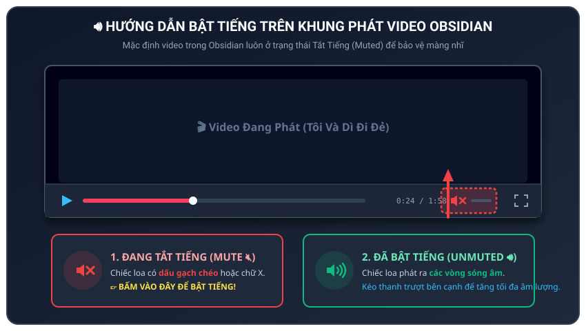
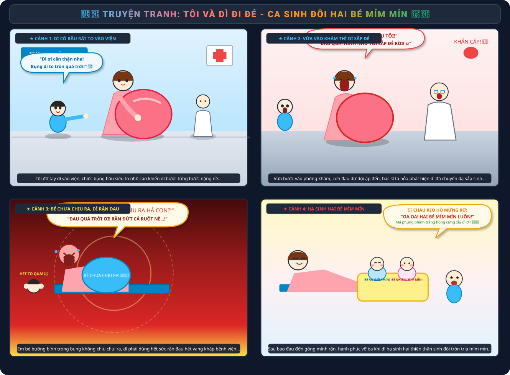
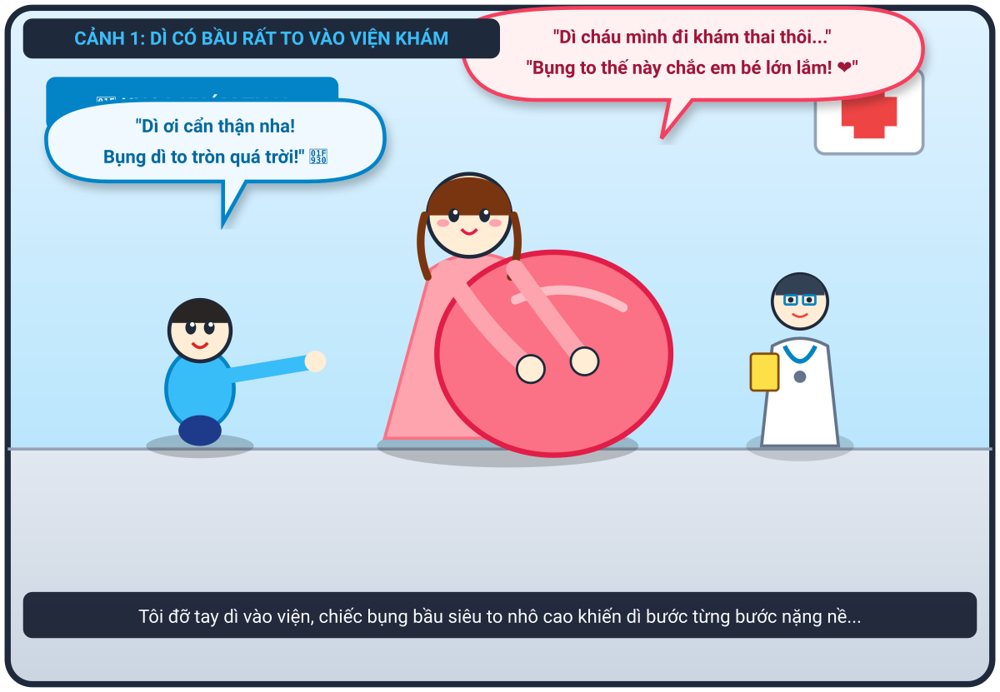
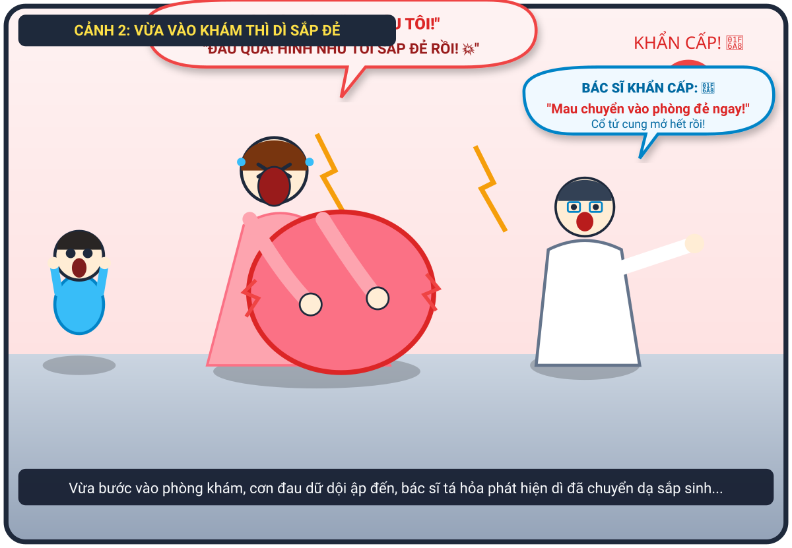
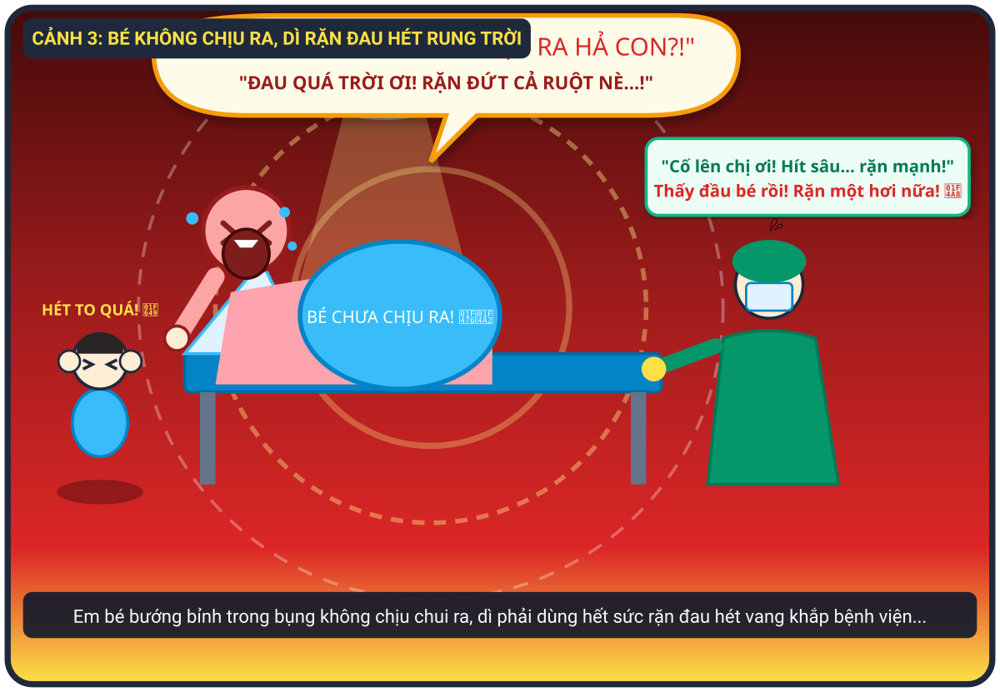
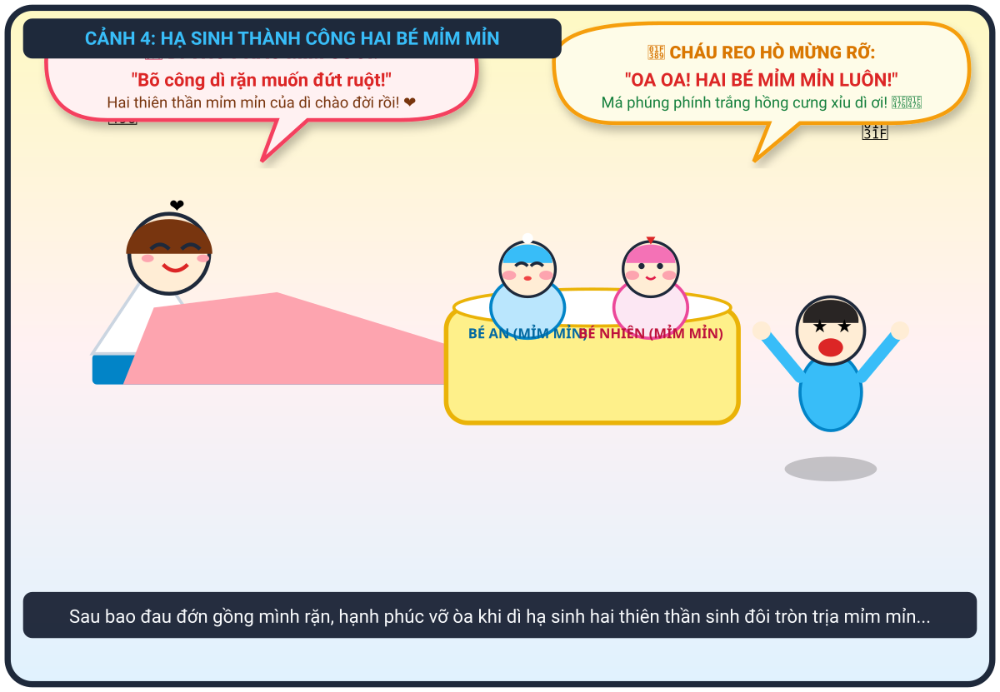

# 🍃 🏥👶 Truyện Tranh Hài Hước: Tôi Và Dì Đi Đẻ - Ca Sinh Đôi Hai Bé Mỉm Mỉn

> *Chuyến đi khám thai bất ngờ nhớ đời của hai dì cháu: từ chiếc bụng bầu siêu to khổng lồ, tiếng hét rung chuyển cả bệnh viện khi bé bướng bỉnh không chịu ra, đến khoảnh khắc vỡ òa hạnh phúc đón chào hai thiên thần sinh đôi mỉm mỉn trắng hồng!*

---

## 🎬 Video Hoạt Hình Lồng Tiếng Tiếng Việt (Bấm Nút Phát ▶)

![[Toi_va_di_di_de_LongTieng.mp4]]

<video controls width="100%" style="border-radius: 12px; margin-top: 10px; margin-bottom: 10px;">
  <source src="Toi_va_di_di_de_LongTieng.mp4" type="video/mp4">
  <source src="Toi_va_di_di_de_LongTieng.mp4" type="video/mp4">
  <source src="Tôi và dì đi đẻ.mp4" type="video/mp4">
</video>

> [!NOTE]
> 🔊 **Đã có bản lồng tiếng tiếng Việt rõ ràng 100%!**
> - Bạn bấm nút **Play (▶)** ở khung video trên để nghe trọn vẹn giọng đọc dẫn chuyện, tiếng cháu reo mừng, tiếng dì la hét rặn đẻ và bác sĩ khẩn cấp.
> - Hoặc mở trực tiếp file video bằng ứng dụng xem phim máy tính: [Toi_va_di_di_de_LongTieng.mp4](Toi_va_di_di_de_LongTieng.mp4).

### 🔍 Hướng Dẫn Vị Trí Bấm Mở Loa (Nếu Bị Tắt Tiếng):

---

## 🎨 Trọn Bộ Truyện Tranh (Comic Strip)

---

## 📖 Chi Tiết Từng Phân Cảnh (Comic Panels)

### 🌟 Cảnh 1: Bụng Bầu "Siêu To Khổng Lồ" Đi Vào Viện Khám

> **Dẫn truyện:** Hôm ấy, tôi được giao nhiệm vụ quan trọng là tháp tùng dì vào viện khám thai định kỳ. Bụng dì dạo này to vượt mặt, to tròn như giấu cả quả dưa hấu khổng lồ trong chiếc váy bầu hồng. Dì bước đi khệ nệ, nghiêng bên nọ lắc bên kia từng bước một. Tôi lon ton đi bên cạnh, hai tay cẩn thận đỡ lấy cánh tay dì như hộ tống hoàng hậu vi hành.
> 
> 🧒 **Tôi (mắt tròn xoe ngước nhìn chiếc bụng to tướng):** *“Dì ơi đi chậm chậm thôi nha! Bụng dì hôm nay to tròn quá trời luôn, con nhìn mà cảm tưởng sắp chạm cả tới cằm dì rồi ấy!”*
> 
> 🤰 **Dì (hai tay xoa chiếc bụng bầu, mỉm cười hiền hậu):** *“Dì cháu mình chỉ đi khám định kỳ xem em bé thế nào thôi con... Bụng to thế này chắc bên trong em bé háu ăn, khỏe mạnh lắm đây! ❤️”*

---

### ⚡ Cảnh 2: Vừa Vào Khám Thì Bác Sĩ Báo "Sắp Đẻ Rồi!"

> **Dẫn truyện:** Vừa mới bước chân vào phòng khám còn chưa kịp ngồi ấm chỗ, dì tôi bỗng nhiên đổi sắc mặt. Cơn gò tử cung ập đến bất thình lình, hai tay dì ôm ghì lấy chiếc bụng bầu tròn xoe, cả người gập xuống, hét toáng lên một tiếng rung rinh cả cửa kính phòng khám!
> 
> 😱 **Dì (ôm chặt bụng bầu, mặt nhăn nhó gào to):** *“Á Á Á...! ĐAU QUÁ CHÁU ƠI! HÌNH NHƯ... HÌNH NHƯ DÌ SẮP ĐẺ RỒI! BÁC SĨ ƠI CỨU TÔI VỚI!”*
> 
> 😨 **Tôi (ôm chặt hai má, giật thót tim nhảy dựng lên):** *“Ối trời ơi! Dì ơi sao thế?! Bác sĩ ơi dì cháu sắp đẻ ngay tại phòng khám rồi!”*
> 
> 👨‍⚕️ **Bác sĩ (giật mình rơi cả bút, cuống cuồng bấm chuông báo động):** *“Báo động đỏ! Cổ tử cung mở trọn rồi, đầu em bé đã tụt xuống! Kíp trực đâu, mau đẩy cáng chuyển sản phụ vào phòng đẻ khẩn cấp ngay lập tức!”*

---

### 🔊 Cảnh 3: Bé Chưa Chịu Ra, Dì Rặn Đau Hét Rung Trời

> **Dẫn truyện:** Dì được đẩy thẳng vào phòng sinh dưới ánh đèn mổ sáng choang. Nhưng éo le thay, em bé trong bụng dường như còn bướng bỉnh chưa chịu chui ra! Dì tôi phải dồn hết 200% công lực gồng mình rặn đẻ trong cơn đau thấu trời. Tiếng hét của dì vang dội qua từng lớp cửa kính, làm rung chuyển cả hành lang bệnh viện khiến ai đi qua cũng phải rợn tóc gáy! Tôi đứng bên ngoài chỉ biết bịt chặt hai tai, mồ hôi hột thi nhau túa ra vì lo lắng.
> 
> 🔊 **Dì (nắm chặt thành giường sắt, mặt đỏ bừng gào to rách họng):** *“Á Á Á Á Á...! SAO MÀ LÌ THẾ HẢ CON, KHÔNG CHỊU RA HẢ?! ĐAU QUÁ TRỜI ƠI... RẶN ĐỨT CẢ RUỘT NÈ... RẶN NỮA LÀ NGẤT ĐẤY...!”*
> 
> 🌀 **Tôi (bịt chặt hai tai, hoa mắt chóng mặt vì sóng âm):** *“Dì hét to như còi báo động phòng không luôn á... Dì ơi cố lên, rặn một hơi nữa thôi!”*
> 
> 👨‍⚕️ **Bác sĩ & Nữ hộ sinh (toát mồ hôi hột, đập tay cổ vũ):** *“Hít một hơi thật sâu... ngậm miệng lại và dồn lực rặn xuống dưới! Một... hai... ba, thấy đầu bé thứ nhất rồi! Rặn thêm một hơi dài nữa nào chị ơi!”*

---

### 🎉 Cảnh 4: Cái Kết Hạnh Phúc – Hạ Sinh Hai Bé "Mỉm Mỉn"!

> **Dẫn truyện:** Sau chuỗi âm thanh rặn đẻ long trời lở đất, không gian phòng sinh bỗng chốc lắng lại, rồi vỡ òa trong hai tiếng khóc oe oe trong trẻo nối tiếp nhau. Chiếc bụng to tướng của dì giờ đã xẹp xuống nhẹ nhõm. Trên chiếc nôi ấm áp bên cạnh giường bệnh là hai thiên thần sinh đôi "mỉm mỉn", má phúng phính trắng hồng núng nính như hai chiếc bánh bao sữa! Dì nằm tựa gối, mồ hôi đầm đìa nhưng nụ cười mãn nguyện, hạnh phúc ngập tràn ánh mắt.
> 
> 🤩 **Tôi (nhảy cẫng lên reo hò, mắt sáng lấp lánh):** *“OA OA OA! Không phải một đứa đâu dì ơi, mà là tận HAI ĐỨA luôn kìa! Bé nào nhìn cũng mỉm mỉn, má phúng phính trắng hồng cưng xỉu luôn! 💖👶👶”*
> 
> 🥰 **Dì (thở phào nhẹ nhõm, hạnh phúc vuốt ve chiếc nôi):** *“Hèn chi bụng to như cái trống, lại còn bướng bỉnh bắt dì rặn muốn đứt ruột mới chịu ra! Bõ công dì hét banh nóc bệnh viện! Chào mừng hai thiên thần mỉm mỉn của dì nhé! ❤️”*
> 
> 👨‍⚕️ **Bác sĩ (cười tươi lau mồ hôi trên trán):** *“Chúc mừng gia đình! Một ca sinh đôi kỳ tích mẹ tròn con vuông, hai bé nặng 3.2kg và 3.1kg cực kỳ kháu khỉnh và bụ bẫm!”*

---

## 📸 Những Khoảnh Khắc Đáng Yêu & Ý Nghĩa

|              🏠 Nỗi Lo Của Dì & Cháu              |             🔊 Tiếng Hét Long Trời Lở Đất              |             👶👶 Cặp Đôi Sinh Đôi Mỉm Mỉn             |
| :-----------------------------------------------: | :----------------------------------------------------: | :---------------------------------------------------: |
|  |  |  |
|    *Dì ôm bụng bầu vượt mặt lo lắng chuyển dạ*    |     *Tiếng hét rặn đẻ vang rúng động cả bệnh viện*     |      *Hai thiên thần nhỏ má bánh bao trắng hồng*      |

---

## 💬 Bài Học & Góc Cười

- 🤰 **Đằng sau chiếc bụng bầu siêu to:** Bụng bầu to bất thường thường ẩn chứa những điều bất ngờ vô cùng ngọt ngào — một ca song thai đáng yêu nhân đôi niềm vui!
- 🔊 **Tiếng hét "thần thánh" của mẹ và dì:** Tiếng hét khi chuyển dạ là minh chứng cho sự hy sinh và sức mạnh phi thường của người phụ nữ để mang lại sự sống cho những thiên thần nhỏ.
- 👶 **Mỉm mỉn nhân đôi:** Hai em bé sinh đôi bụ bẫm, má bánh bao núng nính là phần thưởng xứng đáng nhất xua tan mọi đau đớn vất vả của ca vượt cạn!

---

*#truyencuoi #truyentranh #comic #doisong #sinhdoi #mimmim #haivai #giadinh*
