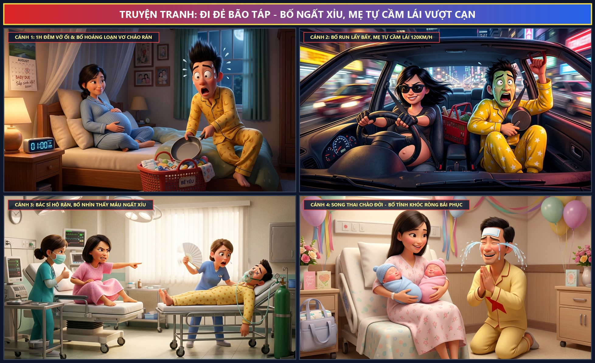

# 🍃 🚗💨 Truyện Tranh Hài Hước: Đi Đẻ Bão Táp - Bố Ngất Xỉu, Mẹ Tự Cầm Lái Vượt Cạn

> *Câu chuyện có thật siêu hài hước về một đêm đi đẻ "bão táp" có một không hai: 1h sáng mẹ vỡ ối điềm tĩnh gọi chồng, ông bố giật mình nhảy dựng xỏ nhầm 2 chân vào một ống quần vơ chảo rán nhét làn đi đẻ; ra đến xe bố run tay đánh rơi chìa khóa, mẹ bụng to vượt mặt phải tự trèo lên ghế lái đạp ga 120km/h như phim Fast & Furious; vào phòng sinh bác sĩ vừa hô thấy tóc em bé thì bố nhìn thấy giọt máu lăn đùng ra ngất xỉu phải thở oxy; kết thúc bằng màn chào đời viên mãn của cặp song thai 7.0kg khiến ông bố tỉnh dậy trán dán cao khóc nức nở bái phục vợ!*

---

## 🎨 Trọn Bộ Truyện Tranh (Comic Strip)

---

## 📖 Chi Tiết Từng Phân Cảnh (Comic Panels)

### 🌙 Cảnh 1: 1h Đêm Vỡ Ối & Ông Bố Hoảng Loạn

> **Dẫn truyện:** Đúng 1h sáng một đêm tĩnh mịch, mẹ bầu mang thai đôi tròn 38 tuần bỗng giật mình cảm nhận một dòng nước ấm tràn ra: vỡ ối rồi! Rất bình thản và khoa học, mẹ thong thả ngồi tựa lưng vào đầu giường, một tay xoa chiếc bụng tròn căng siêu to khổng lồ, một tay khẽ lay ông chồng đang ngáy khò khò bên cạnh: *"Anh ơi dậy đi, em vỡ ối rồi, chuẩn bị đưa em vào viện nhé!"*.
> 
> 😱 **Cơn bão hoảng loạn của ông bố trẻ:** Vừa nghe thấy hai từ "VỠ ỐI", ông bố như bị điện giật 220V giật nảy bắn người lên tận trần nhà! Tóc tai dựng đứng ngược lên như người Saiyan, mắt tròn xoe như hai quả trứng gà, miệng ngoác to hét thất thanh: *"Á Á Á! ĐẺ RỒI! TRỜI ƠI ĐẺ THẬT RỒI CỨU TÔI VỚI!"*.
> 
> 🍳 **Pha sửa soạn đồ đạc đi vào lịch sử:** Trong cơn hoảng loạn tột độ, bố vớ lấy chiếc áo phông mặc lộn ngược từ trong ra ngoài. Chưa hết, chân trái xỏ vào ống quần bên phải, rồi chân phải lại nhét nốt vào... cùng ống quần đó! Kết quả là bố nhảy lò cò hai bước rồi té ngã dập mông xuống sàn. Chưa dừng lại ở đó, chạy xuống bếp vơ vét đồ đạc nhét vào làn đi đẻ màu đỏ, thay vì lấy bình sữa và khăn xô, bố lại cuống cuồng vơ ngay... một chiếc **CHẢO RÁN CHỐNG DÍNH** và chiếc máy sấy tóc nhét thẳng vào làn!
> 
> 🤰 **Mẹ bầu (nở nụ cười bất lực đầy điềm tĩnh):**  
> *“Anh ơi bình tĩnh lại giùm em với! Người đẻ là em chứ có phải anh đâu mà anh nhảy dựng tóc tai thế kia? Đi đẻ chứ có phải đi thi MasterChef đâu mà anh mang theo chảo rán? 🍳🤣”*
> 
> 😨 **Bố (mặt tái mét, thở hồng hộc):**  
> *“Anh... anh mang chảo đi để lỡ nửa đêm vợ đói thì anh rán trứng bồi dưỡng! Mau mau, đi đẻ thôi không kịp bây giờ vợ ơi! 🏃‍♂️💨”*

---

### 🚗 Cảnh 2: Bố Run Lẩy Bẩy, Mẹ Bầu Tự Cầm Lái Vượt Cạn

> **Dẫn truyện:** Khó khăn lắm hai vợ chồng mới xuống được tầng hầm gửi xe. Nhưng lúc này hai đầu gối của bố đã va vào nhau run lẩy bẩy như máy đánh trứng, bàn tay run rẩy cầm chùm chìa khóa xe ô tô mà cắm trượt ổ khóa cửa xe đến năm lần bảy lượt rồi làm rơi tọt xuống gầm xe!
> 
> 🏎️ **Màn đổi tài xế ngoạn mục:** Thấy cơn co thắt bắt đầu đến dồn dập mà chồng thì mặt mũi đã xám ngoét không còn hột máu, mẹ bầu quyết định: **"Tự thân vận động!"**. Mẹ nhặt phắt chìa khóa xe, mở cửa ghế phụ đẩy ông chồng vào ngồi ôm làn đẻ, còn mình thì bụng to vượt mặt lách người trèo lên ghế lái chính!
> 
> 🕶️ **Fast & Furious phiên bản bà bầu:** Đeo chiếc kính râm đen cực ngầu, mẹ chỉnh ghế lùi ra sau một nấc để chiếc bụng bầu khổng lồ không bị cấn vô lăng. Vặn chìa khóa, đạp ga... *"VROOOOMMM!"* – chiếc xe lao vút ra khỏi hầm, xé toạc màn đêm đường phố vắng với vận tốc 120km/h! Một tay mẹ điềm đạm xoay vô lăng né cua điệu nghệ, một tay chống hông gồng cơn gò, vẻ mặt lạnh lùng như tay đua cự phách!
> 
> 🤢 **Trong khi đó ở ghế phụ:** Bố co rúm người lại như con tôm luộc, hai tay ôm chặt khư khư chiếc làn đẻ màu đỏ và cái chảo rán trước ngực, mắt đảo như rang lạc, miệng run bần bật, mồ hôi đầm đìa:
> 
> 🏎️ **Mẹ bầu (nhấn ga vượt đèn vàng, hô lớn):**  
> *“Bám chắc tay vịn anh ơi! Hôm nay mẹ con em sẽ đưa anh... à nhầm, đưa em đi đẻ đúng giờ! Tốc độ là đam mê của mẹ bầu này! 🚀💨”*
> 
> 🥶 **Bố (mặt xanh như tàu lá chuối, khóc dở mếu dở):**  
> *“Vợ ơi... chậm lại một xíu thôi em ơi... tim anh rớt xuống dạ dày rồi... Hu hu, anh thề từ nay không bao giờ dám bảo vợ lái xe yếu bóng vía nữa! 😭🤢”*

---

### 🏥 Cảnh 3: Vào Phòng Sinh – Bác Sĩ Hô Rặn, Bố Ngất Lăn Ra Sàn

> **Dẫn truyện:** Chiếc xe phanh kít ngay trước sảnh cấp cứu sản khoa. Các y bác sĩ lập tức đẩy mẹ vào phòng sinh đặc biệt. Vì thương vợ và muốn chứng kiến khoảnh khắc thiêng liêng con chào đời, bố nằng nặc xin bác sĩ mặc áo bảo hộ vô trùng để được vào phòng sinh nắm tay tiếp sức cho vợ. Nhưng hỡi ôi, lòng nhiệt tình thì có thừa mà bản lĩnh thì lại... âm vô cực!
> 
> ⚡ **Cú sốc phòng sinh:** Trong phòng sinh sáng rực dưới ánh đèn mổ chuyên dụng, mẹ bầu nằm trên bàn sinh, hai tay nắm chặt tay vịn gồng hết sức mình. Bác sĩ sản khoa đứng dưới hô to cổ vũ: *"Giỏi lắm mẹ ơi! Thấy chỏm tóc đen của em bé đầu tiên rồi! Cố lên nào, 1... 2... 3... RẶN MẠNH MỘT HƠI NÀO!"*.
> 
> 😵 **Cú "ngất xỉu thế kỷ":** Nghe bác sĩ hô, bố tò mò nhòm xuống xem... Vừa nhìn thấy một giọt máu nhỏ xíu xiu dính trên găng tay bác sĩ, mắt bố bỗng trợn ngược lên, môi tím tái, hai chân mềm nhũn ra như sợi bún. *"RẦM...!"* – Ông bố cao 1m78 lăn đùng ngã ngửa ra sàn phòng sinh, ngất xỉu không biết trời trăng mây gió gì nữa!
> 
> 🚨 **Cấp cứu ngược đời:** Phòng sinh bỗng chốc trở nên hỗn loạn tột độ! Thay vì chỉ tập trung đỡ đẻ cho sản phụ, hai cô y tá phải cuống cuồng chạy sang khiêng bố đặt lên chiếc cáng bệnh bên cạnh, đo huyết áp, đắp khăn lạnh lên trán và chụp ngay mặt nạ thở oxy vào mũi bố!
> 
> 😤 **Mẹ bầu (trên bàn đẻ vừa rặn vừa tức giận chỉ tay sang giường bố):**  
> *“DẬY NGAY ÔNG TƯỚNG ƠI! 💢 Ai là người đi đẻ mà ông lăn đùng ra ngất bắt y tá phục vụ thở oxy thế hả?! Có dậy mà ngắm con không thì bảo! HỰYYYYYYY...!”*
> 
> 👩‍⚕️ **Y tá (vừa bóp bóng thở oxy vừa sốt sắng lay bố):**  
> *“Anh ơi tỉnh lại anh ơi! Bố sản phụ bị tụt huyết áp ngất lịm rồi! Bác sĩ ơi cho thêm một bình oxy 100% qua giường bố gấp!”*

---

### 🎉 Cảnh 4: Song Thai Chào Đời – Mẹ Rạng Rỡ, Bố Tỉnh Dậy Bái Phục

> **Dẫn truyện:** Sau tiếng gầm sấm sét và cú rặn đầy nội lực của người mẹ siêu phàm, hai tiếng khóc chào đời trong trẻo, đanh thép *"OE... OE... OA!"* liên tiếp vang lên khắp phòng sinh! Ca sinh đôi mẹ tròn con vuông diễn ra nhanh như một cơn lốc!
> 
> 👶👶 **Kỳ tích song thai 7.0kg:** Bé anh trai nặng tròn trĩnh **3.5kg**, bé em gái cũng nặng đúng **3.5kg** – tổng cộng là **7.0kg** thịt thơm tho bụ bẫm! Hai bé má phúng phính trắng hồng như hai củ cải trắng, quấn gọn gàng trong tã xanh và tã hồng nằm trọn trong vòng tay ấm áp của mẹ. Chiếc bụng bầu siêu to khổng lồ của mẹ đã hoàn thành sứ mệnh thiêng liêng một cách xuất sắc nhất!
> 
> 😭🙏 **Màn tỉnh dậy "thức tỉnh linh hồn":** Khi được chuyển sang phòng hậu sản ngập tràn bóng bay và hoa chúc mừng, liều oxy tinh khiết cuối cùng cũng giúp bố hồi tỉnh. Mở mắt ra, trán vẫn còn dán nguyên miếng cao dán Salonpas to tướng hạ nhiệt, bố nhìn thấy cảnh tượng trước mắt: Vợ mình mặt mũi hồng hào tươi tắn như hoa hậu đang ôm hai thiên thần nhỏ bụ bẫm cười toe toét!
> 
> 🌟 **Pha bái phục đi vào lòng người:** Bố vội vàng trèo xuống giường, quỳ gối ngay ngắn bên cạnh giường vợ, hai hàng nước mắt xúc động và hối hận tuôn trào lã chã như hai dòng suối. Bố chắp hai tay lại thành tâm vái lạy người vợ vĩ đại:
> 
> 😭 **Bố (khóc nức nở sụt sùi, giọng run run nghẹn ngào):**  
> *“Vợ ơi... Em là Siêu Nhân! Em là Thần Tượng số 1 của đời anh! 😭🙏 Một mình em lái xe 120km/h, một mình em rặn đẻ hai đứa 7 ký, trong khi anh vô dụng chỉ biết ngất xỉu nằm thở oxy... Anh thề từ nay về sau, đội vợ lên đầu trường sinh bất lão! Vợ bảo đi hướng Đông anh không dám nhìn hướng Tây! Anh xin phục vợ sát đất luôn! 🙏💖”*
> 
> 🥰 **Mẹ (cười tít mắt, khẽ hôn lên trán hai con):**  
> *“Biết thế là tốt! Nhìn hai con đi này, mặt mũi giống bố như đúc! May mắn duy nhất là trộm vía hai đứa gan dạ giống mẹ chứ không nhát gan lăn ra ngất như bố đâu nhé! 🤣❤️”*

---

## 📸 Những Khoảnh Khắc Đáng Yêu & Ý Nghĩa

| 🌙 Nửa Đêm Vỡ Ối Bố Hoảng Loạn | 🚗 Mẹ Bầu Cầm Lái Fast & Furious | 👶👶 Song Thai 7.0kg Chào Đời |
| :---: | :---: | :---: |
|  |  |  |
| *Bố cuống cuồng xỏ một ống quần vơ chảo rán đi đẻ* | *Mẹ bụng bầu vượt mặt phóng 120km/h chở bố run rẩy* | *Hai bé bụ bẫm 3.5kg mỗi bé, bố tỉnh khóc lạy vợ* |

---

## 💬 Bài Học & Góc Cười

- 🤰 **Sức mạnh phi thường của người phụ nữ khi vượt cạn:** Đứng trước ngưỡng cửa làm mẹ, người phụ nữ có thể bộc phát nguồn năng lượng và bản lĩnh phi thường mà chính họ cũng không ngờ tới – từ việc bình tĩnh đối diện cơn đau, tự xử lý mọi tình huống khẩn cấp cho đến cú rặn đưa con chào đời bình an.
- 👨 **Thấu hiểu và trân trọng nỗi đau đẻ của vợ:** Dù ông bố có phần vụng về, nhát gan đến mức ngất xỉu, nhưng giọt nước mắt nghẹn ngào và sự bái phục chân thành chính là minh chứng rõ nhất cho tình yêu thương và sự biết ơn vô bờ bến dành cho người bạn đời.
- 💖 **Hạnh phúc gia đình bắt đầu từ những kỷ niệm khó quên:** Đêm đi đẻ bão táp ấy sẽ mãi là một câu chuyện hài hước, ấm áp được kể đi kể lại trong mỗi bữa cơm gia đình khi các con khôn lớn!

---

*#truyencuoi #truyentranh #comic #didebaotap #bongatxiu #melaisieunhan #vuotcan #songthai #mevacon #giadinhhanhphuc #chuyenda*

