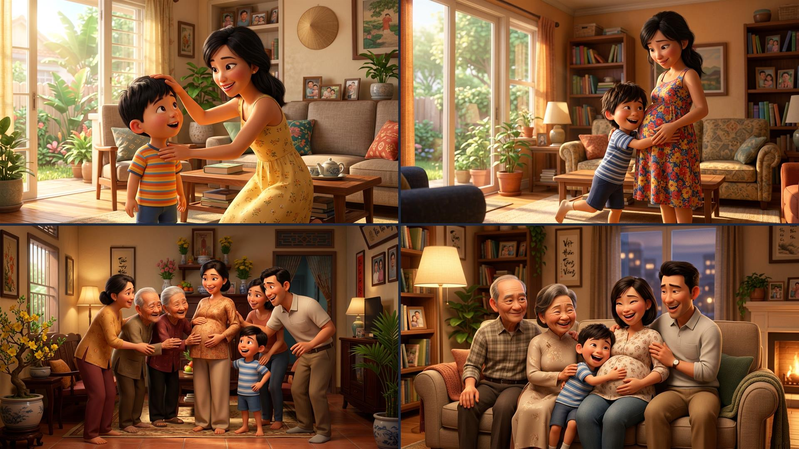
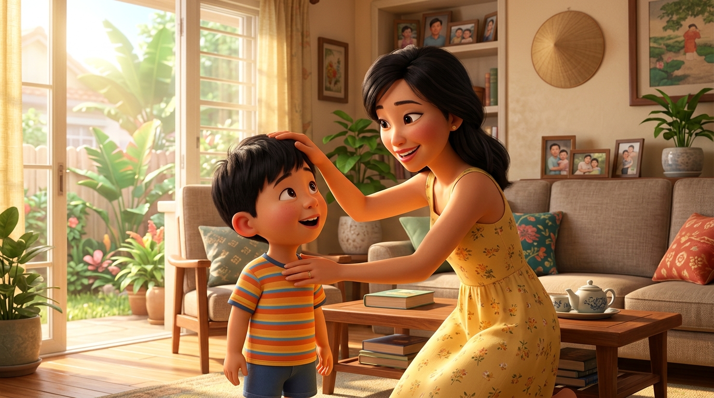
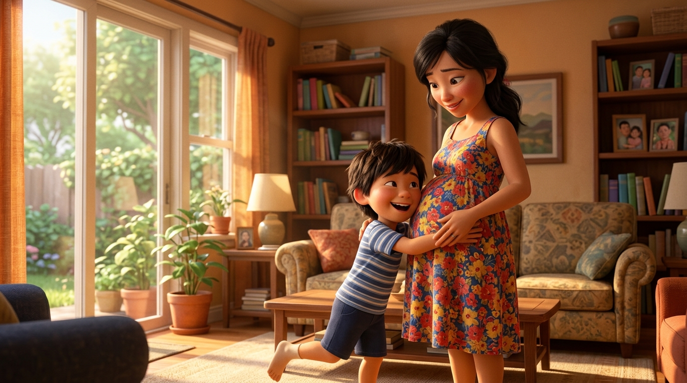
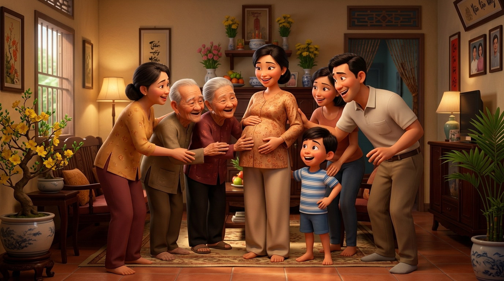
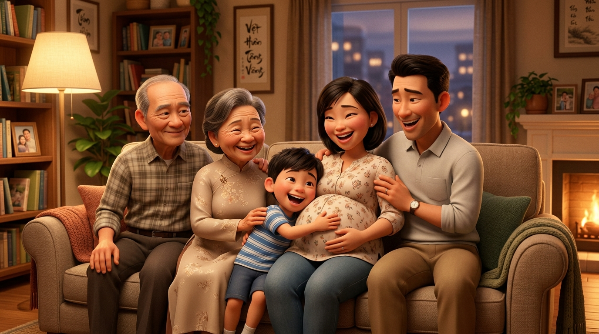

# 🍃 🤰❤️ Truyện Tranh Hài Hước & Hạnh Phúc: Điều Ước Có Em Bé & Chiếc Bụng Bầu Của Mẹ

> *"Tôi thấy mọi người đều có em bé nhưng tôi thì không, tôi nói với mẹ thì mẹ đồng ý ngay. Những ngày sau thì tôi thấy bụng mẹ dần dần to ra, tôi ôm chặt lấy bụng mẹ, ai cũng muốn chạm vào bụng mẹ tôi. Cả nhà tôi vui vẻ ở bên nhau."*  
> — Một câu chuyện chân thực, ngọt ngào và đong đầy tiếng cười ấm áp về tình cảm gia đình thiêng liêng.

---

## 🎬 Trình Chiếu Video Hoạt Hình & Lồng Tiếng Điện Ảnh

<iframe src="video_dieu_uoc_co_em_be.html" width="100%" height="680" style="border: none; border-radius: 16px; box-shadow: 0 12px 36px rgba(0,0,0,0.5); margin: 12px 0 18px 0;" allow="autoplay"></iframe>

> 💡 **Xem video tương tác rạp chiếu phim (Cinema Theater):**
> - Bấm nút **▶ Phát Phim** ở khung trên để thưởng thức câu chuyện với âm thanh studio **Microsoft An (vi-VN)** trong trẻo, mượt mà 100% không giật lag.
> - Hiệu ứng chuyển cảnh điện ảnh **Ken Burns 3D Pixar**, phụ đề đồng bộ từng nhân vật.
> - 🎪 Mở trình phát độc lập: [video_dieu_uoc_co_em_be.html](video_dieu_uoc_co_em_be.html)
> - 📥 Tích hợp nút **Xuất / Tải Video MP4** trực tiếp ngay trên thanh điều khiển của trình phát.

---

### 🎨 Trọn Bộ Truyện Tranh Hoạt Hình 3D Pixar (Full 4-Panel Comic Strip)

---

## 📖 Chi Tiết Từng Phân Cảnh Hoạt Hình 3D (Comic Scenes)

### 🧒 Cảnh 1: Điều Ước Bé Thơ – "Sao Bạn Nào Cũng Có Em Bé, Còn Con Thì Không?"

> **Dẫn truyện:** Một buổi chiều ngập tràn ánh nắng vàng rực rỡ, tôi đứng bên khung cửa sổ nhìn ra khoảnh sân trước nhà. Ngoài kia, các bạn bè cùng trang lứa trong xóm ai nấy đều có em bé nhỏ xíu bụ bẫm để bế bồng, cưng nựng, thơm má suốt cả ngày. Nhìn các bạn cười đùa tíu tít quanh chiếc xe nôi em bé, trong lòng tôi bỗng trào dâng một cảm giác thèm thuồng và ghen tị không tả xiết.  
> 
> Không thể chần chừ thêm một giây nào nữa, tôi liền quay ngoắt người, chạy vội vào phòng khách ấm cúng. Thấy mẹ đang dịu dàng ngồi đọc sách trong chiếc váy hoa vàng tươi tắn, tôi sà ngay vào lòng mẹ, hai tay níu chặt lấy vạt áo mẹ, phụng phịu thắc mắc bằng giọng điệu ngây thơ nhất quả đất:
> 
> 🧒 **Bé Lam (chớp chớp đôi mắt to tròn, môi chu ra nũng nịu):**  
> *“Mẹ ơi mẹ! Con thấy bạn Bo, bạn Bống, bạn nào trong xóm cũng có em bé nhỏ xíu bồng bế hết trơn á... Sao chỉ có mỗi mình con là không có em bé hả mẹ? Con thèm có em bé lắm rồi, mẹ cho con một đứa em đi mẹ!”*
> 
> 👩 **Mẹ (ngỡ ngàng vài giây rồi bật cười giòn tan, ánh mắt rạng ngời đưa bàn tay ấm áp xoa đầu tôi):**  
> *“Ôi cục cưng của mẹ ngoan quá! Tưởng chuyện gì to tát, mẹ đồng ý ngay tắp tức! Mẹ hứa sẽ tặng cho con một em bé thật bụ bẫm, đáng yêu để hai anh em cùng chơi đùa nhé!”*
> 
> 🧒 **Bé Lam (nhảy cẫng lên sung sướng, vỗ tay bôm bốp):**  
> *“Aaa hoan hô mẹ! Mẹ nhớ giữ lời nha mẹ, ngoắc tay cái nào! 🥳💖”*

---

### 🤰 Cảnh 2: Phép Màu Bụng Tròn – Bụng Mẹ To Dần & Cái Ôm Siết Chặt Đầy Yêu Thương

> **Dẫn truyện:** Lời hứa của mẹ quả nhiên không phải chuyện đùa! Những tuần và những tháng sau đó, một phép màu kỳ diệu thực sự diễn ra ngay trước mắt tôi. 
> 
> Chiếc bụng thon thả ngày nào của mẹ bắt đầu nhú lên, rồi cứ thế... dần dần to tròn lên trông thấy từng ngày! Ban đầu chỉ như một quả bưởi nhỏ, rồi nhanh chóng nở nang tròn căng như một quả dưa hấu ngoại cỡ khổng lồ, căng tròn phúc hậu dưới lớp váy hoa xinh xắn. 
> 
> Mỗi ngày đi học mẫu giáo về, việc đầu tiên tôi làm không phải là tháo cặp sách, mà là phóng thẳng một mạch vào phòng khách, sà ngay vào lòng mẹ:
> 
> 🧒 **Bé Lam (dang rộng cả hai cánh tay nhỏ xíu, ôm chặt cứng lấy chiếc bụng bầu tròn xoe của mẹ, áp cả má bánh bao vào lớp vải mềm):**  
> *“Oa oa! Bụng mẹ hôm nay lại to hơn hôm qua rồi nè! Tròn ủng, êm ru và ấm áp y như chiếc gối bông khổng lồ vậy mẹ ơi! Em bé ơi, anh hai đi học về rồi nè, anh đang ôm chặt lấy em đây!”*
> 
> 🤰 **Mẹ (mỉm cười hạnh phúc vô bờ bến, hai tay nâng đỡ bụng bầu và vuốt nhẹ lưng tôi):**  
> *“Con trai mẹ ôm khéo thế! Em bé bên trong bụng cảm nhận được hơi ấm của anh hai đấy... Này, em bé vừa đạp *bụp* một cái vào má con để chào anh hai kìa!”*
> 
> 🧒 **Bé Lam (mắt sáng rực, cười tít cả mắt):**  
> *“Con thấy rồi! Em bé đạp nhẹ nhẹ như cá con quẫy đuôi vậy! Con sẽ ôm bụng mẹ suốt ngày để bảo vệ em bé luôn!”*

---

### ✨ Cảnh 3: Chiếc Bụng Bầu "Ngôi Sao" – Ai Đến Chơi Cũng Muốn Chạm Tay Lấy May!

> **Dẫn truyện:** Khi chiếc bụng bầu của mẹ bước sang những tháng cuối thai kỳ, chu vi ước tính đã vượt qua con số 110 centimet – tròn ủng, căng mọng và sáng ngời nét phúc hậu của một người phụ nữ viên mãn. Chiếc bụng ấy bỗng chốc trở thành "ngôi sao sáng nhất khu phố", một thỏi nam châm thu hút sự quan tâm và niềm hân hoan của tất cả mọi người!
> 
> Bố đi làm về chưa kịp cởi giày đã chạy lại ngắm bụng mẹ; ông bà nội ngoại bước vào cửa là cười rạng rỡ; các cô chú họ hàng và cả những bác hàng xóm thân thiết hễ sang chơi nhà là đều trầm trồ, háo hức quây quần quanh mẹ:
> 
> 👵 **Bà ngoại & Cô bác hàng xóm (tươi cười rạng rỡ, đưa những bàn tay ấm áp xoa nhẹ lên bụng mẹ):**  
> *“Trộm vía em bé! Bụng mẹ tròn xoe, cao ráo và phúc hậu thế này thì sinh ra chắc chắn thông minh, khỏe mạnh và đáng yêu lắm đây! Nào nào, cho bà và các cô chạm tay xoa nhẹ một chút để lấy may mắn nhé!”*
> 
> 👨 **Bố (đứng cạnh vừa cười vừa nhìn mẹ đầy yêu thương):**  
> *“Cả xóm ai cũng mê chiếc bụng bầu của mẹ nó hết trơn! Nhìn tròn xoe đáng yêu thế này, thảo nào ai cũng muốn chạm vào chia vui!”*
> 
> 🛡️ **Bé Lam (đứng hiên ngang ngay bên cạnh bụng mẹ, hai tay chống hông làm dáng vệ sĩ tí hon vô cùng nghiêm túc):**  
> *“Dạ được ạ, con cho phép mọi người chạm vào bụng mẹ con lấy may! Nhưng mà các bác phải xoa thật nhẹ tay thôi nha, em bé của con đang ngủ trưa đấy, ai làm em bé giật mình là vệ sĩ anh hai không cho chạm nữa đâu đó! 😜”*
> 
> 🤣 **Cả phòng khách bật cười rộn rã trước sự quả quyết và hãnh diện dễ thương của cậu anh hai tí hon!**

---

### 🏡 Cảnh 4: Sum Vầy Trọn Vẹn – Cả Nhà Cười Vang Hạnh Phúc Bên Chiếc Bụng Yêu Thương

> **Dẫn truyện:** Buổi tối hôm ấy, dưới ánh đèn vàng ấm áp và ngọn lửa sưởi bập bùng trong phòng khách, một bức tranh gia đình tuyệt đẹp và bình yên nhất đã được dệt nên.
> 
> Trên chiếc ghế sofa êm ái, cả gia đình chúng tôi quây quần ngồi sát bên nhau. Bố ngồi bên phải, một tay trìu mến choàng qua bờ vai mẹ, một tay âu yếm đặt lên bụng mẹ. Tôi ngồi nép chặt vào lòng mẹ, hai tay ôm ghì lấy khối bụng bầu tròn xoe, áp trán vào bụng em như thể muốn truyền hết mọi yêu thương của mình cho em bé sắp chào đời. Ông bà ngồi cạnh, nụ cười hiền hậu ánh lên niềm tự hào rạng rỡ:
> 
> 👨‍👩‍👧 **Bố & Mẹ (nhìn nhau say đắm rồi nhìn xuống hai đứa con, giọng nói ấm áp rung động):**  
> *“Cảm ơn điều ước ngây thơ của con trai nhé! Nhờ có điều ước của con mà nhà mình sắp có thêm một thành viên nhí tuyệt vời. Cả nhà mình sẽ luôn yêu thương, gắn bó và chở che cho nhau suốt cuộc đời!”*
> 
> 🧒 **Bé Lam (cười toác miệng, khoe lúm đồng tiền xinh xắn):**  
> *“Hồi trước con cứ tủi thân vì thấy ai cũng có em bé bế bồng, giờ thì mẹ sắp sinh cho con một em bé cưng nhất hệ mặt trời rồi! Gia đình mình là số một, cả nhà mình ở bên nhau là vui nhất trần đời! ❤️🎉”*
> 
> 🌟 **Tiếng cười giòn tan, ngọt ngào của cả nhà vang rền khắp căn phòng nhỏ, xua tan mọi mỏi mệt ngoài kia, thắp sáng niềm hy vọng và tình mẫu tử thiêng liêng vô giá!**

---

## 🖼️ Thư Viện 4 Phân Cảnh Hoạt Hình 3D Pixar

| 🧒 Cảnh 1: Điều Ước Ngây Thơ | 🤰 Cảnh 2: Bụng Mẹ To Dần & Cái Ôm |
| :---: | :---: |
|  |  |

| ✨ Cảnh 3: Ai Cũng Chạm Lấy May | 🏡 Cảnh 4: Cả Nhà Sum Vầy Hạnh Phúc |
| :---: | :---: |
|  |  |

---

## 📊 Bảng Thống Kê Những Chi Tiết Đáng Yêu Trong Câu Chuyện

| Hạng Mục | Chi Tiết Thực Tế Trong Câu Chuyện | Ý Nghĩa Hài Hước & Cảm Xúc |
| :--- | :---: | :--- |
| 🧒 **Nguyên nhân câu chuyện** | **Thấy bạn bè ai cũng có em bé** | Nỗi hờn dỗi ngây thơ, đáng yêu của trẻ con khi muốn có em bế bồng |
| ⚡ **Tốc độ đồng ý của mẹ** | **Đồng ý ngay tắp lự** | Tình yêu thương chiều chuộng vô điều kiện của người mẹ |
| 🍉 **Hình dáng chiếc bụng bầu** | **Tròn xoe, to dần như quả bóng lớn** | Chiếc bụng bầu phúc hậu ngày một nở nang ấm áp |
| 🤗 **Hành động quen thuộc của bé** | **Ôm chặt cứng lấy bụng mẹ** | Thể hiện sự gắn bó thiêng liêng, nôn nóng chờ ngày làm anh hai |
| 🌟 **Phản ứng của mọi người** | **Ai cũng muốn chạm tay lấy may** | Chiếc bụng bầu trở thành niềm vui và phước lành của cả họ hàng, xóm giềng |
| 🛡️ **Vai trò mới của bé** | **Vệ sĩ canh chừng giấc ngủ em bé** | Trách nhiệm và sự hãnh diện đáng yêu của cậu anh trai nhỏ |
| 🏡 **Kết thúc câu chuyện** | **Cả nhà quây quần cười vang hạnh phúc** | Giá trị cốt lõi của tình cảm gia đình sum vầy, đoàn kết yêu thương |

---

## 💬 Góc Bình Luận & Bài Học Yêu Thương Gia Đình

> [!TIP]
> **Thông điệp nhân văn sâu sắc từ câu chuyện:**
> 1. **Lắng nghe mong ước của con trẻ:** Trẻ con nhìn thế giới bằng lăng kính hồn nhiên và giàu tình cảm. Khi thấy bạn bè có em, bé khao khát có một người em ruột thịt để yêu thương, nhường nhịn và đồng hành.
> 2. **Sự gắn kết thai giáo tự nhiên:** Việc người anh lớn thường xuyên sà vào lòng, ôm chặt lấy bụng mẹ và trò chuyện với thai nhi chính là bài học thai giáo tuyệt vời nhất, giúp em bé cảm nhận được tình thương ngay từ trong bụng mẹ.
> 3. **Niềm vui lan tỏa:** Một sinh linh bé bỏng sắp chào đời không chỉ là niềm hạnh phúc của riêng bố mẹ, mà còn là sợi dây gắn kết cả đại gia đình, họ hàng và bà con lối xóm trong tiếng cười rộn rã và những lời chúc phúc an lành! 🥰💖👨‍👩‍👧‍👦
