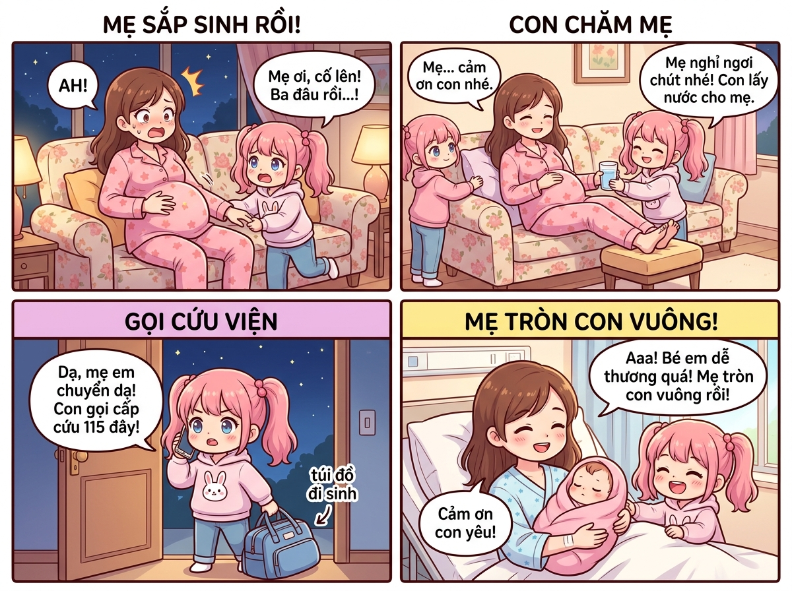
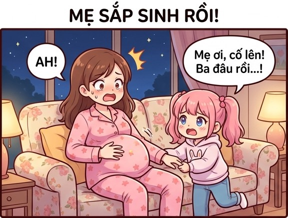
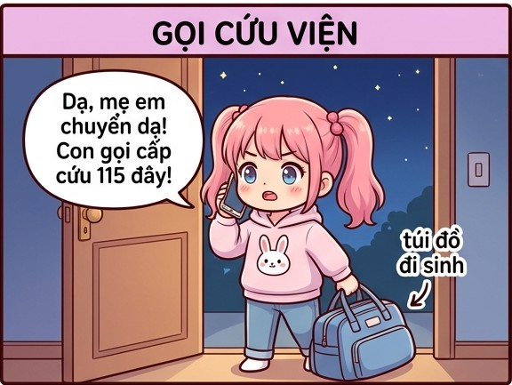
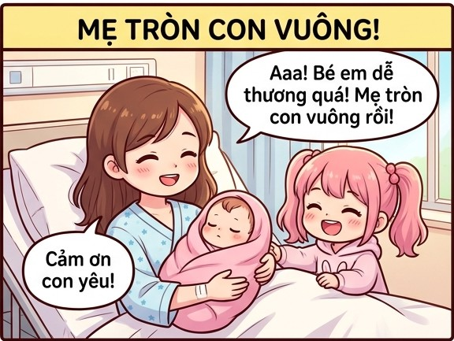
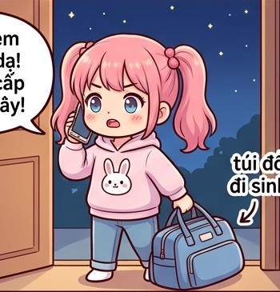

# 🍃 🌙🤰 Truyện Tranh Hoạt Hình: Đêm Mẹ Chuyển Dạ Bất Ngờ

> *Một buổi tối ấm áp bỗng trở nên hồi hộp khi mẹ mang chiếc bụng bầu siêu to bất ngờ lên cơn đau chuyển dạ tại nhà. Bạn nhỏ đã vô cùng nhanh trí, bình tĩnh đỡ mẹ nghỉ ngơi, nâng chân mẹ gác lên đệm êm, lấy nước ấm và gọi điện thoại cấp cứu 115 thần tốc giúp mẹ đến viện an toàn đón em bé chào đời!*

---

## 🎨 Trọn Bộ Truyện Tranh Hoạt Hình (Comic Strip)

---

## 📖 Chi Tiết Từng Phân Cảnh (Comic Panels)

### 🌟 Cảnh 1: Cơn Đau Ập Đến Giữa Đêm – "Mẹ Sắp Sinh Rồi!"

> **Dẫn truyện:** Đêm hôm ấy, trong phòng khách ấm cúng, mẹ đang ngồi trên chiếc ghế sofa quen thuộc. Mẹ đang ở những ngày cuối thai kỳ, chiếc bụng bầu tròn xoe, to vượt mặt khiến việc đi lại và cử động của mẹ rất khó khăn. Bỗng nhiên, một cơn gò chuyển dạ ập đến bất thình lình làm mẹ giật mình ôm lấy bụng, khẽ reo lên một tiếng: *"Á!"*. Bạn nhỏ đang chơi gần đó nghe thấy liền hốt hoảng chạy ào tới nắm chặt lấy tay mẹ lo lắng:
> 
> 🤰 **Mẹ (hai tay ôm bụng bầu, toát mồ hôi):** *“Ối chao... Cơn gò đến dồn dập quá... Hình như mẹ sắp sinh em bé rồi con ơi!”*
> 
> 👧 **Bạn nhỏ (mắt tròn xoe, lo lắng nắm tay mẹ):** *“Mẹ ơi cố lên! Ba thì đang kẹt xe chưa về tới... Mẹ đừng lo, có con ở đây chăm mẹ!”*

---

### 💖 Cảnh 2: Bạn Nhỏ Ân Cần Chăm Sóc – "Con Chăm Mẹ"

> **Dẫn truyện:** Dù còn nhỏ nhưng bạn rất nhanh trí và bình tĩnh. Bạn nhanh chóng lấy chiếc gối bông êm ái kê nhẹ nhàng sau lưng cho mẹ tựa, rồi nhẹ nhàng đỡ hai bàn chân mẹ nâng lên, gác lên chiếc ghế đệm nhỏ để chân mẹ đỡ bị phù nề và giảm áp lực cơn đau. Bạn còn nhanh chân chạy vào bếp rót một cốc nước ấm mang ra mời mẹ uống, tay khẽ xoa lưng vỗ về động viên mẹ:
> 
> 👧 **Bạn nhỏ (chu đáo đỡ mẹ, đưa cốc nước ấm):** *“Mẹ ngả lưng tựa gối cho đỡ mỏi nhé! Con kê ghế gác chân lên cho mẹ rồi nè. Mẹ uống ngụm nước ấm cho dễ chịu nha mẹ!”*
> 
> 🤰 **Mẹ (ngả lưng êm ái, mỉm cười xúc động):** *“Mẹ cảm ơn con yêu nhiều lắm... Con gái mẹ hôm nay giỏi và hiểu chuyện quá!”*

---

### 🚨 Cảnh 3: Cuộc Gọi Cứu Viện Thần Tốc – "Gọi Cứu Viện"

> **Dẫn truyện:** Nhận thấy cơn đau của mẹ mỗi lúc một dồn dập, bạn nhỏ không hề chần chừ. Bạn chạy ngay ra góc cửa lấy chiếc túi đồ đi sinh mà mẹ đã chuẩn bị sẵn từ trước, một tay xách túi đồ, tay kia cầm điện thoại bấm số gọi ngay cho tổng đài cấp cứu 115 với giọng điệu vô cùng dõng dạc và mạch lạc:
> 
> 👧 **Bạn nhỏ (một tay xách giỏ đồ, một tay cầm máy nói rành rọt):** *“Alo chú bác sĩ ơi! Mẹ cháu bụng bầu to sắp sinh em bé rồi ạ, mẹ đang lên cơn đau nhiều lắm! Địa chỉ nhà cháu ở số 12 đường Hoa Mai, các chú cho xe cấp cứu tới đón mẹ cháu với ạ!”*
> 
> 🚑 **Xe cấp cứu:** Chỉ ít phút sau, tiếng còi hụ vang lên ngoài cổng, các y bác sĩ kịp thời có mặt đưa mẹ lên cáng chuyển thẳng vào bệnh viện!

---

### 🎉 Cảnh 4: Mẹ Tròn Con Vuông – Nụ Cười Thiên Thần!

> **Dẫn truyện:** Nhờ được sơ cứu và đưa đến bệnh viện kịp thời, ca sinh nở diễn ra vô cùng suôn sẻ. Tại phòng hậu sản sáng sủa và ấm cúng, mẹ nằm nghỉ ngơi với nụ cười hạnh phúc rạng rỡ, bế trên tay em bé sơ sinh đáng yêu đang ngủ say sưa trong chiếc khăn bọc màu hồng. Bạn nhỏ đứng bên cạnh giường ngắm em bé, vừa tự hào vừa vui sướng reo hò:
> 
> 👧 **Bạn nhỏ (nhảy cẫng lên cười toe toét):** *“Aaa! Bé em dễ thương quá đi thôi! Má phúng phính cưng xỉu luôn! Mẹ tròn con vuông rồi!”*
> 
> 🤰 **Mẹ (mỉm cười hiền dịu, đặt tay lên đầu bạn nhỏ):** *“Cảm ơn con yêu nhé! Nhờ có con gái nhanh nhẹn, chu đáo mà mẹ con mình mới vượt cạn an toàn và thuận lợi như thế này đấy! ❤️”*

---

## 📸 Những Khoảnh Khắc Đáng Yêu & Ý Nghĩa

| 🤰 Mẹ Bầu Kiên Cường | 👧 Nữ Anh Hùng Nhí Chu Đáo | 👶 Thiên Thần Nhỏ Bình An |
| :---: | :---: | :---: |
|  |  |  |
| *Cơn đau gò chuyển dạ dữ dội và tình mẫu tử thiêng liêng* | *Tay xách túi đồ đi sinh, tay gọi 115 dõng dạc báo tin* | *Em bé ngủ ngon trong vòng tay yêu thương của mẹ* |

---

## 💬 Bài Học & Góc Cười

- 🤰 **Sự hy sinh của mẹ bầu:** Những cơn đau chuyển dạ bất ngờ là khoảnh khắc hồi hộp nhất của người phụ nữ mang thai, đòi hỏi sự dũng cảm và kiên cường.
- 💡 **Bạn nhỏ dũng cảm và nhanh trí:** Sự bình tĩnh, biết lấy gối kê lưng, đỡ chân mẹ, rót nước và gọi điện thoại cấp cứu 115 là tấm gương sáng cho sự hiếu thảo và kỹ năng sống tuyệt vời!
- 💖 **Tình cảm gia đình thiêng liêng:** Sự ra đời của em bé không chỉ mang lại niềm vui cho ba mẹ mà còn giúp các anh chị nhỏ trong nhà thêm trưởng thành và biết yêu thương gia đình nhiều hơn.

---

*#truyencuoi #truyentranh #comic #hoathinh #mebau #chuyenda #sinhcon #giadinh #chamsocme #amap*
